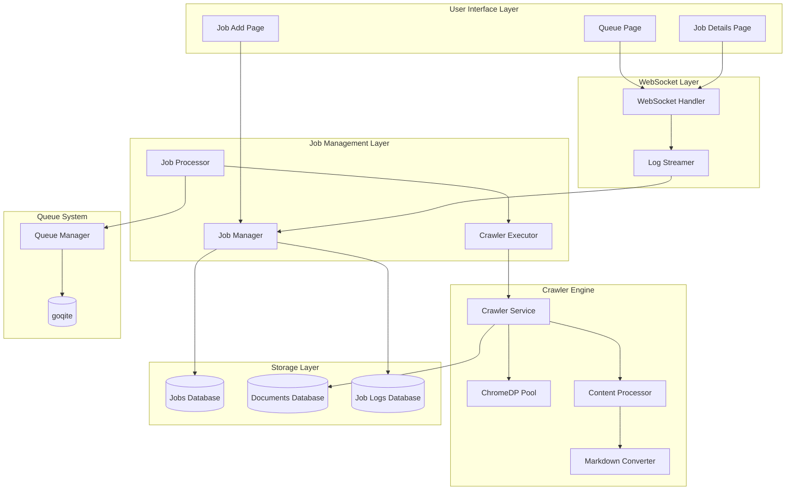
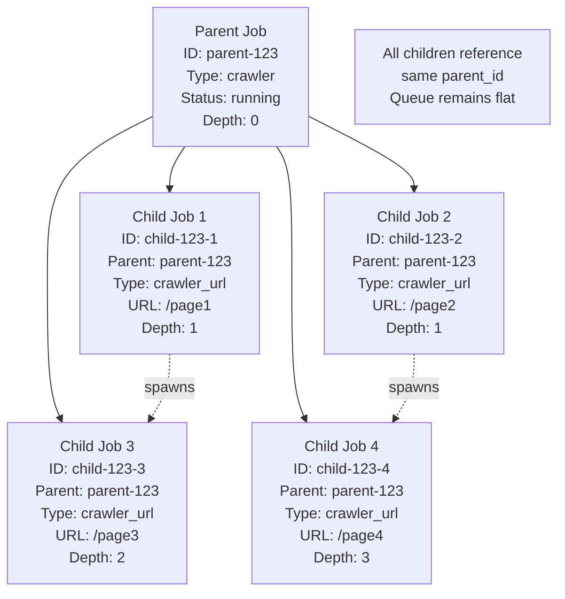

# Web Crawler Enhancement Design

## Overview

This design document outlines the enhancement of the Quaero web crawler system to provide comprehensive website crawling capabilities with real-time monitoring, parent-child job relationships, and content processing using ChromeDP for JavaScript-rendered sites. The design builds upon the existing goqite-based job queue system and maintains compatibility with the current architecture.

## Architecture

### High-Level System Architecture



### Parent-Child Job Architecture

The crawler uses a flat hierarchical job structure where:

1. **Parent Job**: Created when a crawler job definition is executed
   - Stores overall configuration and metadata
   - Tracks aggregate progress across all child jobs
   - Manages job lifecycle and cleanup
   - Does not process URLs directly

2. **Child Jobs**: Individual URL crawling tasks that ALL reference the parent
   - Each child job processes a single URL using the same process:
     - Access the page and convert to markdown
     - Extract links and filter using include/exclude patterns
     - Follow filtered links by spawning more children (respecting depth limits)
   - ALL child jobs have the same `parent_id` (flat structure, not nested)
   - Child jobs can spawn additional child jobs from discovered links
   - Depth tracking prevents infinite recursion



## Components and Interfaces

### Enhanced Crawler Executor

```go
type CrawlerExecutor struct {
    crawlerService  *crawler.Service
    jobManager      *jobs.Manager
    queueManager    *queue.Manager
    documentStorage interfaces.DocumentStorage
    logger          arbor.ILogger
    chromeDPPool    *ChromeDPPool
}

func (e *CrawlerExecutor) Execute(ctx context.Context, job *models.JobModel) error {
    // 1. Extract URL and configuration from job
    // 2. Acquire ChromeDP browser instance from pool
    // 3. Navigate to URL and wait for JavaScript rendering
    // 4. Extract content and convert to markdown
    // 5. Store document with metadata
    // 6. Extract and filter links using include/exclude patterns
    // 7. Log link discovery: "Links found: 10 | filtered: 2 | followed: 2"
    // 8. Spawn child jobs for filtered links (respecting depth limits)
    // 9. Update job progress and status
    // 10. Stream logs via WebSocket
}

type LinkProcessingResult struct {
    Found     int `json:"found"`
    Filtered  int `json:"filtered"`
    Followed  int `json:"followed"`
    Skipped   int `json:"skipped_depth"`
}
```

### ChromeDP Pool Management

```go
type ChromeDPPool struct {
    browsers        []context.Context
    browserCancels  []context.CancelFunc
    allocatorCancels []context.CancelFunc
    mu              sync.Mutex
    maxInstances    int
    currentIndex    int
}

func (p *ChromeDPPool) GetBrowser() (context.Context, context.CancelFunc, error)
func (p *ChromeDPPool) ReleaseBrowser(ctx context.Context)
func (p *ChromeDPPool) Shutdown() error
```

### Content Processing Pipeline

```go
type ContentProcessor struct {
    markdownConverter *MarkdownConverter
    linkExtractor    *LinkExtractor
    logger           arbor.ILogger
}

type ProcessedContent struct {
    Title       string
    Content     string
    Markdown    string
    Links       []string                   // All discovered links
    FilteredLinks []string                 // Links after include/exclude filtering
    Metadata    map[string]interface{}
    ProcessTime time.Duration
    ContentSize int
}

type LinkFilterResult struct {
    OriginalLinks []string `json:"original_links"`
    FilteredLinks []string `json:"filtered_links"`
    Found         int      `json:"found"`
    Filtered      int      `json:"filtered"`
    Excluded      int      `json:"excluded"`
    Reasons       []string `json:"exclusion_reasons"`
}

func (p *ContentProcessor) ProcessHTML(html string, sourceURL string) (*ProcessedContent, error)
func (p *ContentProcessor) FilterLinks(links []string, includePatterns, excludePatterns []string) *LinkFilterResult
```

### Real-Time Logging System

```go
type WebSocketLogger struct {
    clients    map[string]*websocket.Conn
    mu         sync.RWMutex
    jobManager *jobs.Manager
}

func (w *WebSocketLogger) StreamJobLog(jobID, level, message string)
func (w *WebSocketLogger) BroadcastJobStatus(jobID string, status JobStatus)
func (w *WebSocketLogger) GetRecentLogs(jobID string, limit int) []JobLog
```

## Data Models

### Enhanced Job Model

The existing `JobModel` structure will be extended to support crawler-specific configuration:

```go
type CrawlerJobConfig struct {
    StartURLs       []string      `json:"start_urls"`
    MaxDepth        int           `json:"max_depth"`        // Maximum depth for link following (e.g., 3)
    MaxPages        int           `json:"max_pages"`
    Concurrency     int           `json:"concurrency"`
    FollowLinks     bool          `json:"follow_links"`     // Whether to follow discovered links
    IncludePatterns []string      `json:"include_patterns"` // Regex patterns for links to include
    ExcludePatterns []string      `json:"exclude_patterns"` // Regex patterns for links to exclude
    RateLimit       time.Duration `json:"rate_limit"`
    Timeout         time.Duration `json:"timeout"`
    EnableJS        bool          `json:"enable_js"`
    UserAgent       string        `json:"user_agent"`
}

// Job metadata includes depth tracking for each child job
type CrawlerJobMetadata struct {
    ParentJobID     string `json:"parent_job_id"`     // Always points to root parent
    CurrentDepth    int    `json:"current_depth"`     // Current depth (1, 2, 3, etc.)
    SourceURL       string `json:"source_url"`        // URL that spawned this job
    SpawnedFromJobID string `json:"spawned_from_job_id"` // Job that discovered this URL
}
```

### Document Storage Schema

```go
type CrawledDocument struct {
    ID          string                 `json:"id"`
    JobID       string                 `json:"job_id"`
    ParentJobID string                 `json:"parent_job_id"`
    SourceURL   string                 `json:"source_url"`
    Title       string                 `json:"title"`
    Content     string                 `json:"content"`
    Markdown    string                 `json:"markdown"`
    ContentSize int                    `json:"content_size"`
    ProcessTime time.Duration          `json:"process_time"`
    Metadata    map[string]interface{} `json:"metadata"`
    CreatedAt   time.Time              `json:"created_at"`
}
```

### Job Progress Tracking

```go
type CrawlerProgress struct {
    TotalURLs       int       `json:"total_urls"`
    CompletedURLs   int       `json:"completed_urls"`
    FailedURLs      int       `json:"failed_urls"`
    PendingURLs     int       `json:"pending_urls"`
    CurrentURL      string    `json:"current_url"`
    Percentage      float64   `json:"percentage"`
    StartTime       time.Time `json:"start_time"`
    EstimatedEnd    time.Time `json:"estimated_end"`
    DocumentsSaved  int       `json:"documents_saved"`
    ErrorCount      int       `json:"error_count"`
    
    // Link following statistics
    LinksFound      int       `json:"links_found"`       // Total links discovered
    LinksFiltered   int       `json:"links_filtered"`    // Links after include/exclude filtering
    LinksFollowed   int       `json:"links_followed"`    // Links actually spawned as child jobs
    LinksSkipped    int       `json:"links_skipped"`     // Links skipped due to depth limits
    
    // Depth distribution
    DepthStats      map[int]int `json:"depth_stats"`     // Count of jobs at each depth level
}
```

## Error Handling

### Retry Strategy

```go
type RetryConfig struct {
    MaxAttempts   int           `json:"max_attempts"`
    InitialDelay  time.Duration `json:"initial_delay"`
    MaxDelay      time.Duration `json:"max_delay"`
    BackoffFactor float64       `json:"backoff_factor"`
}

func (e *CrawlerExecutor) executeWithRetry(ctx context.Context, url string, config RetryConfig) error {
    // Implement exponential backoff retry logic
    // Log each retry attempt
    // Handle different error types (network, timeout, 4xx, 5xx)
}
```

### Error Classification

```go
type CrawlerError struct {
    Type        ErrorType `json:"type"`
    URL         string    `json:"url"`
    Message     string    `json:"message"`
    StatusCode  int       `json:"status_code,omitempty"`
    Retryable   bool      `json:"retryable"`
    Timestamp   time.Time `json:"timestamp"`
}

type ErrorType string

const (
    ErrorTypeNetwork    ErrorType = "network"
    ErrorTypeTimeout    ErrorType = "timeout"
    ErrorTypeHTTP       ErrorType = "http"
    ErrorTypeJavaScript ErrorType = "javascript"
    ErrorTypeContent    ErrorType = "content"
    ErrorTypeStorage    ErrorType = "storage"
)
```

## Testing Strategy

### Unit Tests

1. **Content Processing Tests**
   - HTML to Markdown conversion accuracy
   - Link extraction from various HTML structures
   - Metadata extraction (title, description, etc.)
   - Error handling for malformed HTML

2. **ChromeDP Integration Tests**
   - JavaScript rendering verification
   - Timeout handling
   - Browser pool management
   - Resource cleanup

3. **Job Management Tests**
   - Parent-child job creation and linking
   - Progress tracking accuracy
   - Status transitions
   - Error propagation

### Integration Tests

1. **End-to-End Crawler Tests**
   - Complete crawling workflow from job creation to document storage
   - Multi-page crawling with link following
   - Rate limiting and concurrency control
   - Real-time progress updates

2. **WebSocket Communication Tests**
   - Log streaming to connected clients
   - Status update broadcasting
   - Client connection management
   - Message queuing during disconnections

### UI Tests

1. **Queue Page Tests**
   - Real-time job status updates
   - Parent-child job hierarchy display
   - Log streaming visualization
   - Job cancellation functionality

2. **Job Details Page Tests**
   - Live progress monitoring
   - Configuration display
   - Log history viewing
   - Document links and previews

## Performance Considerations

### ChromeDP Pool Sizing

```go
type PoolConfig struct {
    MinInstances    int           `json:"min_instances"`
    MaxInstances    int           `json:"max_instances"`
    IdleTimeout     time.Duration `json:"idle_timeout"`
    StartupTimeout  time.Duration `json:"startup_timeout"`
    MemoryLimit     int64         `json:"memory_limit_mb"`
}
```

### Resource Management

1. **Memory Management**
   - Browser instance lifecycle management
   - Content size limits and truncation
   - Garbage collection of completed jobs

2. **Concurrency Control**
   - Per-domain rate limiting
   - Global concurrency limits
   - Queue depth monitoring

3. **Storage Optimization**
   - Document deduplication
   - Compression for large content
   - Archival of old job data

### Monitoring and Metrics

```go
type CrawlerMetrics struct {
    ActiveJobs          int           `json:"active_jobs"`
    QueueDepth          int           `json:"queue_depth"`
    AvgProcessingTime   time.Duration `json:"avg_processing_time"`
    SuccessRate         float64       `json:"success_rate"`
    DocumentsPerMinute  float64       `json:"documents_per_minute"`
    BrowserPoolUsage    float64       `json:"browser_pool_usage"`
    MemoryUsage         int64         `json:"memory_usage_mb"`
}
```

## Security Considerations

### Content Sanitization

```go
type ContentSanitizer struct {
    maxContentSize int
    allowedTags    []string
    blockedDomains []string
}

func (s *ContentSanitizer) SanitizeHTML(html string) (string, error)
func (s *ContentSanitizer) ValidateURL(url string) error
```

### Rate Limiting and Respect

```go
type RateLimiter struct {
    domainLimits map[string]*rate.Limiter
    globalLimit  *rate.Limiter
    mu           sync.RWMutex
}

func (r *RateLimiter) Wait(ctx context.Context, domain string) error
func (r *RateLimiter) SetDomainLimit(domain string, rps float64)
```

## Deployment and Configuration

### Configuration Schema

```toml
[crawler]
enable_javascript = true
user_agent = "Quaero-Crawler/1.0"
default_timeout = "30s"
max_content_size = "10MB"

[crawler.browser_pool]
min_instances = 2
max_instances = 8
idle_timeout = "5m"
memory_limit = 512

[crawler.rate_limiting]
global_rps = 10.0
default_domain_rps = 2.0
respect_robots_txt = true

[crawler.content]
enable_markdown_conversion = true
preserve_html = true
extract_metadata = true
max_link_depth = 5
```

### Environment Variables

```bash
QUAERO_CRAWLER_ENABLE_JS=true
QUAERO_CRAWLER_BROWSER_POOL_SIZE=4
QUAERO_CRAWLER_MAX_CONCURRENCY=10
QUAERO_CRAWLER_RATE_LIMIT=2.0
```

## Migration Strategy

### Phase 1: Core Infrastructure
1. Implement ChromeDP pool management
2. Create enhanced CrawlerExecutor
3. Add content processing pipeline
4. Update job models and database schema

### Phase 2: Real-Time Features
1. Implement WebSocket logging system
2. Update UI for real-time monitoring
3. Add parent-child job visualization
4. Implement live progress tracking

### Phase 3: Advanced Features
1. Add advanced error handling and retry logic
2. Implement content deduplication
3. Add performance monitoring and metrics
4. Optimize for large-scale crawling

### Phase 4: Polish and Testing
1. Comprehensive testing suite
2. Performance optimization
3. Documentation and user guides
4. Production deployment and monitoring

## API Endpoints

### Job Management

```http
POST /api/jobs/crawler
Content-Type: application/json

{
  "name": "Website Crawl",
  "start_urls": ["https://example.com"],
  "config": {
    "max_depth": 3,
    "max_pages": 100,
    "follow_links": true,
    "enable_js": true
  }
}
```

### Real-Time Monitoring

```http
GET /api/jobs/{jobId}/status
WebSocket: /ws/jobs/{jobId}/logs
```

### Document Retrieval

```http
GET /api/jobs/{jobId}/documents
GET /api/documents/{documentId}
```

This design provides a comprehensive foundation for implementing the enhanced web crawler system while maintaining compatibility with the existing Quaero architecture and leveraging the proven goqite-based job queue system.