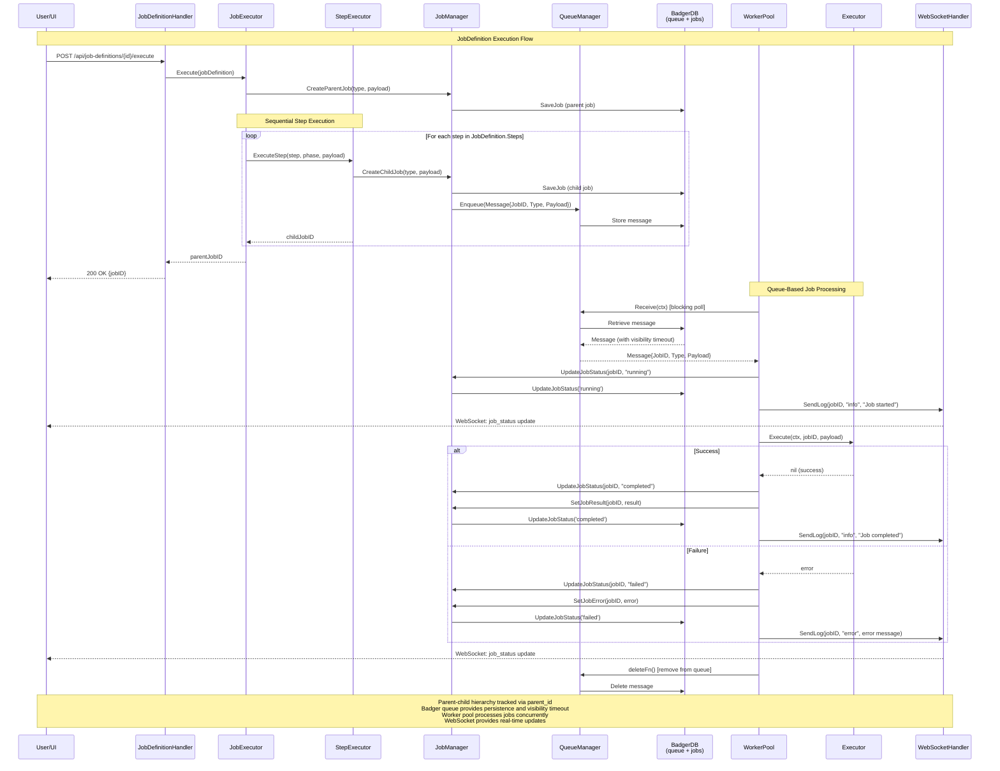

# Quaero

**Quaero** (Latin: "I seek, I search") - A local knowledge collection and search system.

## Overview

Enterprise knowledge is locked behind authenticated web applications (Confluence, Jira, documentation sites) where traditional RAG tools cannot access or safely store sensitive data. Quaero solves this by running entirely locally on your machine, capturing your authenticated browser sessions via a Chrome extension, and crawling pages to normalize them into markdown with metadata. All data is stored in a local Badger database with scheduled recrawls and LLM-powered summarization keeping your private knowledge base current using Google ADK with Gemini models.

Quaero is a local service (Windows, Linux, macOS) that provides fast full-text and semantic search, along with chat capabilities through integrated language models via Google ADK.

### Key Features

- 🔐 **Cookie-Based Authentication** - Chrome extension captures session cookies
- 🕸️ **Website Crawler** - Depth-based crawling starting from seed URLs
- 📝 **Markdown Conversion** - Converts web pages to LLM-friendly markdown
- 💾 **Badger Storage** - Local embedded key-value database for documents and metadata
- 🎯 **Job Manager** - Persistent queue-based job execution system
- 📚 **Document Summarization** - LLM-powered content summaries
- 🔍 **Advanced Search** - Google-style query parser with regex-based search and vector search
- 🌐 **Web Interface** - Browser-based UI for job management and monitoring
- ⏰ **Scheduled Jobs** - Automated crawling and summarization tasks

## Technology Stack

- **Language:** Go 1.25+
- **Storage:** BadgerDB (embedded key-value store)
- **Web UI:** HTML templates, Alpine.js, Bulma CSS
- **Crawler:** chromedp for JavaScript rendering, HTML to Markdown conversion
- **Job Queue:** Badger-backed persistent queue
- **Authentication:** Chrome extension → HTTP POST
- **Logging:** github.com/ternarybob/arbor (structured logging)
- **Configuration:** TOML via github.com/pelletier/go-toml/v2
- **MCP:** Model Context Protocol for internal agent tools

## Quick Start

### Prerequisites

- Go 1.25+
- Chrome browser

### Installation

#### Windows (PowerShell)

```powershell
# Clone the repository
git clone https://github.com/ternarybob/quaero.git
cd quaero

# Build
.\scripts\build.ps1
```

#### Linux/macOS (Bash)

```bash
# Clone the repository
git clone https://github.com/ternarybob/quaero.git
cd quaero

# Build
./scripts/build.sh
```

**Important:** Always use the build scripts (`build.ps1` on Windows, `build.sh` on Linux/macOS). Direct `go build` is not supported for production builds as it doesn't handle versioning and assets correctly.

## MCP Server for Claude CLI

Quaero includes an **MCP (Model Context Protocol) server** that exposes search functionality to AI assistants like Claude CLI.

### Features

- **4 search tools** for Claude to access your knowledge base
- **Stdio/JSON-RPC** communication (local-only, no network exposure)
- **Markdown-formatted results** for easy reading in Claude Desktop
- **Automatic build** with main Quaero application

### Quick Setup

1. **Build Quaero** (builds both quaero.exe and quaero-mcp.exe):
   ```powershell
   .\scripts\build.ps1
   ```

2. **Configure Claude Desktop** (`%APPDATA%\Claude\claude_desktop_config.json`):
   ```json
   {
     "mcpServers": {
       "quaero": {
         "command": "C:\\development\\quaero\\bin\\quaero-mcp.exe",
         "args": [],
         "env": {
           "QUAERO_CONFIG": "C:\\development\\quaero\\bin\\quaero.toml"
         }
       }
     }
   }
   ```

3. **Restart Claude Desktop** to load the MCP server

### Available Tools

- `search_documents` - Full-text search (filters, limits, boolean operators)
- `get_document` - Retrieve complete document by ID
- `list_recent_documents` - Show recently updated documents
- `get_related_documents` - Find documents referencing specific keys

### Example Queries

Ask Claude natural language questions:
- "Search my knowledge base for authentication bugs"
- "Show me the 15 most recent confluence pages"
- "What documents reference issue PROJ-456?"

For detailed configuration and troubleshooting, see [docs/implement-mcp-server/mcp-configuration.md](docs/implement-mcp-server/mcp-configuration.md).

### Configuration

Create `quaero.toml` in your project directory (or use the default from `deployments/local/quaero.toml`):

```toml
# Server configuration
[server]
host = "localhost"
port = 8080  # Default port (can be overridden with --port flag or QUAERO_SERVER_PORT env var)

# Storage configuration
[storage]
type = "badger"

[storage.badger]
path = "./data"

# Gemini API configuration (required for all AI features)
[gemini]
google_api_key = "YOUR_GOOGLE_GEMINI_API_KEY"  # Required for all AI operations
agent_model = "gemini-2.0-flash"               # Model for agent operations
chat_model = "gemini-2.0-flash"                # Model for chat operations
timeout = "5m"                                 # Operation timeout
rate_limit = "4s"                              # Rate limit (4s = 15 RPM free tier)

# Search configuration
[search]
mode = "advanced"  # "advanced" (Google-style) or "disabled"
case_sensitive_multiplier = 3
case_sensitive_max_cap = 1000

# Job configuration
[jobs.crawl_and_collect]
enabled = true
auto_start = false      # Don't run on startup
schedule = "*/5 * * * *"  # Every 5 minutes (minimum interval)
```

### Running the Server

#### Windows
```powershell
# Start the server (after building)
.\bin\quaero.exe

# Or build and run in one step
.\scripts\build.ps1 -Run

# With custom port
.\bin\quaero.exe --port 9090
```

#### Linux/macOS
```bash
# Start the server (after building)
./bin/quaero

# With custom config file
./bin/quaero --config deployments/local/quaero.toml

# With environment variables
QUAERO_SERVER_PORT=9090 ./bin/quaero
```

#### Docker
```bash
# Build and run with Docker
docker-compose -f deployments/docker/docker-compose.yml up
```

### Installing Chrome Extension

1. Open Chrome and navigate to `chrome://extensions/`
2. Enable "Developer mode" (top right)
3. Click "Load unpacked"
4. Select the `cmd/quaero-chrome-extension/` directory
5. **Configure server URL** in extension settings if not using default `http://localhost:8080`

## LLM Setup (Google Gemini)

**Google Gemini Integration**: Quaero uses Google Gemini models for AI-powered features including chat, agents, and document processing. All AI operations use Google's cloud APIs.

⚠️ **Important**: A valid Google API key is required for AI functionality. Without an API key, the service will start but AI features (chat, agents, keyword extraction) will be unavailable.

### Prerequisites

To use Quaero's AI capabilities, you need:
- A Google Gemini API key
- Internet connection for API calls
- No local model files or binaries required

### Quick Start

#### 1. Get Google Gemini API Key

1. Visit Google AI Studio: https://aistudio.google.com/app/apikey
2. Sign in with your Google account
3. Click "Create API Key"
4. Copy the generated API key

**Free Tier Limits** (as of 2025):
- 15 requests per minute
- 1500 requests per day
- Sufficient for personal knowledge base use

#### 2. Configure Quaero

Add the API key to your `quaero.toml` configuration:

```toml
[gemini]
google_api_key = "YOUR_GOOGLE_GEMINI_API_KEY"
agent_model = "gemini-2.0-flash"   # Model for agent operations
chat_model = "gemini-2.0-flash"    # Model for chat operations
timeout = "5m"                     # Operation timeout
rate_limit = "4s"                  # Rate limit (4s = 15 RPM free tier)
```

#### 3. Environment Variable Override (Optional)

You can also set the API key via environment variable (takes precedence):

```bash
export QUAERO_GEMINI_GOOGLE_API_KEY="YOUR_GOOGLE_GEMINI_API_KEY"
```

#### 4. Verification

Start Quaero and check the startup logs:

**✅ Success** - Look for this message:
```
LLM service initialized with Google ADK
Agent service initialized with Google ADK
```

**❌ Failure** - If you see this message, the API key is missing or invalid:
```
To enable LLM features, set QUAERO_GEMINI_GOOGLE_API_KEY or gemini.google_api_key in config
```

#### 5. Test AI Functionality

1. Start Quaero: `.\scripts\build.ps1 -Run`
2. Navigate to the Chat page in the web UI
3. Send a test message to verify chat functionality works
4. Create an agent job to test AI document processing

### Model Details

**Default Model**: `gemini-2.0-flash`
- Fast response times
- Cost-effective for regular use
- Used for both chat and agent operations
- Suitable for document summarization, keyword extraction, and chat

### Troubleshooting

**API Key Not Found**:
- Ensure `google_api_key` is set in `[gemini]` section of `quaero.toml`
- Or set `QUAERO_GEMINI_GOOGLE_API_KEY` environment variable
- Get API key from: https://aistudio.google.com/app/apikey

**API Rate Limits**:
- Free tier: 15 requests/minute, 1500/day
- Adjust `rate_limit` in config (default: "4s" = 15 RPM)
- Reduce concurrency in `[queue]` configuration
- Consider upgrading to paid tier for higher limits

**Timeout Errors**:
- Increase timeout in config: `timeout = "10m"`
- Large documents may take longer to process
- Check Gemini API status: https://status.ai.google.dev/

See AGENTS.md for developer-focused debug steps and agent-specific troubleshooting.

### Using Quaero

1. **Start the server:**
   ```powershell
   # Windows
   .\scripts\build.ps1 -Run

   # Linux/macOS
   ./scripts/build.sh && ./bin/quaero
   ```

2. **Navigate to a website:**
   - Go to any website you want to crawl (e.g., Confluence, Jira, documentation sites)
   - Log in normally (handles 2FA, SSO, etc.)

3. **Capture Authentication:**
   - Click the Quaero extension icon
   - Extension sends cookies to server via `POST /api/auth`
   - Verify connection status in extension popup

4. **Access Web Interface:**
   - Open http://localhost:8080 (default port)
   - Navigate to Jobs page to create crawl jobs
   - Visit Queue page to monitor running jobs

5. **Create a Crawl Job:**
   - Go to Jobs page
   - Click "New Job Definition"
   - Configure sources, schedule, and crawl parameters
   - Execute job manually or wait for schedule

6. **Search and Query:**
   - Use Search page for advanced queries
   - Chat page for natural language questions with RAG

## Build and Test Instructions

**IMPORTANT:** The following instructions are critical for maintaining a stable development environment.

### Platform-Specific Build Instructions

#### Windows (PowerShell)
```powershell
# Development build (silent, no deployment)
.\scripts\build.ps1

# Deploy files to bin directory after build
.\scripts\build.ps1 -Deploy

# Build, deploy, and run in new terminal
.\scripts\build.ps1 -Run
```

#### Linux/macOS (Bash)
```bash
# Development build
./scripts/build.sh

# Clean build
./scripts/build.sh --clean

# Release build (optimized)
./scripts/build.sh --release

# Build with tests
./scripts/build.sh --test
```

#### Docker
```bash
# Build Docker image
docker build -f deployments/docker/Dockerfile -t quaero:latest .

# Run with Docker Compose
docker-compose -f deployments/docker/docker-compose.yml up

# Production build with version
docker build \
  --build-arg VERSION=1.0.0 \
  --build-arg BUILD=production \
  --build-arg GIT_COMMIT=$(git rev-parse HEAD) \
  -f deployments/docker/Dockerfile \
  -t quaero:1.0.0 .
```

**Platform-Specific Notes:**
- **Windows:** UI tests require Chrome installed. Use PowerShell for scripts.
- **Linux:** Ensure execute permissions on build.sh (`chmod +x scripts/build.sh`)
- **macOS:** Requires Chrome or Chromium for UI tests
- **All Platforms:** Always use build scripts to ensure proper versioning and asset handling

### Testing Instructions

**CRITICAL: The test runner handles EVERYTHING automatically!**

### UI Framework

**Framework:** Vanilla JavaScript with Alpine.js and Bulma CSS

**Important:** The project uses Alpine.js for client-side interactivity and Bulma CSS for styling.

## Project Structure

```
quaero/
├── cmd/
│   ├── quaero/                      # Main application entry point
│   └── quaero-chrome-extension/     # Chrome extension for auth
├── internal/
│   ├── app/                         # Application orchestration & DI
│   ├── common/                      # Stateless utilities (config, logging, banner)
│   ├── server/                      # HTTP server & routing
│   ├── handlers/                    # HTTP & WebSocket handlers
│   │   ├── api.go                   # System API (version, health)
│   │   ├── ui.go                    # UI page handlers
│   │   ├── websocket.go             # WebSocket & log streaming
│   │   ├── collection.go            # Manual sync endpoints
│   │   ├── document.go              # Document management
│   │   ├── scheduler.go             # Event triggers
│   │   ├── job_handler.go           # Job management API
│   │   ├── job_definition_handler.go # Job definition API
│   │   └── chat_handler.go          # Chat API
│   ├── services/                    # Stateful business services
│   │   ├── atlassian/               # Jira & Confluence transformers
│   │   │   ├── jira_transformer.go  # Jira data transformation
│   │   │   └── confluence_transformer.go # Confluence data transformation
│   │   ├── crawler/                 # Website crawler service
│   │   │   ├── service.go           # Core crawler logic
│   │   │   └── filters.go           # URL pattern filtering
│   │   ├── events/                  # Pub/sub event service
│   │   │   └── event_service.go
│   │   ├── scheduler/               # Cron scheduler
│   │   │   └── scheduler_service.go
│   │   ├── llm/                     # LLM abstraction layer
│   │   │   ├── factory.go           # LLM service factory
│   │   │   ├── audit.go             # Audit logging
│   │   │   └── gemini_service.go    # Google ADK Gemini implementation
│   │   ├── documents/               # Document service
│   │   ├── chat/                    # Chat service (RAG)
│   │   ├── search/                  # Search service
│   │   ├── summary/                 # Summary generation
│   │   ├── sources/                 # Source configuration
│   │   ├── status/                  # Status tracking
│   │   └── jobs/                    # Job executor & registry
│   │       ├── executor.go          # Job definition executor
│   │       ├── registry.go          # Action type registry
│   │       └── actions/             # Action handlers (crawler, summarizer)
│   ├── queue/                       # Queue-based job system
│   │   ├── badger_manager.go        # Queue manager (Badger)
│   │   └── types.go                 # Queue message types
│   ├── jobs/                        # Job management
│   │   ├── manager.go               # Job CRUD operations
│   │   └── types/                   # Job type implementations
│   │       ├── base.go              # BaseJob shared functionality
│   │       ├── crawler.go           # CrawlerJob (URL processing)
│   │       ├── summarizer.go        # SummarizerJob
│   │       └── cleanup.go           # CleanupJob
│   ├── storage/                     # Data persistence layer
│   │   ├── factory.go               # Storage factory
│   │   └── badger/                  # Badger implementation
│   │       ├── auth_storage.go      # Authentication storage
│   │       ├── document_storage.go  # Document CRUD
│   │       ├── job_storage.go       # Job CRUD
│   │       ├── job_log_storage.go   # Job logs
│   │       ├── kv_storage.go        # Key-value storage
│   │       └── manager.go           # Storage manager
│   ├── interfaces/                  # Service interfaces
│   │   ├── llm_service.go           # LLM abstraction
│   │   ├── event_service.go         # Event pub/sub
│   │   ├── queue_manager.go         # Queue operations
│   │   ├── job_storage.go           # Job persistence
│   │   └── ...                      # Other interfaces
│   └── models/                      # Data models
│       ├── document.go              # Document model
│       ├── job.go                   # Job models
│       ├── job_definition.go        # Job definition model
│       └── config.go                # Configuration models
├── pages/                           # Web UI templates
│   ├── index.html                   # Dashboard
│   ├── jira.html                    # Jira UI
│   ├── confluence.html              # Confluence UI
│   ├── documents.html               # Documents browser
│   ├── embeddings.html              # Embeddings test UI
│   ├── partials/                    # Reusable components
│   └── static/                      # CSS, JS
├── test/                            # Go-native test infrastructure
│   ├── main_test.go                 # TestMain fixture (setup/teardown)
│   ├── helpers.go                   # Common test utilities
│   ├── run_tests.go                 # Go-native test runner
│   ├── api/                         # API integration tests
│   │   └── chat_api_test.go
│   ├── ui/                          # UI tests (chromedp)
│   │   ├── homepage_test.go
│   │   └── chat_test.go
│   └── results/                     # Test results (timestamped)
├── scripts/                         # Build & deployment
│   └── build.ps1                    # Build script
├── docs/                            # Documentation
│   ├── architecture.md
│   ├── requirements.md
│   └── remaining-requirements.md
├── bin/                             # Build output
│   ├── quaero.exe                   # Compiled binary
│   ├── quaero.toml                  # Runtime config
│   └── data/                        # Badger database
└── CLAUDE.md                        # Development standards
```

## Commands

### Server

```bash
# Start server (no subcommand needed)
quaero

# With custom port
quaero --port 8080

# With custom host
quaero --host 0.0.0.0

# With custom config
quaero --config /path/to/quaero.toml
```

### Version

```bash
# Show version
quaero version
```

## Security & Privacy

### Cloud-Based LLM Processing (Google ADK)

**Current Configuration:** Quaero uses Google ADK with Gemini models for LLM processing, ensuring:
- ✅ **Efficient Cloud Processing** - Leverages Google's infrastructure for fast, scalable LLM operations
- ✅ **No Model Management** - No local model files or binary management required
- ✅ **Badger Storage** - All crawled content and metadata stored locally
- ✅ **No Telemetry** - No usage data collection from Quaero itself

### API Security

**Google Gemini API:**
- API keys required for LLM functionality
- Data sent to Google's servers for processing
- Subject to Google's AI privacy policy and data handling practices
- Not suitable for highly sensitive or classified data

```toml
[gemini]
google_api_key = "YOUR_GOOGLE_GEMINI_API_KEY"  # Required for all AI features
```

**API Key Security:**
- Store API keys in environment variables when possible
- Use least-privilege principles
- Monitor API usage in Google AI Studio
- Rotate keys regularly

**Data Handling:**
- Document content transmitted to Google for embedding and chat
- Query text sent to Gemini API for processing
- Local Badger database contains all crawled content
- Review Google's AI privacy policy for data retention details

⚠️ **Important**: If you require 100% local processing, this configuration is not suitable. Consider alternative solutions with local LLM inference.

### Logging

Quaero includes comprehensive logging for debugging and monitoring:

```toml
[logging]
level = "info"           # Log level: debug, info, warn, error
min_event_level = "info" # Minimum level for real-time UI events
```

Logs include:
- API request/response metadata
- Job execution status and progress
- Error details with context
- Real-time WebSocket events for UI

### Authentication Security

- Chrome extension captures cookies locally
- Cookies transmitted only to localhost
- No cloud storage of credentials
- Session data encrypted at rest in Badger

## Architecture

**For comprehensive documentation of the job system, see [Manager/Worker Architecture](docs/architecture/MANAGER_WORKER_ARCHITECTURE.md).**

Quaero uses a Manager/Worker pattern for job orchestration and execution:
- **Managers** create parent jobs and define workflows
- **Workers** execute individual jobs from the queue
- **Orchestrators** monitor parent job progress and aggregate child statistics

For detailed system architecture including Markdown+Metadata design, see [Architecture Documentation](docs/architecture/).

### Core Components

#### 1. Crawler Service
The crawler service (`internal/services/crawler/`) manages web crawling operations:

**Responsibilities:**
- Creates and manages crawl jobs
- Orchestrates depth-first crawling from seed URLs
- Handles JavaScript rendering with chromedp
- Converts HTML pages to markdown
- Filters and discovers child links
- Applies include/exclude URL patterns
- Tracks job progress and completion

**Key Features:**
- Cookie-based authentication (from Chrome extension)
- Configurable crawl depth
- Domain filtering (stay within domain or expand)
- URL pattern matching (regex include/exclude)
- Max pages limit
- Rate limiting and concurrency control
- JavaScript rendering support

#### 2. Job Manager
The job manager (`internal/jobs/`) handles job lifecycle and execution:

**Job Queue System (Badger):**
- Persistent queue backed by BadgerDB
- Jobs survive application restarts
- Worker pool processes messages (5 workers default)
- Visibility timeout (5 minutes default) - messages become visible for retry if not completed
- Max receive count (3 attempts) - messages move to dead-letter after exhausting retries
- Delayed completion probe - 5-second grace period after job completion to ensure all child URLs are processed
- Atomic progress updates - Pending/Total counts maintained consistently when spawning child URLs
- Heartbeat mechanism for long-running jobs to prevent visibility timeout

**Job Types:**
1. **crawler_url** - Process individual URLs
   - Fetch and parse HTML
   - Convert to markdown
   - Save to document storage
   - Discover and enqueue child URLs
   - Track progress (completed/pending/failed)

2. **summarizer** - Generate document summaries
   - Batch process documents
   - LLM-powered summarization
   - Extract keywords
   - Update document metadata

3. **cleanup** - Maintenance tasks
   - Remove old completed jobs
   - Clean up job logs
   - Configurable age threshold

#### 3. Document Storage
The document storage (`internal/storage/badger/`) manages crawled content:

**Document Model:**
- Unique document ID
- Source URL and type
- Title and markdown content
- Detail level (full, summary, brief)
- Metadata (tags, timestamps, keywords)
- Creation and update timestamps

**Storage Features:**
- Badger database with regex-based search
- Document deduplication by URL
- Batch operations for performance
- Metadata queries and filtering
- Document versioning support

#### 4. Search Service
The search service (`internal/services/search/`) provides multiple search modes:

**Search Modes:**
- **advanced** (default) - Google-style query parser with operators:
  - Quoted phrases: `"exact match"`
  - Boolean operators: `AND`, `OR`, `NOT`
  - Field searches: `title:keyword`
  - Wildcards: `test*`
- **disabled** - Search disabled

**Features:**
- Case-sensitive search with multiplier (fetches 3x results, caps at 1000)
- Regex-based search on title + content
- Vector search support when enabled
- Configurable embedding dimensions (768 for Gemini embedding model)
- Hybrid search combining keyword and semantic results

#### 5. Scheduler Service
The scheduler (`internal/services/scheduler/`) manages automated tasks:

**Default Jobs:**
1. **crawl_and_collect** (every 5 minutes minimum)
   - Refreshes configured sources
   - Crawls new pages
   - Updates existing documents

**Features:**
- Cron-based scheduling
- Job enable/disable controls
- `auto_start` flag for immediate execution on startup
- Dynamic schedule updates with 5-minute minimum interval
- Manual trigger support via API
- Prevents concurrent execution

#### 6. MCP Integration
Model Context Protocol integration (internal for Claude Code only):

**Current Status:**
- ⚠️ **Internal use only** - MCP endpoint is specifically for Claude Code integration
- Not a general-purpose MCP server implementation
- Provides document corpus access to Claude agents

**Supported Queries (via Claude Code):**
- "How many backlog items are there?"
- "List all the projects"
- "How do I get access to this server?"
- Technical and developer-focused questions

**Implementation Notes:**
- `/mcp` endpoint handles Claude-specific requests
- Documents exposed as MCP resources
- Query interface for agent tools only
- Not intended for external MCP clients

### Job Queue and Executor Architecture

Quaero has two complementary job execution systems that work together to provide robust, scalable job processing:

- **Queue System** (`internal/queue/`, `internal/jobs/`, `internal/services/workers/`) - Handles persistent job execution with Badger-backed queue, QueueManager, JobManager, and WorkerPool for reliable background processing
- **Job Executor** (`internal/jobs/executor/`) - Orchestrates multi-step workflows from JobDefinitions with sequential step execution and proper error handling

These systems work together seamlessly: JobExecutor creates parent jobs and executes JobDefinition steps sequentially, which may create child jobs that are processed by the queue-based system. This architecture enables complex workflows while maintaining reliability and observability.



This architecture provides several key benefits:

- **Separation of Concerns**: JobExecutor handles workflow orchestration while the Queue System manages reliable execution
- **Parent-Child Hierarchy**: Enables comprehensive progress tracking and status aggregation across complex job trees
- **Persistent Queuing**: Badger-backed persistence with visibility timeouts for fault tolerance
- **Real-Time Updates**: WebSocket integration delivers live progress updates to the UI
- **Scalable Processing**: Configurable worker pool enables concurrent job processing with proper resource management

The parent-child job hierarchy allows for sophisticated workflows where a single JobDefinition can spawn multiple child jobs (e.g., URL discovery creating individual crawler jobs), with all progress and status information properly tracked and aggregated.

#### Step Executors

The JobExecutor system supports multiple step types through registered executors:

| Action | Executor | Purpose |
|--------|----------|---------|
| `crawl` | CrawlerStepExecutor | Start crawling jobs for URL discovery and content extraction |
| `transform` | TransformStepExecutor | Data transformation and processing |
| `reindex` | ReindexStepExecutor | Rebuild search index for optimal performance |

#### Configuration

```toml
# Job Definition Configuration
[jobs]
enabled = true
max_concurrent_jobs = 5
job_timeout = "30m"
cleanup_interval = "24h"
max_job_history = 1000

# Queue Configuration
[queue]
queue_name = "quaero-jobs"
concurrency = 4
poll_interval = "1s"
visibility_timeout = "5m"
max_receive = 3
```

#### Key API Endpoints

```http
# Job Definition Management
POST   /api/job-definitions/{id}/execute  # Execute job definition
GET    /api/job-definitions              # List all job definitions

# Job Monitoring
GET    /api/jobs                         # List job execution records
GET    /api/jobs/{id}                    # Get job details and logs
POST   /api/jobs/{id}/cancel             # Cancel running job

# Queue Management
GET    /api/queue/stats                  # Queue statistics and health
GET    /api/queue/jobs                   # List queued jobs
```

For comprehensive technical documentation including database schemas, error handling strategies, lifecycle states, and troubleshooting guides, see [Manager/Worker Architecture](docs/architecture/MANAGER_WORKER_ARCHITECTURE.md).

### Authentication Flow

```
1. User logs into website (Jira, Confluence, etc.)
   ↓
2. Extension captures session cookies
   ↓
3. Extension sends POST to localhost:8080/api/auth
   ↓
4. Server stores cookies in Badger
   ↓
5. Crawler uses cookies for authenticated requests
```

### Crawl Job Flow

```
1. User creates crawl job via UI
   ├─ Seed URLs
   ├─ Crawl depth
   ├─ Include/exclude patterns
   └─ Max pages
   ↓
2. Job manager creates job in database
   ↓
3. Seed URLs enqueued as crawler_url messages
   ↓
4. Worker pool pulls messages from queue
   ↓
5. For each URL:
   ├─ Fetch HTML (with chromedp if JavaScript)
   ├─ Convert to markdown
   ├─ Save document to Badger
   ├─ Discover child links
   ├─ Filter links (patterns, depth, domain)
   ├─ Deduplicate URLs (database)
   └─ Enqueue valid child URLs
   ↓
6. Job completes when PendingURLs == 0
   ↓
7. UI displays progress and results
```

### Summarization Flow

```
1. Scheduler triggers scan_and_summarize job (cron: every 2 hours)
   ↓
2. summarizer job message enqueued
   ↓
3. Worker pulls and executes summarizer
   ↓
4. Batch query documents without summaries
   ↓
5. For each document:
   ├─ Truncate content to limit
   ├─ Send to LLM service
   ├─ Generate summary
   ├─ Extract keywords
   └─ Update document metadata
   ↓
6. Job completes, documents ready for search
```

## Web UI

### Pages

#### Dashboard (`/`)
- System overview and status
- Quick access to main features
- Authentication status

#### Jobs (`/jobs`)
- Job definition management
- Create, edit, delete job definitions
- Configure sources and schedules
- Execute jobs manually

#### Queue (`/queue`)
- Active job monitoring
- Real-time job status updates
- Job logs and progress tracking
- Cancel or rerun jobs

#### Search (`/search`)
- Advanced search with query operators
- Full-text and semantic search
- Filter by source, date, type

#### Chat (`/chat`)
- Natural language queries
- RAG-enabled responses
- Document context integration

#### Documents (`/documents`)
- Browse collected documents
- View document metadata
- Force reprocessing

#### Settings (`/settings`)
- Application configuration
- LLM settings
- Storage management

## API Endpoints

### HTTP Endpoints

#### Authentication
```
POST /api/auth                          - Update authentication from Chrome extension
GET  /api/auth/status                   - Check authentication status
GET  /api/auth/list                     - List authenticated sources
```

#### Job Definitions
```
GET  /api/job-definitions                - List all job definitions
GET  /api/job-definitions/{id}           - Get job definition by ID
POST /api/job-definitions                - Create new job definition
PUT  /api/job-definitions/{id}           - Update job definition
DELETE /api/job-definitions/{id}         - Delete job definition
POST /api/job-definitions/{id}/execute   - Execute job definition manually
```

#### Jobs
```
GET  /api/jobs                          - List all jobs (with pagination)
GET  /api/jobs/{id}                     - Get job by ID
POST /api/jobs/{id}/cancel              - Cancel running job
POST /api/jobs/{id}/retry               - Retry failed job
DELETE /api/jobs/{id}                   - Delete job
GET  /api/jobs/{id}/logs                - Get job logs
```

#### Documents
```
GET  /api/documents                     - List documents (with pagination)
GET  /api/documents/{id}                - Get document by ID
PUT  /api/documents/{id}                - Update document
DELETE /api/documents/{id}              - Delete document
POST /api/documents/search              - Search documents
```

#### Search
```
POST /api/search                        - Advanced search with query operators
```

#### Chat
```
POST /api/chat                          - Send chat message (RAG-enabled)
GET  /api/chat/history                  - Get chat history
```

#### System
```
GET  /api/version                       - Server version info
GET  /api/health                        - Health check endpoint
GET  /api/config                        - Get server configuration
```

#### MCP (Model Context Protocol)
```
POST /mcp                                - Handle MCP requests

#### Default Jobs
```
GET  /api/jobs/default                      - List all default jobs with status
POST /api/jobs/default/{name}/enable        - Enable a default job
POST /api/jobs/default/{name}/disable       - Disable a default job
PUT  /api/jobs/default/{name}/schedule      - Update job schedule (JSON: {"schedule": "* * * * *"})
```

#### System
```
GET  /api/version                    - API version
GET  /api/health                     - Health check
```

### WebSocket

```
WS   /ws                             - Real-time updates & log streaming
```

**Event Types:**
- `job_created` - New job created
- `job_started` - Job execution started
- `job_completed` - Job finished successfully
- `job_failed` - Job execution failed
- `job_cancelled` - Job cancelled by user
- `crawl_progress` - Crawler progress updates
- `job_spawn` - Child job spawned
- `log_event` - Real-time log streaming (filtered by `logging.min_event_level`)

### Logging and Real-Time Events

Quaero uses a sophisticated logging architecture that separates audit logging from real-time UI updates:

**Log Flow Architecture:**
```
Services → Arbor Logger → LogService → [Database + EventService]
                                         ↓           ↓
                                    (all logs)   (filtered)
                                                    ↓
                                               WebSocket → UI
```

**Key Concepts:**

1. **All logs are saved to database** - Complete audit trail regardless of log level
2. **Only filtered logs go to UI** - Reduce noise and network traffic with `logging.min_event_level`
3. **LogService publishes events** - Only logs >= `min_event_level` are published to EventService
4. **WebSocket broadcasts events** - Real-time updates delivered to connected UI clients

**Configuration:**

```toml
[logging]
level = "info"            # Application log level (what gets logged)
min_event_level = "info"  # Minimum level for real-time UI events (what gets broadcast)
                         # Options: "debug", "info", "warn", "error"
```

**Use Cases:**

- **Show all logs in UI** (verbose development):
  ```toml
  level = "debug"
  min_event_level = "debug"  # Broadcast everything to UI
  ```

- **Show only important logs in UI** (production):
  ```toml
  level = "info"             # Log everything at info+ level
  min_event_level = "warn"   # Only show warnings/errors in UI
  ```

- **Audit all, show only critical**:
  ```toml
  level = "debug"            # Log everything for audit
  min_event_level = "error"  # Only show errors in UI
  ```

**Legacy WebSocket Configuration:**

The old WebSocket `min_level` configuration is **deprecated**. Use `logging.min_event_level` instead.

```toml
# ❌ DEPRECATED: Old WebSocket min_level
# [websocket]
# min_level = "info"

# ✅ CORRECT: New logging min_event_level
[logging]
min_event_level = "info"
```

**Event Filtering:**

You can further filter which events are broadcast to WebSocket clients:

```toml
[websocket]
allowed_events = [
    "job_created",
    "job_started",
    "job_completed",
    "job_failed",
    "log_event",  # Real-time log streaming (filtered by logging.min_event_level)
]
```

**Environment Variables:**

```bash
QUAERO_LOG_LEVEL=info              # Application log level
QUAERO_LOG_MIN_EVENT_LEVEL=warn    # Filter logs for real-time UI events
QUAERO_WEBSOCKET_ALLOWED_EVENTS=job_created,job_completed,log_event
```

## Development

### Building

```powershell
# Development build (silent, no deployment)
.\scripts\build.ps1

# Deploy files to bin directory after build
.\scripts\build.ps1 -Deploy

# Build, deploy, and run in new terminal
.\scripts\build.ps1 -Run
```

# Run specific test suite
cd test
go test -v ./api              # API integration tests
go test -v ./ui               # UI browser tests

# Run unit tests (colocated with source)
go test ./internal/...

# Run specific test
cd test
go test -v ./api -run TestListSources
```

**Test Coverage:**
- **Unit Tests** (`internal/*/...`): Colocated with source code
  - Crawler service (9 tests)
  - Search service (8 tests)
  - Storage/Badger (11 tests)
  - Config, identifiers, metadata (30 tests)
- **API Tests** (`test/api/`): HTTP endpoint testing
  - Sources API
  - Chat API
- **UI Tests** (`test/ui/`): Browser automation (chromedp)
  - Homepage workflows
  - Chat interface

### Code Quality

See [CLAUDE.md](CLAUDE.md) for:
- Agent-based development system
- Code quality standards
- Architecture patterns
- Testing requirements

## Configuration

### Priority Order

1. **CLI Flags** (highest)
2. **Environment Variables**
3. **Config File** (quaero.toml)
4. **Defaults** (lowest)

### Environment Variables

```bash
QUAERO_PORT=8085
QUAERO_HOST=localhost
QUAERO_LOG_LEVEL=info
QUAERO_LOG_MIN_EVENT_LEVEL=info  # Filter logs for real-time UI events
```

### Configuration File

```toml
[server]
host = "localhost"
port = 8085

# NOTE: Source-specific configuration sections ([sources.*]) have been removed.
# Data collection is now managed exclusively through Crawler Jobs.
# Configure data sources via job definitions in the job-definitions/ directory.
# See job-definitions/ for examples of Jira/Confluence/GitHub crawlers.
# Legacy sections removed: [sources.jira], [sources.confluence], [sources.github]

[gemini]
google_api_key = "YOUR_GOOGLE_GEMINI_API_KEY"  # Required for all AI features
agent_model = "gemini-2.0-flash"               # Model for agent operations
chat_model = "gemini-2.0-flash"                # Model for chat operations
timeout = "5m"                                 # Operation timeout
rate_limit = "4s"                              # Rate limit (4s = 15 RPM free tier)

[jobs]
# Default jobs configuration

[jobs.crawl_and_collect]
enabled = true
schedule = "*/10 * * * *"  # Every 10 minutes

[jobs.scan_and_summarize]
enabled = true
schedule = "0 */2 * * *"  # Every 2 hours

[logging]
level = "debug"              # Application log level: debug, info, warn, error
output = ["console", "file"]
min_event_level = "info"     # Minimum log level to publish as real-time events to UI
                             # Logs below this level go to database only, not to UI
                             # Options: "debug", "info", "warn", "error"
                             # Example: Set to "warn" to only show warnings/errors in UI
                             # Example: Set to "debug" to show all logs in UI (verbose)

[storage]
type = "badger"

[storage.badger]
path = "./data"
```

## Troubleshooting

### Server won't start

```powershell
# Check port availability (default is 8085)
netstat -an | findstr :8085

# Check if config is valid
type quaero.toml

# Check logs in console output
```

### Extension not connecting

1. Check server is running: http://localhost:8080/health
2. Check extension permissions in Chrome
3. Reload extension
4. Check browser console for errors

### Collection fails

1. Verify authentication in extension
2. Check server logs
3. Verify Atlassian instance URL
4. Check network connectivity

## Documentation

- [Architecture Documentation](docs/architecture/) - Comprehensive architecture guides
  - [Manager/Worker Architecture](docs/architecture/MANAGER_WORKER_ARCHITECTURE.md) - Job system orchestration and execution
  - [Markdown+Metadata Architecture](docs/architecture/architecture.md) - Document storage and search design
- [Dependency Injection](docs/dependency-injection.md) - Constructor-based DI pattern
- [Requirements](docs/requirements.md) - Current requirements
- [Remaining Requirements](docs/remaining-requirements.md) - Future work
- [AGENTS.md](AGENTS.md) - AI agent development standards
- [CLAUDE.md](CLAUDE.md) - Legacy agent standards (see AGENTS.md)

## Current Status

**✅ Working:**
- Generic website crawler with depth-based traversal
- Cookie-based authentication via Chrome extension
- HTML to Markdown conversion with chromedp
- Persistent job queue (Badger)
- Worker pool with configurable concurrency
- Document storage with Badger
- Job progress tracking with real-time WebSocket updates
- URL filtering (include/exclude regex patterns)
- Job management UI (create, monitor, execute)
- Scheduled jobs with cron expressions
- LLM-powered document summarization (Google ADK/Gemini)
- Advanced search with Google-style query parser
- Chat interface with RAG support
- Real-time job logs and status updates

**⚠️ In Progress:**
- Image extraction from crawled pages
- MCP endpoint (internal Claude Code use only)
- Vector embeddings optimization
- Source citation formatting

**❌ Not Yet Implemented:**
- Multi-user support with authentication
- GitHub/GitLab native integrations
- Slack/Teams connectors
- Distributed queue support (Redis/RabbitMQ)
- Cloud-native deployment (Kubernetes)

## Roadmap

See [docs/remaining-requirements.md](docs/remaining-requirements.md) and [docs/QUEUE_MANAGER_IMPLEMENTATION_STATUS.md](docs/QUEUE_MANAGER_IMPLEMENTATION_STATUS.md) for detailed status.

**Current Sprint (~75% Complete):**
- [x] Persistent job queue (Badger)
- [x] Worker pool with job routing
- [x] Crawler job implementation
- [x] Document storage and deduplication
- [x] Job progress tracking
- [x] Summarizer job implementation
- [ ] Image extraction from crawled pages
- [ ] Complete queue manager refactor (remaining 25%)

**Next Sprint:**
- [ ] MCP (Model Context Protocol) server
- [ ] Natural language query interface
- [ ] Vector embeddings for semantic search
- [ ] RAG pipeline with context retrieval
- [ ] Progressive thinking chain-of-thought
- [ ] Source citation system

**Future:**
- [ ] GitHub/GitLab source integration
- [ ] Slack/Teams messaging integration
- [ ] Multi-user support with authentication
- [ ] Cloud deployment option (Docker/K8s)
- [ ] Distributed queue (Redis/RabbitMQ)
- [ ] Advanced analytics and reporting

## Contributing

See [AGENTS.md](AGENTS.md) for AI agent development guidelines and workflow standards.

## License

MIT

---

**Quaero: I seek knowledge. 🔍**
