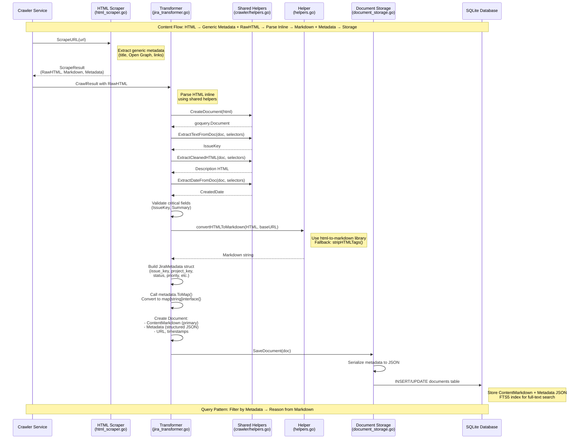

# Quaero Architecture: Markdown + Metadata Design

## 1. Overview

Quaero implements a **canonical format strategy** where all content from diverse sources (Jira, Confluence, GitHub) is transformed into two complementary parts:

1. **Generic Markdown** - Clean, unified text format ideal for AI processing and reasoning
2. **Rich Metadata** - Structured JSON with source-specific data for efficient filtering and faceted search

This design enables a powerful two-step query pattern:
- **Step 1:** Filter documents using structured metadata (SQL WHERE clauses on JSON fields)
- **Step 2:** Reason and synthesize answers from clean Markdown content of filtered results

## 2. Design Philosophy

### Why Markdown?

- **Unified Format:** All content (Jira issues, Confluence pages, GitHub code) becomes consistent text
- **LLM-Friendly:** Clean format ideal for language model reasoning and synthesis
- **Full-Text Search:** Works seamlessly with SQLite FTS5 for fast text search
- **Human-Readable:** Easy to inspect, debug, and understand
- **Version Control:** Text format enables diffs and change tracking

### Why Structured Metadata?

- **Efficient Filtering:** Query by status, priority, dates without parsing content
- **Faceted Search:** Group by project, space, author, labels
- **Preserve Structure:** Maintain source-specific fields (issue keys, page IDs)
- **Enable Cross-References:** Track relationships between documents
- **Query Optimization:** Filter first, then reason from smaller result sets

### The Power of Separation

By separating **content** (markdown) from **structure** (metadata), we get:
- Fast filtering via metadata indexes
- Deep reasoning via markdown content
- Schema flexibility (add metadata fields without migrations)
- Source independence (same query pattern across Jira/Confluence/GitHub)

## 3. Content Flow Pipeline



### Pipeline Components

**1. Crawler Service** (`internal/services/crawler/service.go`)
- Fetches HTML pages from Jira, Confluence using authenticated HTTP client
- Stores raw HTML in `CrawlResult` objects
- Respects rate limits and handles authentication

**2. HTML Scraper** (`internal/services/crawler/html_scraper.go`)
- Extracts generic metadata from HTML pages (title, description, Open Graph, Twitter Card, JSON-LD)
- Generates markdown representation using html-to-markdown conversion
- Discovers links for crawling
- Produces `ScrapeResult` with RawHTML, Markdown, Metadata, and Links

**3. Shared Parsing Helpers** (`internal/services/crawler/helpers.go`)
- `CreateDocument()` - Creates goquery.Document from HTML string for CSS selector-based extraction
- `ExtractTextFromDoc()` - Tries multiple selectors in priority order, returns first match
- `ExtractMultipleTextsFromDoc()` - Collects text from all matching elements (for arrays)
- `ExtractCleanedHTML()` - Extracts and cleans HTML from selectors (removes UI elements)
- `ExtractDateFromDoc()` - Extracts dates with RFC3339 normalization
- `ParseJiraIssueKey()`, `ParseConfluencePageID()`, `ParseSpaceKey()` - Regex-based ID extraction
- `NormalizeStatus()` - Status normalization for canonical forms
- Used by transformers for source-specific metadata extraction

**4. Transformers** (`internal/services/atlassian/jira_transformer.go`, `confluence_transformer.go`)
- Subscribe to `EventCollectionTriggered` event (published every 5 minutes by scheduler)
- Parse RawHTML directly using CSS selectors and shared helpers from `crawler/helpers.go`
- Extract source-specific metadata (IssueKey, ProjectKey, Status, Priority for Jira; PageID, SpaceKey, Author for Confluence)
- Validate critical fields (IssueKey/Summary for Jira, PageID/PageTitle for Confluence)
- Convert HTML descriptions/content to Markdown
- Build typed metadata structs and convert to maps
- Save normalized `Document` structs to storage

**5. HTML-to-Markdown Conversion** (`internal/services/atlassian/helpers.go`)
- `convertHTMLToMarkdown()` uses `github.com/JohannesKaufmann/html-to-markdown` library
- Takes baseURL parameter for resolving relative links
- Fallback to `stripHTMLTags()` if conversion fails
- Logs conversion quality metrics (input/output lengths, warnings)

**6. Document Storage** (`internal/storage/sqlite/document_storage.go`)
- Smart upsert logic: preserves full content when upserting metadata-only documents
- Serializes metadata to JSON before storage
- Creates FTS5 full-text search index on title + content_markdown
- Deserializes metadata JSON on read

## 4. Markdown Storage Pipeline

Quaero converts HTML content to markdown format for LLM consumption and search indexing. The pipeline consists of five stages that ensure robust markdown generation and storage.

### Pipeline Stages

**1. HTML Scraping** (`html_scraper.go`)

The HTML scraper fetches and processes HTML content:
- Fetches HTML content from URLs via authenticated HTTP client
- Converts HTML to markdown using `github.com/JohannesKaufmann/html-to-markdown`
- Stores markdown in `ScrapeResult.Markdown` field (line 384)
- Uses base URL for resolving relative links in markdown
- Generates markdown for all successful page scrapes

**2. Metadata Storage** (`types.go`)

The `ToCrawlResult()` method converts scrape results to crawler results:
- Stores markdown in `CrawlResult.Metadata["markdown"]` (line 155)
- Also stores HTML in `metadata["html"]` for transformer parsing
- Stores plain text in `metadata["text_content"]` for fallback
- Body field contains HTML (not markdown) for backward compatibility with transformers
- All metadata fields preserved during conversion

**3. Metadata Propagation** (`service.go`)

The crawler service ensures metadata flows through the pipeline:
- Executes HTML scraping via `scraper.ScrapeURL()` (lines 1148-1158)
- Converts `ScrapeResult` to `CrawlResult` via `ToCrawlResult()` (line 1160)
- Merges scrape metadata (including markdown) into `item.Metadata` (lines 1219-1226)
- Propagates metadata to final `CrawlResult.Metadata` (lines 986-998)
- Markdown flows: `ScrapeResult` → `CrawlResult` → `item.Metadata` → final result
- Preserves job-specific metadata (job_id, source_type, entity_type)

**4. Document Transformation** (`jira_transformer.go`, `confluence_transformer.go`)

Transformers extract and convert content for document creation:
- Extract HTML from `CrawlResult` via `selectResultBody()` helper
- **Jira**: Extract description HTML (line 250), convert to markdown (line 345), store in document (line 429)
- **Confluence**: Extract content HTML (line 255), convert to markdown (line 325), store in document (line 398)
- Use `convertHTMLToMarkdown()` helper with base URL for link resolution
- Fallback to `stripHTMLTags()` if conversion produces empty output (configurable)
- Log conversion quality metrics for troubleshooting

**5. Database Persistence** (`document_storage.go`)

The storage layer handles markdown persistence:
- `SaveDocument()` persists `doc.ContentMarkdown` to `content_markdown` column (line 84)
- Smart upsert preserves full content when upserting metadata-only documents (lines 56-61)
- `scanDocument()` retrieves `contentMarkdown` from database (line 544)
- Populates `doc.ContentMarkdown` field on read (line 560)
- Batch scanning retrieves markdown for multiple documents (lines 628-629)

### Data Flow Diagram

```
HTML Page → HTMLScraper → ScrapeResult.Markdown
          ↓
          ToCrawlResult() → CrawlResult.Metadata["markdown"]
          ↓
          Metadata Merge → item.Metadata["markdown"]
          ↓
          Transformer → convertHTMLToMarkdown()
          ↓
          Document.ContentMarkdown → Database (content_markdown column)
```

### Configuration Options

**Output Format** - Controls markdown generation mode:
- `config.OutputFormat = "markdown"` - Generate markdown only
- `config.OutputFormat = "html"` - Store HTML only
- `config.OutputFormat = "both"` - Generate and store both formats

**Fallback Behavior** - Controls empty output handling:
- `enableEmptyOutputFallback = true` - Strip HTML tags if conversion produces empty output
- `enableEmptyOutputFallback = false` - Store empty markdown (default)

**Base URL** - Used for resolving relative links:
- Passed to markdown converter for link resolution
- Ensures internal links work correctly in markdown output
- Configured per-source based on `source.BaseURL`

### Conversion Helper Functions

**convertHTMLToMarkdown()** (`helpers.go` lines 198-266)

Main conversion function with quality logging:
- Creates markdown converter with base URL (line 209)
- Converts HTML to markdown using library (line 210)
- Handles conversion errors with fallback (lines 211-220)
- Detects empty output and applies fallback if enabled (lines 232-252)
- Logs quality metrics: input/output lengths, compression ratio, warnings (lines 222-263)

**stripHTMLTags()** (`helpers.go` lines 179-193)

Fallback function for failed conversions:
- Removes HTML tags using regex
- Cleans up whitespace
- Decodes HTML entities
- Returns plain text as last resort

**selectResultBody()** (`helpers.go` lines 107-140)

Helper for extracting HTML from crawler results:
- Prioritizes `metadata["html"]` for cleaned HTML parsing
- Falls back to `metadata["response_body"]` for backward compatibility
- Uses `result.Body` if it looks like HTML
- Does NOT fall back to markdown (preserves HTML for parsers)

### Troubleshooting

**Check Conversion Success:**
```bash
# Look for conversion log messages
grep "Converting HTML to markdown" service.log
grep "Markdown conversion completed" service.log
```

**Check for Empty Output:**
```bash
# Look for empty output warnings
grep "Markdown conversion produced empty output" service.log
```

**Verify Database Storage:**
```sql
-- Check markdown content in database
SELECT id, source_type, source_id, title,
       LENGTH(content_markdown) as markdown_length,
       SUBSTR(content_markdown, 1, 100) as markdown_preview
FROM documents
WHERE source_type IN ('jira', 'confluence')
LIMIT 10;
```

**Expected Results:**
- `markdown_length` should be > 0 for most documents
- `markdown_preview` should show markdown syntax (`#`, `*`, `[links]()`)
- No HTML tags (`<div>`, `<p>`) in markdown preview

**Quality Metrics:**

The pipeline logs conversion quality for troubleshooting:
- Input HTML length (bytes)
- Output markdown length (bytes)
- Compression ratio (output/input)
- Empty output warnings
- Conversion errors and fallback usage

### Known Limitations

**1. Markdown in CrawlResult.Metadata**

The markdown stored in `CrawlResult.Metadata["markdown"]` is generated by the initial HTML scraper and may differ from the final document markdown because:
- Transformers re-convert HTML using source-specific content extraction
- Different HTML regions may be selected (description vs full page content)
- This is by design - scraped markdown is generic, document markdown is source-specific

**2. Empty Output Fallback**

The `enableEmptyOutputFallback` configuration is currently hardcoded in transformers. Future enhancement: make this configurable per-source or per-job.

**3. Link Resolution**

Relative links are resolved using base URL, but:
- Links may still be broken if they reference dynamic content
- Some Jira/Confluence internal links may not work outside the platform
- Future enhancement: validate and mark broken links in markdown

## 5. Document Model

The core `Document` struct (`internal/models/document.go`) has these key fields:

```go
type Document struct {
    // Identity
    ID         string  // doc_{uuid}
    SourceType string  // jira, confluence, github
    SourceID   string  // Original ID from source (e.g., "BUG-123", "12345678")

    // Content (PRIMARY: Markdown format)
    Title           string
    ContentMarkdown string  // PRIMARY CONTENT FIELD
    DetailLevel     string  // "metadata" or "full" (Firecrawl-style layered crawling)

    // Metadata (source-specific structured data as JSON)
    Metadata map[string]interface{}  // Serialized JiraMetadata, ConfluenceMetadata, etc.
    URL      string                  // Link to original document

    // Sync tracking
    LastSynced       *time.Time
    SourceVersion    string
    ForceSyncPending bool

    // Timestamps
    CreatedAt time.Time
    UpdatedAt time.Time
}
```

**Key Design Decisions:**

- `ContentMarkdown` is the PRIMARY CONTENT field (line 25 in `document.go`)
- `Metadata` is `map[string]interface{}` for flexibility (line 32)
- `DetailLevel` enables Firecrawl-style incremental crawling (metadata vs full content)
- No embedding fields (Phase 5 removed embeddings in favor of FTS5 search)

## 5. Metadata Schemas

### JiraMetadata (lines 48-63 in `document.go`)

```go
type JiraMetadata struct {
    IssueKey       string      // e.g., "BUG-123", "STORY-456"
    ProjectKey     string      // e.g., "BUG", "STORY"
    IssueType      string      // Bug, Story, Task, Epic
    Status         string      // Open, In Progress, Resolved, Closed
    Priority       string      // High, Medium, Low
    Assignee       string      // Username
    Reporter       string      // Username
    Labels         []string    // Tags
    Components     []string    // Component names
    Summary        string      // Issue title
    ResolutionDate *time.Time  // When issue was resolved
    CreatedDate    *time.Time  // When issue was created
    UpdatedDate    *time.Time  // Last update timestamp
}
```

**Usage:** Populated by `jira_transformer.go` parseJiraIssue method (lines 192-437) by parsing HTML inline using shared helpers

**Query Examples:**
- Filter by status: `WHERE json_extract(metadata, '$.status') = 'In Progress'`
- Filter by priority: `WHERE json_extract(metadata, '$.priority') = 'High'`
- Filter by date range: `WHERE json_extract(metadata, '$.created_date') >= '2024-01-01'`

### ConfluenceMetadata (lines 65-76)

```go
type ConfluenceMetadata struct {
    PageID       string      // Unique page identifier
    PageTitle    string      // Page title
    SpaceKey     string      // Space identifier (e.g., "TEAM", "DOCS")
    SpaceName    string      // Human-readable space name
    Author       string      // Page author
    Version      int         // Page version number
    ContentType  string      // page, blogpost
    LastModified *time.Time  // When page was last modified
    CreatedDate  *time.Time  // When page was created
}
```

**Usage:** Populated by `confluence_transformer.go` parseConfluencePage method (lines 194-406) by parsing HTML inline using shared helpers

**Query Examples:**
- Filter by space: `WHERE json_extract(metadata, '$.space_key') = 'TEAM'`
- Filter by author: `WHERE json_extract(metadata, '$.author') = 'alice'`
- Filter by content type: `WHERE json_extract(metadata, '$.content_type') = 'page'`

### GitHubMetadata (lines 78-88)

```go
type GitHubMetadata struct {
    RepoName     string      // Repository name (e.g., "org/repo")
    FilePath     string      // File path within repository
    CommitSHA    string      // Commit SHA
    Branch       string      // Branch name
    FunctionName string      // Auto-extracted function/class name
    Author       string      // Commit author
    CommitDate   *time.Time  // Commit timestamp
    PullRequest  string      // Associated PR number (if any)
}
```

**Status:** Defined but not yet implemented (GitHub source coming in future phase)

### CrossSourceMetadata (lines 90-95)

```go
type CrossSourceMetadata struct {
    ReferencedIssues []string  // Jira keys found in content (e.g., ["BUG-123"])
    ReferencedPRs    []string  // GitHub PR numbers (e.g., ["#123"])
    ReferencedPages  []string  // Confluence page IDs mentioned
}
```

**Status:** Defined but **currently unpopulated** by transformers (see section 10 on limitations)

## 6. HTML to Markdown Conversion

The conversion process is implemented in `internal/services/atlassian/helpers.go`:

### convertHTMLToMarkdown() (lines 47-63)

```go
func convertHTMLToMarkdown(html string, baseURL string, logger arbor.ILogger) string {
    if html == "" {
        return ""
    }

    // Try HTML-to-markdown conversion
    mdConverter := md.NewConverter(baseURL, true, nil)
    converted, err := mdConverter.ConvertString(html)
    if err != nil {
        logger.Warn().Err(err).Msg("Failed to convert HTML to markdown, using fallback")
        // Fallback: strip HTML tags
        return stripHTMLTags(html)
    }

    return converted
}
```

**Key Features:**

- Uses `github.com/JohannesKaufmann/html-to-markdown` library (imported as `md` on line 8)
- Takes `baseURL` parameter to resolve relative links in markdown output
- Fallback mechanism: if conversion fails, calls `stripHTMLTags()` to remove HTML tags
- Logs warnings on conversion failures for debugging
- Enhanced with quality logging (see section 10)

### stripHTMLTags() Fallback (lines 34-45)

```go
func stripHTMLTags(html string) string {
    // Remove HTML tags using regex
    re := regexp.MustCompile(`<[^>]*>`)
    stripped := re.ReplaceAllString(html, "")

    // Clean up multiple whitespaces
    spaceRe := regexp.MustCompile(`\s+`)
    cleaned := spaceRe.ReplaceAllString(stripped, " ")

    return strings.TrimSpace(cleaned)
}
```

**Usage:** Safety net when markdown conversion fails - strips all HTML tags and cleans whitespace

## 7. HTML Parsing Details

### HTML Parsing Architecture

**Generic Parsing:** `html_scraper.go` (lines 536-636)
- Extracts standard metadata (title, description, Open Graph, Twitter Card, JSON-LD, canonical URL) using goquery
- Generates markdown representation of page content
- Discovers links for crawling
- Works with any HTML source without customization

**Specialized Parsing:** Transformers parse RawHTML directly for source-specific fields
- **Jira Transformer** (`jira_transformer.go` parseJiraIssue method, lines 192-437):
  - Extracts IssueKey, ProjectKey, Summary, Status, Priority, Assignee, Reporter, Labels, Components
  - Uses CSS selectors with multiple fallbacks for resilience against UI changes
  - Validates critical fields (IssueKey, Summary)
  - Parses dates and normalizes status values

- **Confluence Transformer** (`confluence_transformer.go` parseConfluencePage method, lines 194-406):
  - Extracts PageID, PageTitle, SpaceKey, SpaceName, Author, Version, ContentType
  - Uses CSS selectors with multiple fallbacks for resilience against UI changes
  - Validates critical fields (PageID, PageTitle)
  - Parses version numbers and determines content type

**Shared Helpers:** `crawler/helpers.go` provides reusable extraction utilities:
- `CreateDocument()` - Creates goquery.Document from HTML string for CSS selector-based extraction
- `ExtractTextFromDoc()` - Tries multiple selectors in priority order, returns first match
- `ExtractMultipleTextsFromDoc()` - Collects text from all matching elements (for labels, components, etc.)
- `ExtractCleanedHTML()` - Extracts and cleans HTML from selectors, removes UI elements (buttons, toolbars, comments)
- `ExtractDateFromDoc()` - Extracts dates with RFC3339 normalization, handles multiple date formats
- `ParseJiraIssueKey()` - Regex-based extraction of Jira issue keys (pattern: `[A-Z][A-Z0-9]+-\d+`)
- `ParseConfluencePageID()` - Regex-based extraction of Confluence page IDs from URLs
- `ParseSpaceKey()` - Regex-based extraction of Confluence space keys from URLs
- `NormalizeStatus()` - Status normalization to canonical forms (e.g., "TODO" → "To Do")

### Design Philosophy

- **html_scraper remains generic and reusable** for any HTML source
- **Source-specific extraction is handled by transformers** using shared helpers
- This keeps the crawler layer clean while allowing specialized metadata extraction where needed
- Shared helpers prevent code duplication and ensure consistent extraction behavior

### Why Inline Parsing in Transformers?

**Architectural Decision:**
- Jira/Confluence-specific fields are not available in standard HTML meta tags
- Extraction requires CSS selectors targeting specific page structure elements
- Multiple fallback selectors provide resilience against UI changes
- Inline parsing in transformers eliminates unnecessary abstraction layer

**Benefits:**
- **Self-contained:** Each transformer has all the logic it needs for its source type
- **Reduced indirection:** No jumping between parser and transformer files
- **Easier debugging:** All extraction logic for a source is in one place
- **Shared utilities:** Helper functions remain reusable across transformers
- **Future-proof:** New sources (GitHub, etc.) can follow the same pattern

**Example: Jira Issue Key Extraction**
```go
// Extract IssueKey with multiple fallbacks
issueKey := crawler.ExtractTextFromDoc(doc, []string{
    `[data-test-id="issue.views.issue-base.foundation.breadcrumbs.current-issue.item"]`,
    `#key-val`,
    `#issuekey-val`,
})
// Fallback: Parse from page title using regex
if issueKey == "" {
    titleText := doc.Find("title").First().Text()
    issueKey = crawler.ParseJiraIssueKey(titleText)
}
```

This pattern:
1. Tries modern data-test-id selectors first (most reliable)
2. Falls back to legacy ID selectors (#key-val)
3. Ultimate fallback: regex parsing from title tag
4. Ensures extraction works across different Jira versions and UI updates

## 8. Storage Implementation

The document storage layer (`internal/storage/sqlite/document_storage.go`) handles persistence:

### Smart Upsert Logic (lines 49-72)

```go
// Smart upsert: If existing doc has DetailLevel="full" and new doc is "metadata",
// preserve existing full content and only update metadata fields
```

**Key Features:**

- Prevents metadata-only updates from overwriting full content
- Detects conflicts and preserves richer content
- Logs upsert operations with detail level information

### Metadata Serialization (line 35)

```go
metadataJSON, err := json.Marshal(doc.Metadata)
```

**Storage Format:** Metadata map is serialized to JSON before INSERT/UPDATE

### Metadata Deserialization (lines 584-588)

```go
if metadataStr != "" {
    if err := json.Unmarshal([]byte(metadataStr), &doc.Metadata); err != nil {
        return nil, fmt.Errorf("failed to unmarshal metadata: %w", err)
    }
}
```

**Read Pattern:** JSON string is unmarshalled back into `map[string]interface{}`

### FTS5 Full-Text Search

The storage layer creates a FTS5 virtual table for fast full-text search:

```sql
CREATE VIRTUAL TABLE documents_fts USING fts5(title, content_markdown);
```

**Query Pattern:**
```sql
SELECT * FROM documents WHERE documents.id IN (
    SELECT rowid FROM documents_fts WHERE documents_fts MATCH 'search query'
);
```

## 9. Two-Step Query Pattern

The Markdown+Metadata architecture enables efficient AI-powered query processing:

### Step 1: Filter Documents Using Metadata

Use SQL WHERE clauses on JSON fields to narrow down relevant documents:

```sql
-- Find high-priority in-progress Jira issues
SELECT * FROM documents
WHERE source_type = 'jira'
  AND json_extract(metadata, '$.status') = 'In Progress'
  AND json_extract(metadata, '$.priority') = 'High';

-- Find Confluence pages in "TEAM" space modified last week
SELECT * FROM documents
WHERE source_type = 'confluence'
  AND json_extract(metadata, '$.space_key') = 'TEAM'
  AND json_extract(metadata, '$.last_modified') >= date('now', '-7 days');
```

### Step 2: Reason from Markdown Content

Once filtered, analyze the `content_markdown` field with LLM:

```python
# Pseudocode
filtered_docs = db.query("SELECT * FROM documents WHERE ...")
markdown_texts = [doc.content_markdown for doc in filtered_docs]

# Send to LLM for reasoning
prompt = f"""
Based on these {len(filtered_docs)} documents:

{markdown_texts[0]}
{markdown_texts[1]}
...

Question: {user_question}
"""
response = llm.generate(prompt)
```

**Benefits:**

- Filter first reduces LLM token usage (only send relevant docs)
- Metadata enables precise filtering (status, priority, dates)
- Markdown provides clean text for reasoning (no HTML noise)
- Citations easy to add (include `doc.url` and `doc.source_id`)

## 10. Known Limitations

### 1. Job Results Unavailable After Restart

**Issue:** `CrawlResult` objects are only stored in-memory during job execution and are not persisted to the database.

**Impact:** After service restart, `getJobResults()` in `atlassian/helpers.go` (lines 21-32) returns empty slice with warning.

**Workaround:** Re-crawl to regenerate results.

**Future Fix:** Persist `CrawlResult` objects to enable post-restart transformation.

### 2. CrossSourceMetadata Not Populated

**Issue:** `CrossSourceMetadata` struct is defined but never populated by transformers.

**Impact:** No extraction of cross-references from content (Jira keys, GitHub PR numbers, Confluence page IDs).

**Location:** `internal/models/document.go` lines 90-95

**Future Fix:** Implement cross-reference extraction using `internal/services/identifiers/extractor.go` service.

### 3. Limited Markdown Conversion Quality Logging

**Issue:** Before recent enhancements, `convertHTMLToMarkdown()` only logged errors, not conversion quality metrics.

**Impact:** No visibility into conversion success rate, size ratios, or empty outputs.

**Fix:** Enhanced logging added (see `docs/markdown_conversion_quality.md` for details).

### 4. No Markdown Output Validation

**Issue:** Transformers don't validate that markdown conversion produced meaningful output (could be empty or whitespace-only).

**Impact:** Empty markdown documents may be stored, reducing search quality.

**Future Fix:** Add validation checks after markdown conversion (see enhancements in transformers).

## 11. Future Enhancements

### High Priority

1. **Persist CrawlResult Objects**
   - Enable post-restart transformation
   - Store raw HTML/JSON responses in database
   - Add background job to process stored results

2. **Populate CrossSourceMetadata**
   - Use `identifiers/extractor.go` service to extract cross-references
   - Parse Jira keys (pattern: `[A-Z][A-Z0-9]+-\d+`)
   - Parse GitHub PR references (pattern: `#\d+` or full URLs)
   - Parse Confluence page IDs from URLs or titles

3. **Add Markdown Quality Metrics**
   - Log conversion success rate across documents
   - Track HTML → Markdown size ratios
   - Monitor fallback usage frequency
   - Alert on high failure rates

4. **Implement Markdown Output Validation**
   - Check for empty or whitespace-only output
   - Validate minimum content length (e.g., > 10 characters)
   - Warn on suspiciously short outputs
   - Log validation failures for debugging

### Medium Priority

5. **Incremental Crawling with DetailLevel**
   - Initial crawl: `DetailLevel="metadata"` (fast discovery)
   - Follow-up: `DetailLevel="full"` (selective deep crawl)
   - Prioritize high-value documents for full content

6. **Metadata Completeness Scoring**
   - Calculate percentage of optional fields populated
   - Track metadata quality over time
   - Identify sources with incomplete data

7. **Custom HTML Conversion Rules**
   - Add Jira-specific macro handling
   - Preserve code blocks with language hints
   - Handle embedded media (images, videos)
   - Improve table formatting in markdown

### Low Priority

8. **Bidirectional Reference Tracking**
   - Store both "references" and "referenced_by" relationships
   - Enable graph queries (e.g., "impact analysis")
   - Build document relationship maps

9. **Cross-Reference API Endpoints**
   - `/api/documents/{id}/references` - Get outgoing references
   - `/api/documents/{id}/referenced-by` - Get incoming references
   - `/api/documents/{id}/related` - Find related documents

10. **UI Visualization of Relationships**
    - Document graph visualization
    - Link highlights in document viewer
    - Related documents sidebar

## 12. Metadata Schema Evolution

The `ToMap()` pattern enables schema evolution without breaking changes:

### How It Works (lines 109-158 in `models/document.go`)

```go
// Each metadata type has a ToMap() method
func (j *JiraMetadata) ToMap() (map[string]interface{}, error) {
    data, err := json.Marshal(j)
    if err != nil {
        return nil, err
    }
    var m map[string]interface{}
    if err := json.Unmarshal(data, &m); err != nil {
        return nil, err
    }
    return m, nil
}
```

### Benefits

- **Add Fields Easily:** Add new fields to typed structs without database migrations
- **Backward Compatible:** Old documents still readable (missing fields = nil/zero values)
- **Type Safety:** Compile-time checks when building metadata
- **Flexibility:** Each source can have unique metadata schema
- **Future-Proof:** New sources (GitHub, Slack) can define their own metadata types

### Example: Adding a New Field

```go
// Before
type JiraMetadata struct {
    IssueKey string
    Status   string
    // ...
}

// After (no migration needed!)
type JiraMetadata struct {
    IssueKey     string
    Status       string
    StoryPoints  int  // NEW FIELD
    // ...
}
```

**Result:** New documents get `story_points` in metadata, old documents still work (field missing or null).

## 13. Crawler Service Logging

The crawler service provides comprehensive INFO-level logging to diagnose crawl behavior, link discovery decisions, and filtering effectiveness. Enhanced logging helps troubleshoot issues and optimize crawl configurations.

### Log Levels

- **INFO:** Summaries, decisions, milestones (link discovery, filtering, enqueueing)
- **DEBUG:** Individual item processing, detailed traces (each link, each filter match)
- **WARN:** Unexpected conditions (zero links, all filtered, auth issues)
- **ERROR:** Failures requiring attention (scraping errors, database errors)

### Key INFO Logs to Monitor

#### 1. Link Discovery Decision (workerLoop)

**Message:** `"Link discovery enabled - will extract and follow links"`

**When:** Before extracting links from a successfully processed page

**Fields:**
- `job_id` - Job identifier
- `url` - Current URL being processed
- `follow_links` - Configuration value (true/false)
- `depth` - Current depth in the crawl tree
- `max_depth` - Maximum allowed depth (0 = unlimited)
- `will_discover_links` - Explicit decision indicator (always true for this log)

**Purpose:** Confirms recursive crawling is active and shows the decision point clearly

**Database Persistence:** Sampled (every 10th URL) to avoid database bloat

**Example:**
```json
{
  "level": "info",
  "job_id": "job_abc123",
  "url": "https://company.atlassian.net/browse/BUG-123",
  "follow_links": true,
  "depth": 1,
  "max_depth": 3,
  "will_discover_links": true,
  "message": "Link discovery enabled - will extract and follow links"
}
```

#### 2. Link Filtering Complete (discoverLinks)

**Message:** `"Link filtering complete"`

**When:** After applying all filters (source-specific + include/exclude patterns) to discovered links

**Fields:**
- `total_discovered` - Total links found on the page
- `after_source_filter` - Links remaining after Jira/Confluence source filtering
- `after_pattern_filter` - Links remaining after include/exclude pattern filtering
- `filtered_out` - Total number of links filtered (= total_discovered - after_pattern_filter)
- `source_type` - Source type (jira, confluence, etc.)
- `parent_depth` - Depth of the page containing these links
- `follow_links` - Configuration value
- `max_depth` - Maximum allowed depth

**Purpose:** Shows filtering effectiveness, helps tune include/exclude patterns

**Database Persistence:** Always persisted for every page with links

**Example:**
```json
{
  "level": "info",
  "total_discovered": 25,
  "after_source_filter": 20,
  "after_pattern_filter": 12,
  "filtered_out": 13,
  "source_type": "jira",
  "parent_depth": 1,
  "follow_links": "true",
  "max_depth": 3,
  "message": "Link filtering complete"
}
```

#### 3. Link Enqueueing Complete (enqueueLinks)

**Message:** `"Link enqueueing complete"`

**When:** After adding filtered links to the crawl queue

**Fields:**
- `job_id` - Job identifier
- `parent_url` - URL of the page containing these links
- `enqueued_count` - Number of links successfully enqueued
- `total_links` - Total number of links passed to enqueue function
- `sample_urls` - Array of first 3 URLs (for visibility without log spam)

**Purpose:** Confirms links are being followed, shows examples of discovered links

**Database Persistence:** Always persisted with sample URLs

**Example:**
```json
{
  "level": "info",
  "job_id": "job_abc123",
  "parent_url": "https://company.atlassian.net/browse/BUG-123",
  "enqueued_count": 12,
  "total_links": 12,
  "sample_urls": [
    "https://company.atlassian.net/browse/BUG-124",
    "https://company.atlassian.net/browse/BUG-125",
    "https://company.atlassian.net/projects/BUG"
  ],
  "message": "Link enqueueing complete"
}
```

#### 4. Pattern Filtering Summary (filterLinks)

**Message:** `"Pattern filtering summary"`

**When:** After applying include/exclude patterns to discovered links

**Fields:**
- `excluded_count` - Number of links excluded by exclude_patterns
- `not_included_count` - Number of links not matching any include_patterns
- `passed_count` - Number of links that passed filtering

**Purpose:** Shows pattern effectiveness, helps diagnose over-filtering or permissive patterns

**Database Persistence:** Not persisted directly (included in parent discoverLinks log)

**Example:**
```json
{
  "level": "info",
  "excluded_count": 3,
  "not_included_count": 5,
  "passed_count": 12,
  "message": "Pattern filtering summary"
}
```

### Troubleshooting Guide

#### Problem: Job completes with only 1 result (seed URL)

**Check:**
1. Look for `"Link discovery enabled"` log - is it appearing?
2. Check `follow_links` field - is it `true`?
3. Check `depth` vs `max_depth` - is depth limit reached?
4. Look for `"Link filtering complete"` log - are links being discovered?

**Common Causes:**
- `follow_links=false` in job or source configuration
- `max_depth=0` or `max_depth=1` (too restrictive)
- Seed URL has no links
- All links filtered out by patterns

#### Problem: All links filtered out

**Check:**
1. Look for `"Link filtering complete"` log
   - Compare `total_discovered` vs `after_pattern_filter`
   - Check `filtered_out` count
2. Look for `"Pattern filtering summary"` log
   - Check `excluded_count` and `not_included_count`
   - Compare with `passed_count`
3. Check WARNING log with sample URLs
   - Shows which links were filtered and why

**Action:**
- Adjust `include_patterns` to be more permissive
- Review `exclude_patterns` for overly broad matches
- Check source-level filters for conflicts

#### Problem: Links discovered but not followed

**Check:**
1. Look for `"Link enqueueing complete"` log
   - Is `enqueued_count` > 0?
   - Check `sample_urls` - are they correct?
2. Check queue diagnostics
   - Is queue growing?
   - Are there queue capacity issues?
3. Check worker logs
   - Are workers processing enqueued URLs?
   - Look for errors during URL processing

**Common Causes:**
- Queue at capacity (check `queue_capacity` setting)
- Workers stopped or crashed
- Rate limiting blocking workers
- Authentication failures

#### Problem: Unexpected filtering behavior

**Check:**
1. Review filter configuration in job step config
2. Review source-level default filters
3. Check priority order: Job config > Source filters > No filtering
4. Look for `"Using follow_links from job config"` or `"Using follow_links from source default"` logs

**Action:**
- Verify include/exclude patterns are comma-separated strings
- Test patterns in isolation (empty one, populate the other)
- Check logs for pattern match details

### Database Logs

All INFO level logs are persisted to the job database and accessible via:

**API Endpoint:** `GET /api/jobs/{job_id}/logs`
- Returns array of log entries with level, message, timestamp
- Filterable by level (`level=info`)
- Sortable by timestamp

**UI:** Job details page, logs tab
- Displays logs in chronological order
- Color-coded by level (info=blue, warn=yellow, error=red)
- Search and filter capabilities

**Database:** `job_logs` table
- Columns: `job_id`, `level`, `message`, `timestamp`
- Indexed by `job_id` for fast retrieval
- Query: `SELECT * FROM job_logs WHERE job_id = ? AND level = 'info' ORDER BY timestamp`

**Example Query:**
```sql
-- Get all INFO logs for a specific job
SELECT timestamp, message
FROM job_logs
WHERE job_id = 'job_abc123'
  AND level = 'info'
ORDER BY timestamp;

-- Count INFO logs by message type
SELECT
  CASE
    WHEN message LIKE '%Link discovery enabled%' THEN 'discovery'
    WHEN message LIKE '%Link filtering complete%' THEN 'filtering'
    WHEN message LIKE '%Link enqueueing complete%' THEN 'enqueueing'
    ELSE 'other'
  END as log_type,
  COUNT(*) as count
FROM job_logs
WHERE job_id = 'job_abc123'
  AND level = 'info'
GROUP BY log_type;
```

### Performance Notes

**Log Volume:**
- Link discovery decision: 1 log per processed URL (sampled for database: every 10th)
- Link filtering: 1 log per page with links (always persisted)
- Link enqueueing: 1 log per batch of links (always persisted with samples)
- Pattern filtering: 1 log per filtering operation (not persisted directly)

**Total:** Approximately 3-5 INFO logs per crawled page (reasonable for diagnostics)

**Database Impact:**
- Sampled persistence reduces database writes (every 10th URL for discovery logs)
- Sample URLs limited to 3 to avoid log spam
- Individual link logs remain at DEBUG level (not persisted by default)

**Console Output:**
- All INFO logs appear in console/stdout for real-time monitoring
- Structured JSON format for easy parsing and log aggregation
- Compatible with log aggregation tools (Splunk, ELK, etc.)

### Log Examples in Context

#### Successful Crawl with Link Following

```
[INFO] Link discovery enabled - will extract and follow links
  job_id=job_abc123 url=https://company.atlassian.net/browse/BUG-123
  follow_links=true depth=1 max_depth=3 will_discover_links=true

[INFO] Link filtering complete
  total_discovered=25 after_source_filter=20 after_pattern_filter=12
  filtered_out=13 source_type=jira parent_depth=1

[INFO] Pattern filtering summary
  excluded_count=3 not_included_count=5 passed_count=12

[INFO] Link enqueueing complete
  job_id=job_abc123 parent_url=https://company.atlassian.net/browse/BUG-123
  enqueued_count=12 total_links=12
  sample_urls=[...BUG-124, ...BUG-125, ...projects/BUG]
```

#### All Links Filtered Out (Warning)

```
[INFO] Link discovery enabled - will extract and follow links
  job_id=job_abc123 url=https://company.atlassian.net/browse/BUG-123
  follow_links=true depth=1 max_depth=3

[INFO] Link filtering complete
  total_discovered=25 after_source_filter=20 after_pattern_filter=0
  filtered_out=25 source_type=jira

[WARN] All links filtered out from page
  url=https://company.atlassian.net/browse/BUG-123
  excluded_samples=[...admin, ...logout]
  not_included_samples=[...settings, ...profile]
  message="Check include/exclude patterns"
```

#### Link Discovery Skipped (DEBUG Level)

```
[DEBUG] Skipping link discovery - FollowLinks disabled or depth limit reached
  job_id=job_abc123 url=https://company.atlassian.net/browse/BUG-123
  follow_links=false depth=2 max_depth=2
```

### Configuration Options

**Enable/Disable Follow Links:**
```json
{
  "step": {
    "config": {
      "follow_links": true,
      "max_depth": 3
    }
  }
}
```

**Configure Link Filtering:**
```json
{
  "step": {
    "config": {
      "include_patterns": ["browse", "projects", "issues"],
      "exclude_patterns": ["admin", "logout", "settings"]
    }
  }
}
```

**Adjust Polling Interval (Affects Log Frequency):**
```toml
[crawler]
worker_count = 5
queue_capacity = 1000
request_timeout = 30
```

## 15. Immediate Document Saving During Crawling

The crawler service now saves documents immediately after successful page crawls, eliminating the 5+ minute delay previously caused by the transformer-based approach. This provides instant document availability for search and chat while maintaining backward compatibility with transformers for metadata enhancement.

### Architecture Change

**Previous Flow (Async, Deferred):**
1. Crawler fetches and stores raw HTML in memory
2. Scheduler publishes `EventCollectionTriggered` every 5 minutes
3. Transformers (Jira/Confluence) process stored results
4. Transformers create documents with markdown
5. Documents available after 5+ minute delay

**New Flow (Immediate, Synchronous):**
1. Crawler fetches HTML and extracts markdown
2. **NEW**: Create document immediately after successful crawl
3. **NEW**: Save document to database synchronously
4. Document available within milliseconds
5. Transformers can still enhance documents later

### Implementation Details

**Location:** `internal/services/crawler/service.go` lines 871-964 (in `workerLoop()`)

**Trigger:** After result is stored in memory and before progress update

**Conditions for Saving:**
1. `result.Error == ""` (successful crawl)
2. `result.Metadata["markdown"]` exists and is non-empty
3. Document saving error doesn't fail the crawl job

### Document Creation Logic

**Source Type Extraction:**
- **Priority 1:** `item.Metadata["source_type"]` (from job metadata)
- **Priority 2:** URL pattern matching (e.g., "atlassian.net/wiki" → "confluence")
- **Default:** "crawler" if unable to determine

**Title Extraction:**
- **Priority 1:** `result.Metadata["title"]` (from HTML scraper)
- **Priority 2:** Last segment of URL path
- **Default:** Full URL

**Document Structure:**
```go
doc := models.Document{
    ID:              "doc_" + uuid.New().String(),
    SourceType:      sourceType,
    SourceID:        item.URL, // Enables deduplication
    Title:           title,
    ContentMarkdown: markdown,
    DetailLevel:     models.DetailLevelFull,
    Metadata:        result.Metadata, // Preserves all scraped metadata
    URL:             item.URL,
    CreatedAt:       time.Now(),
    UpdatedAt:       time.Now(),
}
```

### Deduplication Strategy

**Database UNIQUE Constraint:** `(source_type, source_id)`

**Using URL as SourceID:**
- Same URL crawled multiple times → same `source_id`
- Database upsert behavior automatically handles duplicates
- No manual deduplication logic needed

### Error Handling

**Non-Blocking Errors:**
- Document save failures are logged at ERROR level
- Crawl job continues processing other URLs
- Failed document saves don't affect crawler progress

**Logging:**
```go
// On success (INFO level):
s.logger.Info().
    Str("job_id", jobID).
    Str("document_id", doc.ID).
    Str("title", doc.Title).
    Str("url", doc.URL).
    Int("markdown_length", len(doc.ContentMarkdown)).
    Str("source_type", doc.SourceType).
    Msg("Document saved immediately after crawling")

// On failure (ERROR level):
s.logger.Error().
    Err(err).
    Str("job_id", jobID).
    Str("document_id", doc.ID).
    Str("title", doc.Title).
    Str("url", doc.URL).
    Msg("Failed to save document immediately after crawling")
```

**Database Persistence:** Success/failure messages are persisted to job logs (sampled: every 10th document to avoid bloat)

### Relationship with Transformers

**Transformers Remain Operational:**
- Jira/Confluence transformers continue to run on schedule
- Extract structured metadata (issue keys, page IDs, etc.)
- Enhance documents with source-specific data
- Database upsert ensures no duplicates

**Enhancement Workflow:**
1. **Immediate Save:** Basic document with markdown content (instant availability)
2. **Transformer Enhancement:** Adds structured metadata fields later
3. **Database Upsert:** Updates existing document without duplication

**Example:**

```
Time 0ms: Crawler saves document
{
  "id": "doc_abc123",
  "source_type": "crawler",
  "title": "BUG-123",
  "content_markdown": "# Bug Description\n..."
}

Time 5min: Jira transformer enhances document
{
  "id": "doc_abc123",
  "source_type": "jira",
  "title": "BUG-123: Login fails",
  "content_markdown": "# Bug Description\n...",
  "metadata": {
    "issue_key": "BUG-123",
    "status": "In Progress",
    "priority": "High"
  }
}
```

### Performance Impact

**Overhead:**
- ~1-2ms per URL (single database write)
- Negligible compared to HTTP request time (100-1000ms)
- No blocking operations or goroutines

**Benefits:**
- Documents available immediately for search
- Chat can use documents within milliseconds
- No 5-minute wait for transformers
- Better user experience during crawls

**Database Considerations:**
- SQLite write performance: ~1ms for small documents
- Mutex in DocumentStorage prevents SQLITE_BUSY errors
- No additional locking or concurrency management needed

### Configuration

**No Additional Config Required:**
- Feature is always enabled during crawling
- Relies on existing `documentStorage` dependency
- Uses same database connection as transformers

**Dependency Injection:**
- Added `documentStorage` field to crawler `Service` struct
- Passed via constructor parameter
- Initialized in `internal/app/app.go` line 244

### Testing Considerations

**Verify:**
1. Documents saved immediately after crawling (query database during job)
2. Markdown content populated correctly
3. Source type correctly identified
4. Title extraction works for various URL patterns
5. Error handling doesn't crash crawler
6. Database persistence via job logs
7. Transformers can still update documents
8. No duplicate documents created

**Test Coverage:**
- Unit tests in `internal/services/crawler/service_test.go`
- Mock DocumentStorage implementation for isolation
- Integration tests verify end-to-end flow

### Troubleshooting

**Problem: Documents not appearing immediately**

**Check:**
1. Look for `"Document saved immediately after crawling"` INFO logs
2. Verify markdown exists in `result.Metadata["markdown"]`
3. Check for ERROR logs indicating save failures
4. Query database directly: `SELECT * FROM documents WHERE url LIKE '%pattern%'`

**Problem: Duplicate documents created**

**Check:**
1. Verify UNIQUE constraint on `(source_type, source_id)` exists
2. Check that URL is being used as `source_id`
3. Review upsert behavior in DocumentStorage

**Problem: Document save errors**

**Check:**
1. ERROR logs with document details
2. Database connection status
3. Mutex deadlocks (unlikely but check logs)
4. Disk space and permissions

### Backward Compatibility

**Transformers:**
- No changes needed to existing transformer code
- Continue to operate on scheduled events
- Upsert behavior prevents conflicts

**Job Execution:**
- No changes to job configuration required
- Works with all existing job types
- Compatible with manual and scheduled jobs

**Database Schema:**
- Uses existing `documents` table
- No new columns or indexes needed
- Leverages UNIQUE constraint for deduplication

## Conclusion

The Markdown+Metadata architecture provides:

✅ **Unified content format** across all sources (Jira, Confluence, GitHub)
✅ **Efficient filtering** via structured metadata (SQL queries)
✅ **Deep reasoning** via clean markdown content (LLM-friendly)
✅ **Schema flexibility** via JSON serialization (no migrations)
✅ **Full-text search** via SQLite FTS5 indexes
✅ **Future-proof design** for new sources and features

This design balances **performance** (fast metadata filtering) with **intelligence** (markdown reasoning), enabling powerful AI-powered knowledge retrieval.
