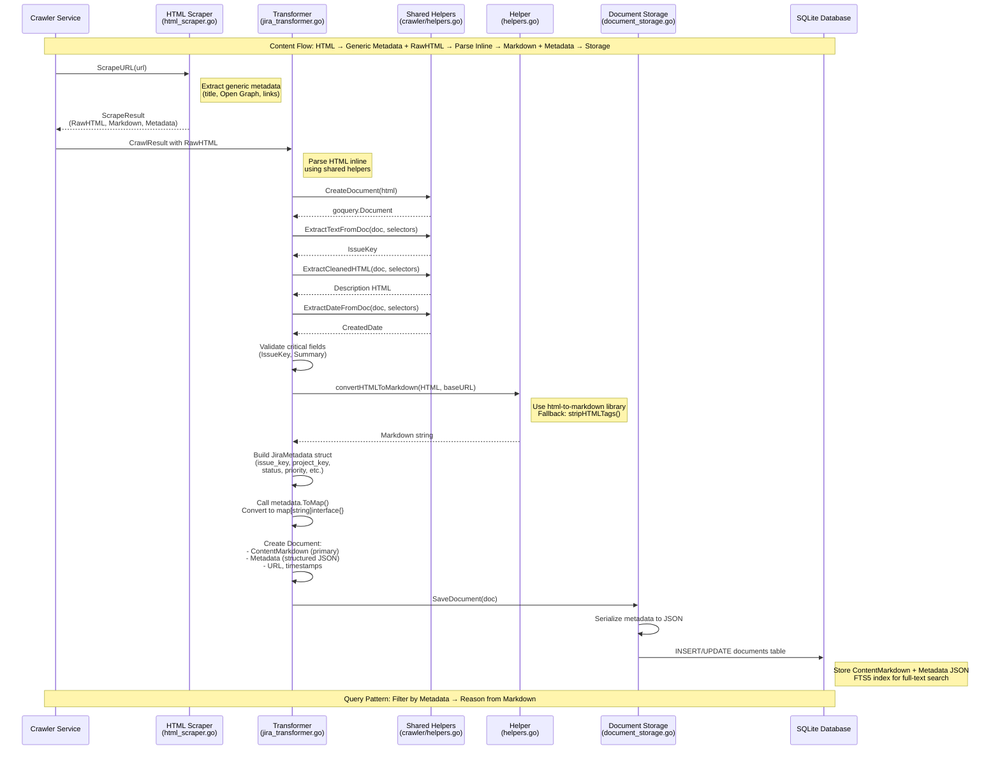

# Quaero Architecture: Markdown + Metadata Design

## 1. Overview

Quaero implements a **canonical format strategy** where all content from diverse sources (Jira, Confluence, GitHub) is transformed into two complementary parts:

1. **Generic Markdown** - Clean, unified text format ideal for AI processing and reasoning
2. **Rich Metadata** - Structured JSON with source-specific data for efficient filtering and faceted search

This design enables a powerful two-step query pattern:
- **Step 1:** Filter documents using structured metadata (SQL WHERE clauses on JSON fields)
- **Step 2:** Reason and synthesize answers from clean Markdown content of filtered results

## 2. Design Philosophy

### Why Markdown?

- **Unified Format:** All content (Jira issues, Confluence pages, GitHub code) becomes consistent text
- **LLM-Friendly:** Clean format ideal for language model reasoning and synthesis
- **Full-Text Search:** Works seamlessly with SQLite FTS5 for fast text search
- **Human-Readable:** Easy to inspect, debug, and understand
- **Version Control:** Text format enables diffs and change tracking

### Why Structured Metadata?

- **Efficient Filtering:** Query by status, priority, dates without parsing content
- **Faceted Search:** Group by project, space, author, labels
- **Preserve Structure:** Maintain source-specific fields (issue keys, page IDs)
- **Enable Cross-References:** Track relationships between documents
- **Query Optimization:** Filter first, then reason from smaller result sets

### The Power of Separation

By separating **content** (markdown) from **structure** (metadata), we get:
- Fast filtering via metadata indexes
- Deep reasoning via markdown content
- Schema flexibility (add metadata fields without migrations)
- Source independence (same query pattern across Jira/Confluence/GitHub)

## 3. Content Flow Pipeline



### Pipeline Components

**1. Crawler Service** (`internal/services/crawler/service.go`)
- Fetches HTML pages from Jira, Confluence using authenticated HTTP client
- Stores raw HTML in `CrawlResult` objects
- Respects rate limits and handles authentication

**2. HTML Scraper** (`internal/services/crawler/html_scraper.go`)
- Extracts generic metadata from HTML pages (title, description, Open Graph, Twitter Card, JSON-LD)
- Generates markdown representation using html-to-markdown conversion
- Discovers links for crawling
- Produces `ScrapeResult` with RawHTML, Markdown, Metadata, and Links

**3. Shared Parsing Helpers** (`internal/services/crawler/helpers.go`)
- `CreateDocument()` - Creates goquery.Document from HTML string for CSS selector-based extraction
- `ExtractTextFromDoc()` - Tries multiple selectors in priority order, returns first match
- `ExtractMultipleTextsFromDoc()` - Collects text from all matching elements (for arrays)
- `ExtractCleanedHTML()` - Extracts and cleans HTML from selectors (removes UI elements)
- `ExtractDateFromDoc()` - Extracts dates with RFC3339 normalization
- `ParseJiraIssueKey()`, `ParseConfluencePageID()`, `ParseSpaceKey()` - Regex-based ID extraction
- `NormalizeStatus()` - Status normalization for canonical forms
- Used by transformers for source-specific metadata extraction

**4. Transformers** (`internal/services/atlassian/jira_transformer.go`, `confluence_transformer.go`)
- Subscribe to `EventCollectionTriggered` event (published every 5 minutes by scheduler)
- Parse RawHTML directly using CSS selectors and shared helpers from `crawler/helpers.go`
- Extract source-specific metadata (IssueKey, ProjectKey, Status, Priority for Jira; PageID, SpaceKey, Author for Confluence)
- Validate critical fields (IssueKey/Summary for Jira, PageID/PageTitle for Confluence)
- Convert HTML descriptions/content to Markdown
- Build typed metadata structs and convert to maps
- Save normalized `Document` structs to storage

**5. HTML-to-Markdown Conversion** (`internal/services/atlassian/helpers.go`)
- `convertHTMLToMarkdown()` uses `github.com/JohannesKaufmann/html-to-markdown` library
- Takes baseURL parameter for resolving relative links
- Fallback to `stripHTMLTags()` if conversion fails
- Logs conversion quality metrics (input/output lengths, warnings)

**6. Document Storage** (`internal/storage/sqlite/document_storage.go`)
- Smart upsert logic: preserves full content when upserting metadata-only documents
- Serializes metadata to JSON before storage
- Creates FTS5 full-text search index on title + content_markdown
- Deserializes metadata JSON on read

## 4. Document Model

The core `Document` struct (`internal/models/document.go`) has these key fields:

```go
type Document struct {
    // Identity
    ID         string  // doc_{uuid}
    SourceType string  // jira, confluence, github
    SourceID   string  // Original ID from source (e.g., "BUG-123", "12345678")

    // Content (PRIMARY: Markdown format)
    Title           string
    ContentMarkdown string  // PRIMARY CONTENT FIELD
    DetailLevel     string  // "metadata" or "full" (Firecrawl-style layered crawling)

    // Metadata (source-specific structured data as JSON)
    Metadata map[string]interface{}  // Serialized JiraMetadata, ConfluenceMetadata, etc.
    URL      string                  // Link to original document

    // Sync tracking
    LastSynced       *time.Time
    SourceVersion    string
    ForceSyncPending bool

    // Timestamps
    CreatedAt time.Time
    UpdatedAt time.Time
}
```

**Key Design Decisions:**

- `ContentMarkdown` is the PRIMARY CONTENT field (line 25 in `document.go`)
- `Metadata` is `map[string]interface{}` for flexibility (line 32)
- `DetailLevel` enables Firecrawl-style incremental crawling (metadata vs full content)
- No embedding fields (Phase 5 removed embeddings in favor of FTS5 search)

## 5. Metadata Schemas

### JiraMetadata (lines 48-63 in `document.go`)

```go
type JiraMetadata struct {
    IssueKey       string      // e.g., "BUG-123", "STORY-456"
    ProjectKey     string      // e.g., "BUG", "STORY"
    IssueType      string      // Bug, Story, Task, Epic
    Status         string      // Open, In Progress, Resolved, Closed
    Priority       string      // High, Medium, Low
    Assignee       string      // Username
    Reporter       string      // Username
    Labels         []string    // Tags
    Components     []string    // Component names
    Summary        string      // Issue title
    ResolutionDate *time.Time  // When issue was resolved
    CreatedDate    *time.Time  // When issue was created
    UpdatedDate    *time.Time  // Last update timestamp
}
```

**Usage:** Populated by `jira_transformer.go` parseJiraIssue method (lines 192-437) by parsing HTML inline using shared helpers

**Query Examples:**
- Filter by status: `WHERE json_extract(metadata, '$.status') = 'In Progress'`
- Filter by priority: `WHERE json_extract(metadata, '$.priority') = 'High'`
- Filter by date range: `WHERE json_extract(metadata, '$.created_date') >= '2024-01-01'`

### ConfluenceMetadata (lines 65-76)

```go
type ConfluenceMetadata struct {
    PageID       string      // Unique page identifier
    PageTitle    string      // Page title
    SpaceKey     string      // Space identifier (e.g., "TEAM", "DOCS")
    SpaceName    string      // Human-readable space name
    Author       string      // Page author
    Version      int         // Page version number
    ContentType  string      // page, blogpost
    LastModified *time.Time  // When page was last modified
    CreatedDate  *time.Time  // When page was created
}
```

**Usage:** Populated by `confluence_transformer.go` parseConfluencePage method (lines 194-406) by parsing HTML inline using shared helpers

**Query Examples:**
- Filter by space: `WHERE json_extract(metadata, '$.space_key') = 'TEAM'`
- Filter by author: `WHERE json_extract(metadata, '$.author') = 'alice'`
- Filter by content type: `WHERE json_extract(metadata, '$.content_type') = 'page'`

### GitHubMetadata (lines 78-88)

```go
type GitHubMetadata struct {
    RepoName     string      // Repository name (e.g., "org/repo")
    FilePath     string      // File path within repository
    CommitSHA    string      // Commit SHA
    Branch       string      // Branch name
    FunctionName string      // Auto-extracted function/class name
    Author       string      // Commit author
    CommitDate   *time.Time  // Commit timestamp
    PullRequest  string      // Associated PR number (if any)
}
```

**Status:** Defined but not yet implemented (GitHub source coming in future phase)

### CrossSourceMetadata (lines 90-95)

```go
type CrossSourceMetadata struct {
    ReferencedIssues []string  // Jira keys found in content (e.g., ["BUG-123"])
    ReferencedPRs    []string  // GitHub PR numbers (e.g., ["#123"])
    ReferencedPages  []string  // Confluence page IDs mentioned
}
```

**Status:** Defined but **currently unpopulated** by transformers (see section 10 on limitations)

## 6. HTML to Markdown Conversion

The conversion process is implemented in `internal/services/atlassian/helpers.go`:

### convertHTMLToMarkdown() (lines 47-63)

```go
func convertHTMLToMarkdown(html string, baseURL string, logger arbor.ILogger) string {
    if html == "" {
        return ""
    }

    // Try HTML-to-markdown conversion
    mdConverter := md.NewConverter(baseURL, true, nil)
    converted, err := mdConverter.ConvertString(html)
    if err != nil {
        logger.Warn().Err(err).Msg("Failed to convert HTML to markdown, using fallback")
        // Fallback: strip HTML tags
        return stripHTMLTags(html)
    }

    return converted
}
```

**Key Features:**

- Uses `github.com/JohannesKaufmann/html-to-markdown` library (imported as `md` on line 8)
- Takes `baseURL` parameter to resolve relative links in markdown output
- Fallback mechanism: if conversion fails, calls `stripHTMLTags()` to remove HTML tags
- Logs warnings on conversion failures for debugging
- Enhanced with quality logging (see section 10)

### stripHTMLTags() Fallback (lines 34-45)

```go
func stripHTMLTags(html string) string {
    // Remove HTML tags using regex
    re := regexp.MustCompile(`<[^>]*>`)
    stripped := re.ReplaceAllString(html, "")

    // Clean up multiple whitespaces
    spaceRe := regexp.MustCompile(`\s+`)
    cleaned := spaceRe.ReplaceAllString(stripped, " ")

    return strings.TrimSpace(cleaned)
}
```

**Usage:** Safety net when markdown conversion fails - strips all HTML tags and cleans whitespace

## 7. HTML Parsing Details

### HTML Parsing Architecture

**Generic Parsing:** `html_scraper.go` (lines 536-636)
- Extracts standard metadata (title, description, Open Graph, Twitter Card, JSON-LD, canonical URL) using goquery
- Generates markdown representation of page content
- Discovers links for crawling
- Works with any HTML source without customization

**Specialized Parsing:** Transformers parse RawHTML directly for source-specific fields
- **Jira Transformer** (`jira_transformer.go` parseJiraIssue method, lines 192-437):
  - Extracts IssueKey, ProjectKey, Summary, Status, Priority, Assignee, Reporter, Labels, Components
  - Uses CSS selectors with multiple fallbacks for resilience against UI changes
  - Validates critical fields (IssueKey, Summary)
  - Parses dates and normalizes status values

- **Confluence Transformer** (`confluence_transformer.go` parseConfluencePage method, lines 194-406):
  - Extracts PageID, PageTitle, SpaceKey, SpaceName, Author, Version, ContentType
  - Uses CSS selectors with multiple fallbacks for resilience against UI changes
  - Validates critical fields (PageID, PageTitle)
  - Parses version numbers and determines content type

**Shared Helpers:** `crawler/helpers.go` provides reusable extraction utilities:
- `CreateDocument()` - Creates goquery.Document from HTML string for CSS selector-based extraction
- `ExtractTextFromDoc()` - Tries multiple selectors in priority order, returns first match
- `ExtractMultipleTextsFromDoc()` - Collects text from all matching elements (for labels, components, etc.)
- `ExtractCleanedHTML()` - Extracts and cleans HTML from selectors, removes UI elements (buttons, toolbars, comments)
- `ExtractDateFromDoc()` - Extracts dates with RFC3339 normalization, handles multiple date formats
- `ParseJiraIssueKey()` - Regex-based extraction of Jira issue keys (pattern: `[A-Z][A-Z0-9]+-\d+`)
- `ParseConfluencePageID()` - Regex-based extraction of Confluence page IDs from URLs
- `ParseSpaceKey()` - Regex-based extraction of Confluence space keys from URLs
- `NormalizeStatus()` - Status normalization to canonical forms (e.g., "TODO" → "To Do")

### Design Philosophy

- **html_scraper remains generic and reusable** for any HTML source
- **Source-specific extraction is handled by transformers** using shared helpers
- This keeps the crawler layer clean while allowing specialized metadata extraction where needed
- Shared helpers prevent code duplication and ensure consistent extraction behavior

### Why Inline Parsing in Transformers?

**Architectural Decision:**
- Jira/Confluence-specific fields are not available in standard HTML meta tags
- Extraction requires CSS selectors targeting specific page structure elements
- Multiple fallback selectors provide resilience against UI changes
- Inline parsing in transformers eliminates unnecessary abstraction layer

**Benefits:**
- **Self-contained:** Each transformer has all the logic it needs for its source type
- **Reduced indirection:** No jumping between parser and transformer files
- **Easier debugging:** All extraction logic for a source is in one place
- **Shared utilities:** Helper functions remain reusable across transformers
- **Future-proof:** New sources (GitHub, etc.) can follow the same pattern

**Example: Jira Issue Key Extraction**
```go
// Extract IssueKey with multiple fallbacks
issueKey := crawler.ExtractTextFromDoc(doc, []string{
    `[data-test-id="issue.views.issue-base.foundation.breadcrumbs.current-issue.item"]`,
    `#key-val`,
    `#issuekey-val`,
})
// Fallback: Parse from page title using regex
if issueKey == "" {
    titleText := doc.Find("title").First().Text()
    issueKey = crawler.ParseJiraIssueKey(titleText)
}
```

This pattern:
1. Tries modern data-test-id selectors first (most reliable)
2. Falls back to legacy ID selectors (#key-val)
3. Ultimate fallback: regex parsing from title tag
4. Ensures extraction works across different Jira versions and UI updates

## 8. Storage Implementation

The document storage layer (`internal/storage/sqlite/document_storage.go`) handles persistence:

### Smart Upsert Logic (lines 49-72)

```go
// Smart upsert: If existing doc has DetailLevel="full" and new doc is "metadata",
// preserve existing full content and only update metadata fields
```

**Key Features:**

- Prevents metadata-only updates from overwriting full content
- Detects conflicts and preserves richer content
- Logs upsert operations with detail level information

### Metadata Serialization (line 35)

```go
metadataJSON, err := json.Marshal(doc.Metadata)
```

**Storage Format:** Metadata map is serialized to JSON before INSERT/UPDATE

### Metadata Deserialization (lines 584-588)

```go
if metadataStr != "" {
    if err := json.Unmarshal([]byte(metadataStr), &doc.Metadata); err != nil {
        return nil, fmt.Errorf("failed to unmarshal metadata: %w", err)
    }
}
```

**Read Pattern:** JSON string is unmarshalled back into `map[string]interface{}`

### FTS5 Full-Text Search

The storage layer creates a FTS5 virtual table for fast full-text search:

```sql
CREATE VIRTUAL TABLE documents_fts USING fts5(title, content_markdown);
```

**Query Pattern:**
```sql
SELECT * FROM documents WHERE documents.id IN (
    SELECT rowid FROM documents_fts WHERE documents_fts MATCH 'search query'
);
```

## 9. Two-Step Query Pattern

The Markdown+Metadata architecture enables efficient AI-powered query processing:

### Step 1: Filter Documents Using Metadata

Use SQL WHERE clauses on JSON fields to narrow down relevant documents:

```sql
-- Find high-priority in-progress Jira issues
SELECT * FROM documents
WHERE source_type = 'jira'
  AND json_extract(metadata, '$.status') = 'In Progress'
  AND json_extract(metadata, '$.priority') = 'High';

-- Find Confluence pages in "TEAM" space modified last week
SELECT * FROM documents
WHERE source_type = 'confluence'
  AND json_extract(metadata, '$.space_key') = 'TEAM'
  AND json_extract(metadata, '$.last_modified') >= date('now', '-7 days');
```

### Step 2: Reason from Markdown Content

Once filtered, analyze the `content_markdown` field with LLM:

```python
# Pseudocode
filtered_docs = db.query("SELECT * FROM documents WHERE ...")
markdown_texts = [doc.content_markdown for doc in filtered_docs]

# Send to LLM for reasoning
prompt = f"""
Based on these {len(filtered_docs)} documents:

{markdown_texts[0]}
{markdown_texts[1]}
...

Question: {user_question}
"""
response = llm.generate(prompt)
```

**Benefits:**

- Filter first reduces LLM token usage (only send relevant docs)
- Metadata enables precise filtering (status, priority, dates)
- Markdown provides clean text for reasoning (no HTML noise)
- Citations easy to add (include `doc.url` and `doc.source_id`)

## 10. Known Limitations

### 1. Job Results Unavailable After Restart

**Issue:** `CrawlResult` objects are only stored in-memory during job execution and are not persisted to the database.

**Impact:** After service restart, `getJobResults()` in `atlassian/helpers.go` (lines 21-32) returns empty slice with warning.

**Workaround:** Re-crawl to regenerate results.

**Future Fix:** Persist `CrawlResult` objects to enable post-restart transformation.

### 2. CrossSourceMetadata Not Populated

**Issue:** `CrossSourceMetadata` struct is defined but never populated by transformers.

**Impact:** No extraction of cross-references from content (Jira keys, GitHub PR numbers, Confluence page IDs).

**Location:** `internal/models/document.go` lines 90-95

**Future Fix:** Implement cross-reference extraction using `internal/services/identifiers/extractor.go` service.

### 3. Limited Markdown Conversion Quality Logging

**Issue:** Before recent enhancements, `convertHTMLToMarkdown()` only logged errors, not conversion quality metrics.

**Impact:** No visibility into conversion success rate, size ratios, or empty outputs.

**Fix:** Enhanced logging added (see `docs/markdown_conversion_quality.md` for details).

### 4. No Markdown Output Validation

**Issue:** Transformers don't validate that markdown conversion produced meaningful output (could be empty or whitespace-only).

**Impact:** Empty markdown documents may be stored, reducing search quality.

**Future Fix:** Add validation checks after markdown conversion (see enhancements in transformers).

## 11. Future Enhancements

### High Priority

1. **Persist CrawlResult Objects**
   - Enable post-restart transformation
   - Store raw HTML/JSON responses in database
   - Add background job to process stored results

2. **Populate CrossSourceMetadata**
   - Use `identifiers/extractor.go` service to extract cross-references
   - Parse Jira keys (pattern: `[A-Z][A-Z0-9]+-\d+`)
   - Parse GitHub PR references (pattern: `#\d+` or full URLs)
   - Parse Confluence page IDs from URLs or titles

3. **Add Markdown Quality Metrics**
   - Log conversion success rate across documents
   - Track HTML → Markdown size ratios
   - Monitor fallback usage frequency
   - Alert on high failure rates

4. **Implement Markdown Output Validation**
   - Check for empty or whitespace-only output
   - Validate minimum content length (e.g., > 10 characters)
   - Warn on suspiciously short outputs
   - Log validation failures for debugging

### Medium Priority

5. **Incremental Crawling with DetailLevel**
   - Initial crawl: `DetailLevel="metadata"` (fast discovery)
   - Follow-up: `DetailLevel="full"` (selective deep crawl)
   - Prioritize high-value documents for full content

6. **Metadata Completeness Scoring**
   - Calculate percentage of optional fields populated
   - Track metadata quality over time
   - Identify sources with incomplete data

7. **Custom HTML Conversion Rules**
   - Add Jira-specific macro handling
   - Preserve code blocks with language hints
   - Handle embedded media (images, videos)
   - Improve table formatting in markdown

### Low Priority

8. **Bidirectional Reference Tracking**
   - Store both "references" and "referenced_by" relationships
   - Enable graph queries (e.g., "impact analysis")
   - Build document relationship maps

9. **Cross-Reference API Endpoints**
   - `/api/documents/{id}/references` - Get outgoing references
   - `/api/documents/{id}/referenced-by` - Get incoming references
   - `/api/documents/{id}/related` - Find related documents

10. **UI Visualization of Relationships**
    - Document graph visualization
    - Link highlights in document viewer
    - Related documents sidebar

## 12. Metadata Schema Evolution

The `ToMap()` pattern enables schema evolution without breaking changes:

### How It Works (lines 109-158 in `models/document.go`)

```go
// Each metadata type has a ToMap() method
func (j *JiraMetadata) ToMap() (map[string]interface{}, error) {
    data, err := json.Marshal(j)
    if err != nil {
        return nil, err
    }
    var m map[string]interface{}
    if err := json.Unmarshal(data, &m); err != nil {
        return nil, err
    }
    return m, nil
}
```

### Benefits

- **Add Fields Easily:** Add new fields to typed structs without database migrations
- **Backward Compatible:** Old documents still readable (missing fields = nil/zero values)
- **Type Safety:** Compile-time checks when building metadata
- **Flexibility:** Each source can have unique metadata schema
- **Future-Proof:** New sources (GitHub, Slack) can define their own metadata types

### Example: Adding a New Field

```go
// Before
type JiraMetadata struct {
    IssueKey string
    Status   string
    // ...
}

// After (no migration needed!)
type JiraMetadata struct {
    IssueKey     string
    Status       string
    StoryPoints  int  // NEW FIELD
    // ...
}
```

**Result:** New documents get `story_points` in metadata, old documents still work (field missing or null).

## Conclusion

The Markdown+Metadata architecture provides:

✅ **Unified content format** across all sources (Jira, Confluence, GitHub)
✅ **Efficient filtering** via structured metadata (SQL queries)
✅ **Deep reasoning** via clean markdown content (LLM-friendly)
✅ **Schema flexibility** via JSON serialization (no migrations)
✅ **Full-text search** via SQLite FTS5 indexes
✅ **Future-proof design** for new sources and features

This design balances **performance** (fast metadata filtering) with **intelligence** (markdown reasoning), enabling powerful AI-powered knowledge retrieval.
