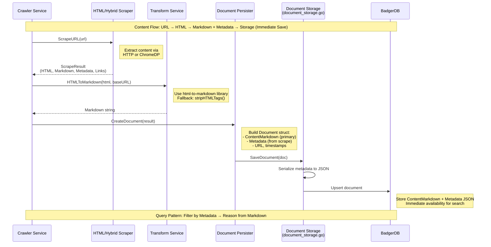

# Quaero Architecture: Markdown + Metadata Design

## 1. Overview

Quaero implements a **canonical format strategy** where all content from diverse sources (Jira, Confluence, GitHub) is transformed into two complementary parts:

1. **Generic Markdown** - Clean, unified text format ideal for AI processing and reasoning
2. **Rich Metadata** - Structured JSON with source-specific data for efficient filtering and faceted search

This design enables a powerful two-step query pattern:
- **Step 1:** Filter documents using structured metadata (SQL WHERE clauses on JSON fields)
- **Step 2:** Reason and synthesize answers from clean Markdown content of filtered results

## 2. Design Philosophy

### Why Markdown?

- **Unified Format:** All content (Jira issues, Confluence pages, GitHub code) becomes consistent text
- **LLM-Friendly:** Clean format ideal for language model reasoning and synthesis
- **Full-Text Search:** Works seamlessly with BadgerDB prefix scanning for fast text search
- **Human-Readable:** Easy to inspect, debug, and understand
- **Version Control:** Text format enables diffs and change tracking

### Why Structured Metadata?

- **Efficient Filtering:** Query by status, priority, dates without parsing content
- **Faceted Search:** Group by project, space, author, labels
- **Preserve Structure:** Maintain source-specific fields (issue keys, page IDs)
- **Enable Cross-References:** Track relationships between documents
- **Query Optimization:** Filter first, then reason from smaller result sets

### The Power of Separation

By separating **content** (markdown) from **structure** (metadata), we get:
- Fast filtering via metadata indexes
- Deep reasoning via markdown content
- Schema flexibility (add metadata fields without migrations)
- Source independence (same query pattern across Jira/Confluence/GitHub)

## 3. Content Flow Pipeline



### Pipeline Components

**1. Crawler Service** (`internal/services/crawler/service.go`)
- Fetches HTML pages from web sources using authenticated HTTP client
- Coordinates scraping, content processing, and document persistence
- Respects rate limits and handles authentication
- Saves documents immediately after successful crawls (no deferred processing)

**2. HTML Scraper** (`internal/services/crawler/html_scraper.go`)
- Extracts generic metadata from HTML pages (title, description, Open Graph, Twitter Card, JSON-LD)
- Generates markdown representation using html-to-markdown conversion
- Discovers links for crawling
- Produces `ScrapeResult` with HTML, Markdown, Metadata, and Links

**3. Hybrid Scraper** (`internal/services/crawler/hybrid_scraper.go`)
- Combines HTTP and ChromeDP (headless Chrome) scraping strategies
- Handles JavaScript-rendered content via ChromeDP
- Falls back to HTTP scraping for simple pages
- Manages browser pool for efficient resource usage

**4. Content Processor** (`internal/services/crawler/content_processor.go`)
- Processes raw HTML content into structured data
- Extracts main content vs navigation/UI elements
- Handles various content types and formats

**5. Document Persister** (`internal/services/crawler/document_persister.go`)
- Creates `Document` structs from crawl results
- Handles deduplication via URL-based source IDs
- Coordinates with storage layer for immediate persistence

**6. Transform Service** (`internal/services/transform/service.go`)
- `HTMLToMarkdown()` uses `github.com/JohannesKaufmann/html-to-markdown` library
- Takes baseURL parameter for resolving relative links
- Fallback to `stripHTMLTags()` if conversion fails
- Logs conversion quality metrics (input/output lengths)

**7. Document Storage** (`internal/storage/badger/document_storage.go`)
- Smart upsert logic: preserves full content when upserting metadata-only documents
- Serializes metadata to JSON before storage
- Uses BadgerDB (via badgerhold) for persistence
- Deserializes metadata JSON on read

**8. Additional Crawler Components**
- `link_extractor.go` - Extracts and filters links for recursive crawling
- `filters.go` - URL pattern filtering (include/exclude patterns)
- `rate_limiter.go` - Per-domain rate limiting
- `chromedp_pool.go` - Browser instance pool management
- `image_storage.go` - Image download and storage
- `types.go` - Type definitions for crawler data structures

## 4. Markdown Storage Pipeline

Quaero converts HTML content to markdown format for LLM consumption and search indexing. The pipeline uses immediate document persistence for instant availability.

### Pipeline Stages

**1. HTML Scraping** (`html_scraper.go`, `hybrid_scraper.go`)

The scraper fetches and processes HTML content:
- Fetches HTML content from URLs via authenticated HTTP client or ChromeDP
- Converts HTML to markdown using `github.com/JohannesKaufmann/html-to-markdown`
- Stores markdown in `ScrapeResult.Markdown` field
- Uses base URL for resolving relative links in markdown
- Generates markdown for all successful page scrapes

**2. Metadata Storage** (`types.go`)

The `ToCrawlResult()` method converts scrape results to crawler results:
- Stores markdown in `CrawlResult.Metadata["markdown"]`
- Also stores HTML in `metadata["html"]` for additional processing
- Stores plain text in `metadata["text_content"]` for fallback
- All metadata fields preserved during conversion

**3. Metadata Propagation** (`service.go`)

The crawler service ensures metadata flows through the pipeline:
- Executes HTML scraping via scraper
- Converts `ScrapeResult` to `CrawlResult` via `ToCrawlResult()`
- Merges scrape metadata (including markdown) into `item.Metadata`
- Markdown flows: `ScrapeResult` → `CrawlResult` → `item.Metadata` → final result
- Preserves job-specific metadata (job_id, source_type, entity_type)

**4. Document Persistence** (`document_persister.go`, `document_storage.go`)

Documents are created and saved immediately after crawling:
- Document persister creates `Document` structs from crawl results
- Transform service converts HTML to markdown with link resolution
- Storage layer handles persistence via BadgerDB
- Smart upsert preserves full content when upserting metadata-only documents
- Documents are immediately available for search and chat

### Data Flow Diagram

```
URL → Scraper (HTTP/ChromeDP)
    ↓
ScrapeResult (HTML, Markdown, Metadata)
    ↓
ToCrawlResult() → CrawlResult.Metadata["markdown"]
    ↓
Document Persister → Transform Service (HTMLToMarkdown)
    ↓
Document.ContentMarkdown → BadgerDB (immediate save)
```

### Configuration Options

**Output Format** - Controls markdown generation mode:
- `config.OutputFormat = "markdown"` - Generate markdown only
- `config.OutputFormat = "html"` - Store HTML only
- `config.OutputFormat = "both"` - Generate and store both formats

**Fallback Behavior** - Controls empty output handling:
- `enableEmptyOutputFallback = true` - Strip HTML tags if conversion produces empty output
- `enableEmptyOutputFallback = false` - Store empty markdown (default)

**Base URL** - Used for resolving relative links:
- Passed to markdown converter for link resolution
- Ensures internal links work correctly in markdown output
- Configured per-source based on `source.BaseURL`

### Conversion Helper Functions

**HTMLToMarkdown()** (`internal/services/transform/service.go`)

Main conversion function with quality logging:
- Creates markdown converter with base URL
- Converts HTML to markdown using `html-to-markdown` library
- Handles conversion errors with fallback
- Detects empty output and applies fallback automatically
- Logs quality metrics: input/output lengths

**stripHTMLTags()** (`internal/services/transform/service.go`)

Fallback function for failed conversions:
- Removes HTML tags using regex
- Cleans up whitespace
- Decodes HTML entities (amp, lt, gt, quot, nbsp)
- Returns plain text as last resort

### Troubleshooting

**Check Conversion Success:**
```bash
# Look for conversion log messages
grep "Converting HTML to markdown" service.log
grep "Markdown conversion completed" service.log
```

**Check for Empty Output:**
```bash
# Look for empty output warnings
grep "Markdown conversion produced empty output" service.log
```

**Verify Database Storage:**

Use the Quaero API to query documents:
```bash
# Get documents with markdown content
curl -X GET "http://localhost:8080/api/documents?limit=10"
```

**Expected Results:**
- `content_markdown` should be non-empty for most documents
- Markdown content should show markdown syntax (`#`, `*`, `[links]()`)
- No HTML tags (`<div>`, `<p>`) in markdown content

**Quality Metrics:**

The pipeline logs conversion quality for troubleshooting:
- Input HTML length (bytes)
- Output markdown length (bytes)
- Compression ratio (output/input)
- Empty output warnings
- Conversion errors and fallback usage

### Known Limitations

**1. Empty Output Fallback**

The empty output fallback (stripping HTML tags) is automatic when markdown conversion produces empty output.

**2. Link Resolution**

Relative links are resolved using base URL, but:
- Links may still be broken if they reference dynamic content
- Some internal links may not work outside the original platform
- Future enhancement: validate and mark broken links in markdown

## 5. Document Model

The core `Document` struct (`internal/models/document.go`) has these key fields:

```go
type Document struct {
    // Identity
    ID         string  // doc_{uuid}
    SourceType string  // jira, confluence, github
    SourceID   string  // Original ID from source (e.g., "BUG-123", "12345678")

    // Content (PRIMARY: Markdown format)
    Title           string
    ContentMarkdown string  // PRIMARY CONTENT FIELD
    DetailLevel     string  // "metadata" or "full" (Firecrawl-style layered crawling)

    // Metadata (source-specific structured data as JSON)
    Metadata map[string]interface{}  // Serialized JiraMetadata, ConfluenceMetadata, etc.
    URL      string                  // Link to original document

    // Sync tracking
    LastSynced       *time.Time
    SourceVersion    string
    ForceSyncPending bool

    // Timestamps
    CreatedAt time.Time
    UpdatedAt time.Time
}
```

**Key Design Decisions:**

- `ContentMarkdown` is the PRIMARY CONTENT field (line 25 in `document.go`)
- `Metadata` is `map[string]interface{}` for flexibility (line 32)
- `DetailLevel` enables Firecrawl-style incremental crawling (metadata vs full content)
- No embedding fields (Phase 5 removed embeddings in favor of FTS5 search)

## 5. Metadata Schemas

### JiraMetadata (lines 48-63 in `document.go`)

```go
type JiraMetadata struct {
    IssueKey       string      // e.g., "BUG-123", "STORY-456"
    ProjectKey     string      // e.g., "BUG", "STORY"
    IssueType      string      // Bug, Story, Task, Epic
    Status         string      // Open, In Progress, Resolved, Closed
    Priority       string      // High, Medium, Low
    Assignee       string      // Username
    Reporter       string      // Username
    Labels         []string    // Tags
    Components     []string    // Component names
    Summary        string      // Issue title
    ResolutionDate *time.Time  // When issue was resolved
    CreatedDate    *time.Time  // When issue was created
    UpdatedDate    *time.Time  // Last update timestamp
}
```

**Usage:** Populated when crawling Jira pages with source-specific metadata extraction

**Query Examples (via API):**
- Filter by status: Use API query parameters or search by metadata fields
- Filter by priority: Search documents with priority metadata
- Filter by date range: Use created_at/updated_at filters

### ConfluenceMetadata (lines 65-76)

```go
type ConfluenceMetadata struct {
    PageID       string      // Unique page identifier
    PageTitle    string      // Page title
    SpaceKey     string      // Space identifier (e.g., "TEAM", "DOCS")
    SpaceName    string      // Human-readable space name
    Author       string      // Page author
    Version      int         // Page version number
    ContentType  string      // page, blogpost
    LastModified *time.Time  // When page was last modified
    CreatedDate  *time.Time  // When page was created
}
```

**Usage:** Populated when crawling Confluence pages with source-specific metadata extraction

**Query Examples (via API):**
- Filter by space: Use API query parameters to filter by space_key
- Filter by author: Search documents with author metadata
- Filter by content type: Filter by page vs blogpost content types

### GitHubMetadata (lines 78-88)

```go
type GitHubMetadata struct {
    RepoName     string      // Repository name (e.g., "org/repo")
    FilePath     string      // File path within repository
    CommitSHA    string      // Commit SHA
    Branch       string      // Branch name
    FunctionName string      // Auto-extracted function/class name
    Author       string      // Commit author
    CommitDate   *time.Time  // Commit timestamp
    PullRequest  string      // Associated PR number (if any)
}
```

**Status:** Defined but not yet implemented (GitHub source coming in future phase)

### CrossSourceMetadata (lines 90-95)

```go
type CrossSourceMetadata struct {
    ReferencedIssues []string  // Jira keys found in content (e.g., ["BUG-123"])
    ReferencedPRs    []string  // GitHub PR numbers (e.g., ["#123"])
    ReferencedPages  []string  // Confluence page IDs mentioned
}
```

**Status:** Defined but **currently unpopulated** (future enhancement for cross-reference tracking)

## 6. HTML to Markdown Conversion

The conversion process is implemented in `internal/services/transform/service.go`:

### HTMLToMarkdown()

```go
func (s *Service) HTMLToMarkdown(html string, baseURL string) (string, error) {
    if html == "" {
        return "", nil
    }

    // Try HTML-to-markdown conversion
    mdConverter := md.NewConverter(baseURL, true, nil)
    converted, err := mdConverter.ConvertString(html)
    if err != nil {
        s.logger.Warn().Err(err).Msg("HTML to markdown conversion failed, using fallback")
        // Fallback: strip HTML tags
        stripped := stripHTMLTags(html)
        return stripped, nil
    }

    // Check for empty output
    if strings.TrimSpace(converted) == "" && html != "" {
        stripped := stripHTMLTags(html)
        return stripped, nil
    }

    return converted, nil
}
```

**Key Features:**

- Uses `github.com/JohannesKaufmann/html-to-markdown` library
- Takes `baseURL` parameter to resolve relative links in markdown output
- Fallback mechanism: if conversion fails or produces empty output, calls `stripHTMLTags()`
- Logs warnings on conversion failures for debugging

### stripHTMLTags() Fallback

```go
func stripHTMLTags(htmlStr string) string {
    // Remove HTML tags using regex
    re := regexp.MustCompile(`<[^>]*>`)
    stripped := re.ReplaceAllString(htmlStr, "")

    // Clean up multiple whitespaces
    spaceRe := regexp.MustCompile(`\s+`)
    cleaned := spaceRe.ReplaceAllString(stripped, " ")

    // Decode HTML entities
    cleaned = strings.ReplaceAll(cleaned, "&amp;", "&")
    cleaned = strings.ReplaceAll(cleaned, "&lt;", "<")
    cleaned = strings.ReplaceAll(cleaned, "&gt;", ">")
    cleaned = strings.ReplaceAll(cleaned, "&quot;", "\"")
    cleaned = strings.ReplaceAll(cleaned, "&#39;", "'")
    cleaned = strings.ReplaceAll(cleaned, "&nbsp;", " ")

    return strings.TrimSpace(cleaned)
}
```

**Usage:** Safety net when markdown conversion fails - strips all HTML tags, cleans whitespace, and decodes HTML entities

## 7. HTML Parsing Details

### HTML Parsing Architecture

**Generic Parsing:** `html_scraper.go`
- Extracts standard metadata (title, description, Open Graph, Twitter Card, JSON-LD, canonical URL) using goquery
- Generates markdown representation of page content
- Discovers links for crawling
- Works with any HTML source without customization

**Hybrid Scraping:** `hybrid_scraper.go`
- Combines HTTP and ChromeDP scraping strategies
- Uses ChromeDP for JavaScript-rendered content
- Falls back to HTTP scraping for simple pages
- Determines strategy based on page requirements

**Content Processing:** `content_processor.go`
- Processes raw HTML content into structured data
- Extracts main content vs navigation/UI elements
- Handles various content types and formats

**Link Extraction:** `link_extractor.go`
- Extracts links from HTML content
- Normalizes URLs and resolves relative paths
- Filters links based on include/exclude patterns

### Design Philosophy

- **HTML scraper is generic and reusable** for any HTML source
- **Content processing handles structure extraction** without source-specific logic
- **Immediate document persistence** eliminates deferred processing complexity
- This keeps the crawler layer clean and efficient

## 8. Storage Implementation

The document storage layer (`internal/storage/badger/document_storage.go`) handles persistence using BadgerDB via the badgerhold wrapper.

### Smart Upsert Logic

```go
// Smart upsert: If existing doc has DetailLevel="full" and new doc is "metadata",
// preserve existing full content and only update metadata fields
```

**Key Features:**

- Prevents metadata-only updates from overwriting full content
- Detects conflicts and preserves richer content
- Uses BadgerDB's transaction support for consistency

### Metadata Serialization

```go
metadataJSON, err := json.Marshal(doc.Metadata)
```

**Storage Format:** Metadata map is serialized to JSON before storage

### Metadata Deserialization

```go
if metadataStr != "" {
    if err := json.Unmarshal([]byte(metadataStr), &doc.Metadata); err != nil {
        return nil, fmt.Errorf("failed to unmarshal metadata: %w", err)
    }
}
```

**Read Pattern:** JSON string is unmarshalled back into `map[string]interface{}`

### Full-Text Search

BadgerDB storage supports full-text search via:
- Prefix-based key scanning for source type filtering
- Metadata field queries via badgerhold query API
- Content search through document retrieval and filtering

## 9. Two-Step Query Pattern

The Markdown+Metadata architecture enables efficient AI-powered query processing:

### Step 1: Filter Documents Using Metadata

Use the Quaero API or search service to filter documents:

```bash
# Find documents by source type
curl "http://localhost:8080/api/documents?source_type=jira"

# Search documents with specific tags
curl "http://localhost:8080/api/documents?tags=high-priority"
```

The search service supports:
- Source type filtering
- Tag-based filtering
- Date range queries
- Full-text search across content

### Step 2: Reason from Markdown Content

Once filtered, analyze the `content_markdown` field with LLM:

```python
# Pseudocode
filtered_docs = api.get_documents(source_type="jira", tags=["high-priority"])
markdown_texts = [doc["content_markdown"] for doc in filtered_docs]

# Send to LLM for reasoning
prompt = f"""
Based on these {len(filtered_docs)} documents:

{markdown_texts[0]}
{markdown_texts[1]}
...

Question: {user_question}
"""
response = llm.generate(prompt)
```

**Benefits:**

- Filter first reduces LLM token usage (only send relevant docs)
- Metadata enables precise filtering (source type, tags, dates)
- Markdown provides clean text for reasoning (no HTML noise)
- Citations easy to add (include `doc.url` and `doc.source_id`)

## 10. Known Limitations

### 1. CrossSourceMetadata Not Populated

**Issue:** `CrossSourceMetadata` struct is defined but never populated.

**Impact:** No extraction of cross-references from content (Jira keys, GitHub PR numbers, Confluence page IDs).

**Location:** `internal/models/document.go`

**Future Fix:** Implement cross-reference extraction service.

### 2. Markdown Output Validation

**Issue:** The system doesn't validate that markdown conversion produced meaningful output (could be empty or whitespace-only).

**Impact:** Empty markdown documents may be stored, reducing search quality.

**Mitigation:** The transform service automatically falls back to HTML stripping when markdown conversion produces empty output.

## 11. Future Enhancements

### High Priority

1. **Populate CrossSourceMetadata**
   - Extract cross-references from document content
   - Parse Jira keys (pattern: `[A-Z][A-Z0-9]+-\d+`)
   - Parse GitHub PR references (pattern: `#\d+` or full URLs)
   - Parse Confluence page IDs from URLs or titles

2. **Add Markdown Quality Metrics**
   - Log conversion success rate across documents
   - Track HTML → Markdown size ratios
   - Monitor fallback usage frequency
   - Alert on high failure rates

3. **Implement Markdown Output Validation**
   - Check for empty or whitespace-only output
   - Validate minimum content length (e.g., > 10 characters)
   - Warn on suspiciously short outputs
   - Log validation failures for debugging

### Medium Priority

4. **Incremental Crawling with DetailLevel**
   - Initial crawl: `DetailLevel="metadata"` (fast discovery)
   - Follow-up: `DetailLevel="full"` (selective deep crawl)
   - Prioritize high-value documents for full content

5. **Metadata Completeness Scoring**
   - Calculate percentage of optional fields populated
   - Track metadata quality over time
   - Identify sources with incomplete data

6. **Custom HTML Conversion Rules**
   - Preserve code blocks with language hints
   - Handle embedded media (images, videos)
   - Improve table formatting in markdown

### Low Priority

7. **Bidirectional Reference Tracking**
   - Store both "references" and "referenced_by" relationships
   - Enable graph queries (e.g., "impact analysis")
   - Build document relationship maps

8. **Cross-Reference API Endpoints**
   - `/api/documents/{id}/references` - Get outgoing references
   - `/api/documents/{id}/referenced-by` - Get incoming references
   - `/api/documents/{id}/related` - Find related documents

9. **UI Visualization of Relationships**
   - Document graph visualization
   - Link highlights in document viewer
   - Related documents sidebar

## 12. Metadata Schema Evolution

The `ToMap()` pattern enables schema evolution without breaking changes:

### How It Works (`models/document.go`)

```go
// Each metadata type has a ToMap() method
func (j *JiraMetadata) ToMap() (map[string]interface{}, error) {
    data, err := json.Marshal(j)
    if err != nil {
        return nil, err
    }
    var m map[string]interface{}
    if err := json.Unmarshal(data, &m); err != nil {
        return nil, err
    }
    return m, nil
}
```

### Benefits

- **Add Fields Easily:** Add new fields to typed structs without database migrations
- **Backward Compatible:** Old documents still readable (missing fields = nil/zero values)
- **Type Safety:** Compile-time checks when building metadata
- **Flexibility:** Each source can have unique metadata schema
- **Future-Proof:** New sources (GitHub, Slack) can define their own metadata types

### Example: Adding a New Field

```go
// Before
type JiraMetadata struct {
    IssueKey string
    Status   string
    // ...
}

// After (no migration needed!)
type JiraMetadata struct {
    IssueKey     string
    Status       string
    StoryPoints  int  // NEW FIELD
    // ...
}
```

**Result:** New documents get `story_points` in metadata, old documents still work (field missing or null).

## 13. Crawler Service Logging

The crawler service provides comprehensive INFO-level logging to diagnose crawl behavior, link discovery decisions, and filtering effectiveness. Enhanced logging helps troubleshoot issues and optimize crawl configurations.

### Log Levels

- **INFO:** Summaries, decisions, milestones (link discovery, filtering, enqueueing)
- **DEBUG:** Individual item processing, detailed traces (each link, each filter match)
- **WARN:** Unexpected conditions (zero links, all filtered, auth issues)
- **ERROR:** Failures requiring attention (scraping errors, database errors)

### Key INFO Logs to Monitor

#### 1. Link Discovery Decision (workerLoop)

**Message:** `"Link discovery enabled - will extract and follow links"`

**When:** Before extracting links from a successfully processed page

**Fields:**
- `job_id` - Job identifier
- `url` - Current URL being processed
- `follow_links` - Configuration value (true/false)
- `depth` - Current depth in the crawl tree
- `max_depth` - Maximum allowed depth (0 = unlimited)
- `will_discover_links` - Explicit decision indicator (always true for this log)

**Purpose:** Confirms recursive crawling is active and shows the decision point clearly

**Database Persistence:** Sampled (every 10th URL) to avoid database bloat

**Example:**
```json
{
  "level": "info",
  "job_id": "job_abc123",
  "url": "https://company.atlassian.net/browse/BUG-123",
  "follow_links": true,
  "depth": 1,
  "max_depth": 3,
  "will_discover_links": true,
  "message": "Link discovery enabled - will extract and follow links"
}
```

#### 2. Link Filtering Complete (discoverLinks)

**Message:** `"Link filtering complete"`

**When:** After applying all filters (source-specific + include/exclude patterns) to discovered links

**Fields:**
- `total_discovered` - Total links found on the page
- `after_source_filter` - Links remaining after Jira/Confluence source filtering
- `after_pattern_filter` - Links remaining after include/exclude pattern filtering
- `filtered_out` - Total number of links filtered (= total_discovered - after_pattern_filter)
- `source_type` - Source type (jira, confluence, etc.)
- `parent_depth` - Depth of the page containing these links
- `follow_links` - Configuration value
- `max_depth` - Maximum allowed depth

**Purpose:** Shows filtering effectiveness, helps tune include/exclude patterns

**Database Persistence:** Always persisted for every page with links

**Example:**
```json
{
  "level": "info",
  "total_discovered": 25,
  "after_source_filter": 20,
  "after_pattern_filter": 12,
  "filtered_out": 13,
  "source_type": "jira",
  "parent_depth": 1,
  "follow_links": "true",
  "max_depth": 3,
  "message": "Link filtering complete"
}
```

#### 3. Link Enqueueing Complete (enqueueLinks)

**Message:** `"Link enqueueing complete"`

**When:** After adding filtered links to the crawl queue

**Fields:**
- `job_id` - Job identifier
- `parent_url` - URL of the page containing these links
- `enqueued_count` - Number of links successfully enqueued
- `total_links` - Total number of links passed to enqueue function
- `sample_urls` - Array of first 3 URLs (for visibility without log spam)

**Purpose:** Confirms links are being followed, shows examples of discovered links

**Database Persistence:** Always persisted with sample URLs

**Example:**
```json
{
  "level": "info",
  "job_id": "job_abc123",
  "parent_url": "https://company.atlassian.net/browse/BUG-123",
  "enqueued_count": 12,
  "total_links": 12,
  "sample_urls": [
    "https://company.atlassian.net/browse/BUG-124",
    "https://company.atlassian.net/browse/BUG-125",
    "https://company.atlassian.net/projects/BUG"
  ],
  "message": "Link enqueueing complete"
}
```

#### 4. Pattern Filtering Summary (filterLinks)

**Message:** `"Pattern filtering summary"`

**When:** After applying include/exclude patterns to discovered links

**Fields:**
- `excluded_count` - Number of links excluded by exclude_patterns
- `not_included_count` - Number of links not matching any include_patterns
- `passed_count` - Number of links that passed filtering

**Purpose:** Shows pattern effectiveness, helps diagnose over-filtering or permissive patterns

**Database Persistence:** Not persisted directly (included in parent discoverLinks log)

**Example:**
```json
{
  "level": "info",
  "excluded_count": 3,
  "not_included_count": 5,
  "passed_count": 12,
  "message": "Pattern filtering summary"
}
```

### Troubleshooting Guide

#### Problem: Job completes with only 1 result (seed URL)

**Check:**
1. Look for `"Link discovery enabled"` log - is it appearing?
2. Check `follow_links` field - is it `true`?
3. Check `depth` vs `max_depth` - is depth limit reached?
4. Look for `"Link filtering complete"` log - are links being discovered?

**Common Causes:**
- `follow_links=false` in job or source configuration
- `max_depth=0` or `max_depth=1` (too restrictive)
- Seed URL has no links
- All links filtered out by patterns

#### Problem: All links filtered out

**Check:**
1. Look for `"Link filtering complete"` log
   - Compare `total_discovered` vs `after_pattern_filter`
   - Check `filtered_out` count
2. Look for `"Pattern filtering summary"` log
   - Check `excluded_count` and `not_included_count`
   - Compare with `passed_count`
3. Check WARNING log with sample URLs
   - Shows which links were filtered and why

**Action:**
- Adjust `include_patterns` to be more permissive
- Review `exclude_patterns` for overly broad matches
- Check source-level filters for conflicts

#### Problem: Links discovered but not followed

**Check:**
1. Look for `"Link enqueueing complete"` log
   - Is `enqueued_count` > 0?
   - Check `sample_urls` - are they correct?
2. Check queue diagnostics
   - Is queue growing?
   - Are there queue capacity issues?
3. Check worker logs
   - Are workers processing enqueued URLs?
   - Look for errors during URL processing

**Common Causes:**
- Queue at capacity (check `queue_capacity` setting)
- Workers stopped or crashed
- Rate limiting blocking workers
- Authentication failures

#### Problem: Unexpected filtering behavior

**Check:**
1. Review filter configuration in job step config
2. Review source-level default filters
3. Check priority order: Job config > Source filters > No filtering
4. Look for `"Using follow_links from job config"` or `"Using follow_links from source default"` logs

**Action:**
- Verify include/exclude patterns are comma-separated strings
- Test patterns in isolation (empty one, populate the other)
- Check logs for pattern match details

### Database Logs

All INFO level logs are persisted to the job database and accessible via:

**API Endpoint:** `GET /api/jobs/{job_id}/logs`
- Returns array of log entries with level, message, timestamp
- Filterable by level (`level=info`)
- Sortable by timestamp

**UI:** Job details page, logs tab
- Displays logs in chronological order
- Color-coded by level (info=blue, warn=yellow, error=red)
- Search and filter capabilities

**Database:** `job_logs` table
- Columns: `job_id`, `level`, `message`, `timestamp`
- Indexed by `job_id` for fast retrieval
- Query: `SELECT * FROM job_logs WHERE job_id = ? AND level = 'info' ORDER BY timestamp`

**Example Query:**
```sql
-- Get all INFO logs for a specific job
SELECT timestamp, message
FROM job_logs
WHERE job_id = 'job_abc123'
  AND level = 'info'
ORDER BY timestamp;

-- Count INFO logs by message type
SELECT
  CASE
    WHEN message LIKE '%Link discovery enabled%' THEN 'discovery'
    WHEN message LIKE '%Link filtering complete%' THEN 'filtering'
    WHEN message LIKE '%Link enqueueing complete%' THEN 'enqueueing'
    ELSE 'other'
  END as log_type,
  COUNT(*) as count
FROM job_logs
WHERE job_id = 'job_abc123'
  AND level = 'info'
GROUP BY log_type;
```

### Performance Notes

**Log Volume:**
- Link discovery decision: 1 log per processed URL (sampled for database: every 10th)
- Link filtering: 1 log per page with links (always persisted)
- Link enqueueing: 1 log per batch of links (always persisted with samples)
- Pattern filtering: 1 log per filtering operation (not persisted directly)

**Total:** Approximately 3-5 INFO logs per crawled page (reasonable for diagnostics)

**Database Impact:**
- Sampled persistence reduces database writes (every 10th URL for discovery logs)
- Sample URLs limited to 3 to avoid log spam
- Individual link logs remain at DEBUG level (not persisted by default)

**Console Output:**
- All INFO logs appear in console/stdout for real-time monitoring
- Structured JSON format for easy parsing and log aggregation
- Compatible with log aggregation tools (Splunk, ELK, etc.)

### Log Examples in Context

#### Successful Crawl with Link Following

```
[INFO] Link discovery enabled - will extract and follow links
  job_id=job_abc123 url=https://company.atlassian.net/browse/BUG-123
  follow_links=true depth=1 max_depth=3 will_discover_links=true

[INFO] Link filtering complete
  total_discovered=25 after_source_filter=20 after_pattern_filter=12
  filtered_out=13 source_type=jira parent_depth=1

[INFO] Pattern filtering summary
  excluded_count=3 not_included_count=5 passed_count=12

[INFO] Link enqueueing complete
  job_id=job_abc123 parent_url=https://company.atlassian.net/browse/BUG-123
  enqueued_count=12 total_links=12
  sample_urls=[...BUG-124, ...BUG-125, ...projects/BUG]
```

#### All Links Filtered Out (Warning)

```
[INFO] Link discovery enabled - will extract and follow links
  job_id=job_abc123 url=https://company.atlassian.net/browse/BUG-123
  follow_links=true depth=1 max_depth=3

[INFO] Link filtering complete
  total_discovered=25 after_source_filter=20 after_pattern_filter=0
  filtered_out=25 source_type=jira

[WARN] All links filtered out from page
  url=https://company.atlassian.net/browse/BUG-123
  excluded_samples=[...admin, ...logout]
  not_included_samples=[...settings, ...profile]
  message="Check include/exclude patterns"
```

#### Link Discovery Skipped (DEBUG Level)

```
[DEBUG] Skipping link discovery - FollowLinks disabled or depth limit reached
  job_id=job_abc123 url=https://company.atlassian.net/browse/BUG-123
  follow_links=false depth=2 max_depth=2
```

### Configuration Options

**Enable/Disable Follow Links:**
```json
{
  "step": {
    "config": {
      "follow_links": true,
      "max_depth": 3
    }
  }
}
```

**Configure Link Filtering:**
```json
{
  "step": {
    "config": {
      "include_patterns": ["browse", "projects", "issues"],
      "exclude_patterns": ["admin", "logout", "settings"]
    }
  }
}
```

**Adjust Polling Interval (Affects Log Frequency):**
```toml
[crawler]
worker_count = 5
queue_capacity = 1000
request_timeout = 30
```

## 15. Immediate Document Saving During Crawling

The crawler service saves documents immediately after successful page crawls, providing instant document availability for search and chat.

### Architecture

**Flow:**
1. Crawler fetches HTML and extracts markdown
2. Create document immediately after successful crawl
3. Save document to database synchronously
4. Document available within milliseconds

### Implementation Details

**Location:** `internal/services/crawler/service.go` and `document_persister.go`

**Conditions for Saving:**
1. `result.Error == ""` (successful crawl)
2. `result.Metadata["markdown"]` exists and is non-empty
3. Document saving error doesn't fail the crawl job

### Document Creation Logic

**Source Type Extraction:**
- **Priority 1:** `item.Metadata["source_type"]` (from job metadata)
- **Priority 2:** URL pattern matching
- **Default:** "crawler" if unable to determine

**Title Extraction:**
- **Priority 1:** `result.Metadata["title"]` (from HTML scraper)
- **Priority 2:** Last segment of URL path
- **Default:** Full URL

**Document Structure:**
```go
doc := models.Document{
    ID:              "doc_" + uuid.New().String(),
    SourceType:      sourceType,
    SourceID:        item.URL, // Enables deduplication
    Title:           title,
    ContentMarkdown: markdown,
    DetailLevel:     models.DetailLevelFull,
    Metadata:        result.Metadata, // Preserves all scraped metadata
    URL:             item.URL,
    CreatedAt:       time.Now(),
    UpdatedAt:       time.Now(),
}
```

### Deduplication Strategy

**Using URL as SourceID:**
- Same URL crawled multiple times → same `source_id`
- Database upsert behavior automatically handles duplicates
- No manual deduplication logic needed

### Error Handling

**Non-Blocking Errors:**
- Document save failures are logged at ERROR level
- Crawl job continues processing other URLs
- Failed document saves don't affect crawler progress

### Performance Impact

**Overhead:**
- ~1-2ms per URL (single database write)
- Negligible compared to HTTP request time (100-1000ms)
- No blocking operations or goroutines

**Benefits:**
- Documents available immediately for search
- Chat can use documents within milliseconds
- Better user experience during crawls

**Database Considerations:**
- BadgerDB write performance: ~1ms for small documents
- Transaction support ensures data consistency
- No additional locking or concurrency management needed

### Configuration

**No Additional Config Required:**
- Feature is always enabled during crawling
- Relies on existing `documentStorage` dependency
- Uses same database connection as other services

**Dependency Injection:**
- Added `documentStorage` field to crawler `Service` struct
- Passed via constructor parameter
- Initialized in `internal/app/app.go`

### Troubleshooting

**Problem: Documents not appearing immediately**

**Check:**
1. Look for `"Document saved immediately after crawling"` INFO logs
2. Verify markdown exists in `result.Metadata["markdown"]`
3. Check for ERROR logs indicating save failures

**Problem: Document save errors**

**Check:**
1. ERROR logs with document details
2. Database connection status
3. Disk space and permissions

## Conclusion

The Markdown+Metadata architecture provides:

- **Unified content format** across all sources (web, Jira, Confluence, GitHub)
- **Efficient filtering** via structured metadata
- **Deep reasoning** via clean markdown content (LLM-friendly)
- **Schema flexibility** via JSON serialization (no migrations)
- **Full-text search** via BadgerDB queries
- **Immediate document availability** via synchronous persistence
- **Future-proof design** for new sources and features

This design balances **performance** (fast metadata filtering) with **intelligence** (markdown reasoning), enabling powerful AI-powered knowledge retrieval.
