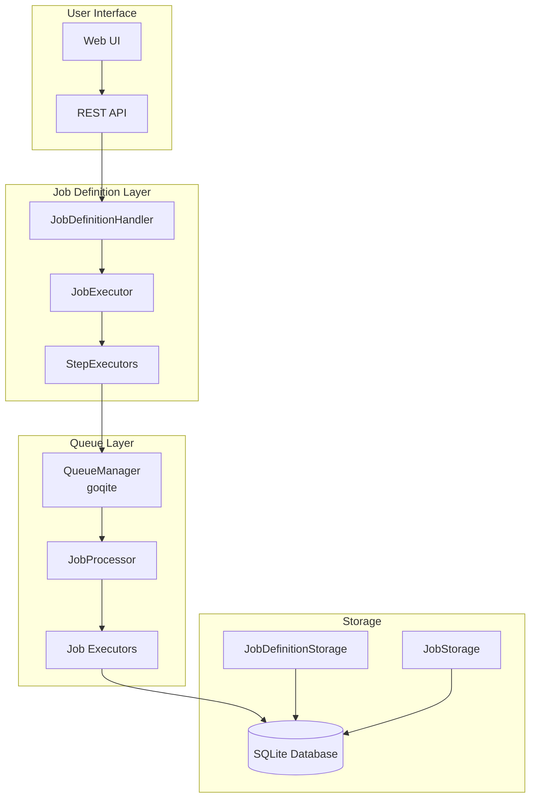
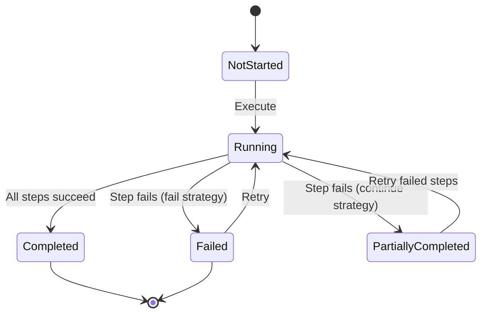
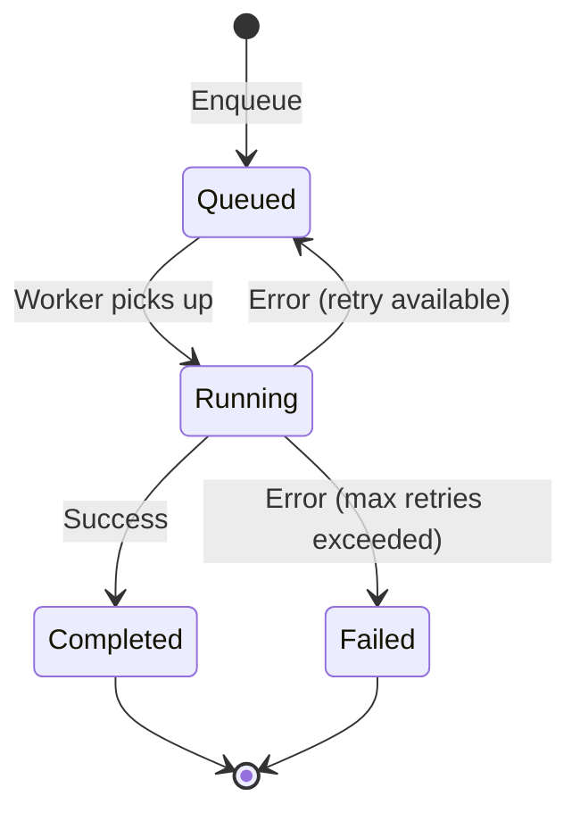

# Job and Queue Management Architecture

This document describes Quaero's job and queue management system, which handles both user-defined job workflows (Job Definitions) and background task processing (Queue Jobs).

## Overview

Quaero uses a dual-layer job system:

1. **Job Definitions** - User-configurable workflows with sequential steps
2. **Queue Jobs** - Background task processing with persistent queue

## Architecture Components

### Core Components



## Job Definitions System

### Components

- **JobDefinitionHandler** - HTTP handlers for CRUD operations
- **JobExecutor** - Orchestrates multi-step workflows
- **StepExecutors** - Handle individual step types (crawl, transform, reindex)

### Job Definition Structure

```go
type JobDefinition struct {
    ID          string
    Name        string
    Type        JobDefinitionType
    Description string
    Sources     []string
    Steps       []JobStep
    Schedule    string
    Enabled     bool
    AutoStart   bool
}

type JobStep struct {
    Name    string
    Action  string
    Config  map[string]interface{}
    OnError ErrorStrategy
}
```

### Step Executors

| Action | Executor | Purpose |
|--------|----------|---------|
| `crawl` | CrawlerStepExecutor | Start crawling jobs |
| `transform` | TransformStepExecutor | Data transformation |
| `reindex` | ReindexStepExecutor | Rebuild FTS5 search index |

## Job Execution Flow

### User-Triggered Execution

```mermaid
sequenceDiagram
    participant U as User
    participant UI as Web UI
    participant JDH as JobDefinitionHandler
    participant JE as JobExecutor
    participant SE as StepExecutor
    participant JM as JobManager
    participant DB as Database
    
    U->>UI: Click "Run" button
    UI->>JDH: POST /api/job-definitions/{id}/execute
    JDH->>JE: Execute(jobDefinition)
    
    Note over JE: Create parent job record
    JE->>JM: CreateJob(parentJob)
    JM->>DB: INSERT job record
    
    loop For each step
        JE->>SE: ExecuteStep(step, sources, parentJobID)
        SE->>JM: CreateJob(childJob)
        SE->>SE: Perform step logic
        SE->>JM: UpdateJobStatus("completed")
    end
    
    JDH-->>UI: 202 Accepted {"job_id": "...", "status": "running"}
    UI->>U: Show success notification

## Queue System Architecture

### Components

- **QueueManager** - Manages goqite-backed message queue
- **WorkerPool** - Pool of worker goroutines
- **JobMessage** - Queue message structure
- **Job Types** - Specific job implementations (CrawlerJob, SummarizerJob, etc.)

### Queue Message Structure

```go
type JobMessage struct {
    Type        string                 // "parent", "crawler_url", "summarizer", "cleanup"
    JobID       string
    ParentJobID *string
    Config      map[string]interface{}
    Metadata    map[string]interface{}
    Depth       int
    CreatedAt   time.Time
}
```

### Job Types

| Type | Handler | Purpose |
|------|---------|---------|
| `parent` | ParentJobHandler | Orchestrates child jobs |
| `crawler_url` | CrawlerJob | Fetches and processes URLs |
| `summarizer` | SummarizerJob | Generates content summaries |
| `cleanup` | CleanupJob | Removes old jobs and logs |

## Queue Processing Flow

```mermaid
sequenceDiagram
    participant SE as StepExecutor
    participant QM as QueueManager
    participant WP as WorkerPool
    participant JH as JobHandler
    participant DB as Database

    SE->>QM: Enqueue(jobMessage)
    QM->>DB: INSERT INTO queue

    loop Worker Processing
        WP->>QM: Receive()
        QM->>DB: SELECT message (visibility timeout)
        QM-->>WP: JobMessage

        WP->>JH: Handle(jobMessage)
        JH->>DB: Process job logic

        alt Success
            JH->>QM: Delete(messageID)
            QM->>DB: DELETE FROM queue
        else Failure
            Note over QM: Message becomes visible again after timeout
        end
    end

## Database Schema

### Job Definition Tables

```sql
-- Job definitions (user-configurable workflows)
CREATE TABLE job_definitions (
    id TEXT PRIMARY KEY,
    name TEXT NOT NULL,
    type TEXT NOT NULL,
    description TEXT,
    sources TEXT, -- JSON array
    steps TEXT,   -- JSON array of JobStep
    schedule TEXT,
    enabled BOOLEAN DEFAULT true,
    auto_start BOOLEAN DEFAULT false,
    created_at DATETIME DEFAULT CURRENT_TIMESTAMP,
    updated_at DATETIME DEFAULT CURRENT_TIMESTAMP
);
```

### Job Execution Tables

```sql
-- Job execution records (both definition jobs and queue jobs)
CREATE TABLE crawl_jobs (
    id TEXT PRIMARY KEY,
    parent_id TEXT,
    job_type TEXT NOT NULL,
    name TEXT,
    description TEXT,
    status TEXT NOT NULL,
    progress INTEGER DEFAULT 0,
    total INTEGER DEFAULT 0,
    error_message TEXT,
    started_at DATETIME,
    completed_at DATETIME,
    created_at DATETIME DEFAULT CURRENT_TIMESTAMP,
    updated_at DATETIME DEFAULT CURRENT_TIMESTAMP,
    FOREIGN KEY (parent_id) REFERENCES crawl_jobs(id)
);

-- Job logs (unlimited history with cascade delete)
CREATE TABLE job_logs (
    id INTEGER PRIMARY KEY AUTOINCREMENT,
    job_id TEXT NOT NULL,
    level TEXT NOT NULL,
    message TEXT NOT NULL,
    timestamp DATETIME DEFAULT CURRENT_TIMESTAMP,
    FOREIGN KEY (job_id) REFERENCES crawl_jobs(id) ON DELETE CASCADE
);

-- URL deduplication for crawler jobs
CREATE TABLE job_seen_urls (
    job_id TEXT NOT NULL,
    url TEXT NOT NULL,
    seen_at DATETIME DEFAULT CURRENT_TIMESTAMP,
    PRIMARY KEY (job_id, url),
    FOREIGN KEY (job_id) REFERENCES crawl_jobs(id) ON DELETE CASCADE
);
```

### Queue Tables

```sql
-- goqite message queue (managed by QueueManager)
CREATE TABLE queue (
    id TEXT PRIMARY KEY,
    queue TEXT NOT NULL,
    body TEXT NOT NULL,
    created DATETIME DEFAULT CURRENT_TIMESTAMP,
    updated DATETIME DEFAULT CURRENT_TIMESTAMP,
    scheduled DATETIME DEFAULT CURRENT_TIMESTAMP,
    received INTEGER DEFAULT 0
);
```

## Configuration

### Job Definition Configuration

```toml
[jobs]
enabled = true
max_concurrent_jobs = 5
job_timeout = "30m"
cleanup_interval = "24h"
max_job_history = 1000

[jobs.default_definitions]
create_database_maintenance = true
create_system_cleanup = true
```

### Queue Configuration

```toml
[queue]
queue_name = "quaero-jobs"
concurrency = 4
poll_interval = "1s"
visibility_timeout = "5m"
max_receive = 3
```

## Job Lifecycle States

### Job Definition Execution States



### Queue Job States



## Error Handling

### Job Definition Error Strategies

| Strategy | Behavior |
|----------|----------|
| `fail` | Stop execution on first error |
| `continue` | Continue with next step on error |
| `retry` | Retry failed step up to max attempts |

### Queue Job Error Handling

- **Visibility Timeout**: Failed jobs become visible again after timeout
- **Max Receive**: Jobs are permanently failed after max receive count
- **Dead Letter Queue**: Failed jobs can be moved to DLQ (future enhancement)

## Monitoring and Observability

### Web UI Pages

- **Jobs Page** (`/jobs`) - Manage job definitions
- **Queue Page** (`/queue`) - Monitor running jobs
- **Job Details** (`/jobs/{id}`) - View job execution details and logs

### Real-time Updates

- **WebSocket** (`/ws`) - Live job status updates
- **Progress Tracking** - Real-time progress bars
- **Log Streaming** - Live log output during execution

### Metrics

- Job execution duration
- Success/failure rates
- Queue depth and processing rate
- Worker utilization

## API Endpoints

### Job Definition Management

```http
GET    /api/job-definitions           # List all job definitions
POST   /api/job-definitions           # Create new job definition
GET    /api/job-definitions/{id}      # Get job definition details
PUT    /api/job-definitions/{id}      # Update job definition
DELETE /api/job-definitions/{id}      # Delete job definition
POST   /api/job-definitions/{id}/execute  # Execute job definition
```

### Job Monitoring

```http
GET    /api/jobs                      # List job execution records
GET    /api/jobs/{id}                 # Get job details
GET    /api/jobs/{id}/logs            # Get job logs
POST   /api/jobs/{id}/cancel          # Cancel running job
DELETE /api/jobs/{id}                 # Delete job record
```

### Queue Management

```http
GET    /api/queue/stats               # Queue statistics
GET    /api/queue/jobs                # List queued jobs
POST   /api/queue/jobs/{id}/cancel    # Cancel queued job
```

## Best Practices

### Job Definition Design

1. **Keep steps atomic** - Each step should be independently executable
2. **Use appropriate error strategies** - Choose based on step criticality
3. **Configure timeouts** - Prevent runaway jobs
4. **Add meaningful descriptions** - Help with monitoring and debugging

### Queue Job Implementation

1. **Idempotent operations** - Jobs should be safely retryable
2. **Progress reporting** - Update progress for long-running jobs
3. **Resource cleanup** - Clean up resources on failure
4. **Structured logging** - Use consistent log formats

### Performance Optimization

1. **Batch operations** - Process multiple items per job when possible
2. **Parallel processing** - Use appropriate concurrency levels
3. **Resource limits** - Set memory and CPU limits
4. **Queue partitioning** - Use multiple queues for different job types (future)

## Troubleshooting

### Common Issues

1. **Jobs stuck in running state** - Check worker health and visibility timeout
2. **High queue depth** - Increase worker concurrency or optimize job processing
3. **Memory leaks** - Ensure proper resource cleanup in job handlers
4. **Database locks** - Optimize database queries and use appropriate isolation levels

### Debugging Tools

1. **Job logs** - Check detailed execution logs
2. **Queue statistics** - Monitor queue depth and processing rates
3. **WebSocket monitoring** - Real-time job status updates
4. **Database queries** - Direct inspection of job tables
```
