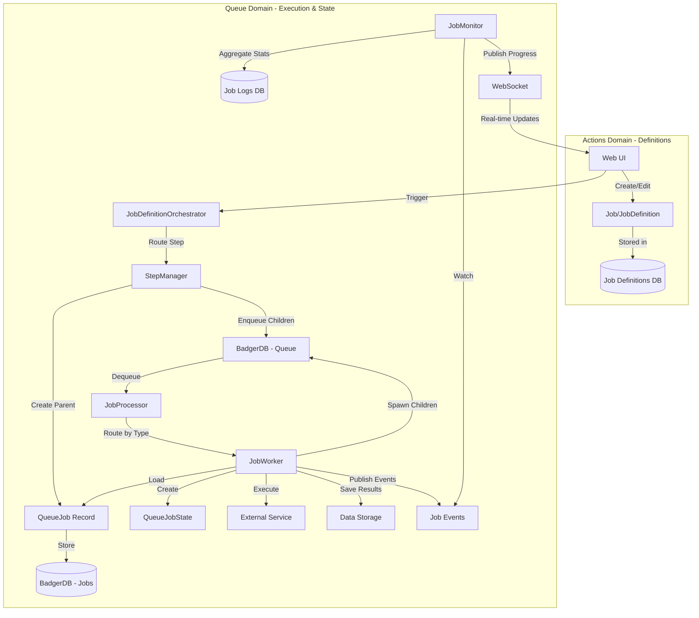

# Manager/Worker Architecture

**Version:** 2.1 (Agent/Queue Refactor - IMPLEMENTED)
**Last Updated:** 2025-11-26
**Migration Status:** ✅ Complete - All phases finished
**Migration Details:** See `docs/features/refactor-agents/requirements.md`

## Executive Summary

Quaero's job system implements a **Manager/Worker/Monitor pattern** with clear separation between job definitions and execution:

### Two Domains

1. **Actions Domain** - User-defined workflows (JobDefinition or Job)
   - Located in: `internal/actions/definitions/`
2. **Queue Domain** - Job execution including immutable work and runtime state
   - Located in: `internal/queue/`
   - Includes: Queue operations, managers, workers, and state tracking

### Three Job Operations (all within Queue Domain)

1. **JobManager (StepManager)** - Orchestrates job execution, creates parent jobs
2. **JobWorker** - Executes individual jobs from queue
3. **JobMonitor** - Watches job logs/events, tracks runtime state

## Key Architectural Principles

**Immutability:** Once a job is enqueued (`QueueJob`), it is immutable. Runtime state (Status, Progress) is tracked via job logs/events, NOT in the stored job.

**Separation of Concerns:**
- **Job/JobDefinition** = What to do (user-defined workflow) - **Actions Domain**
- **QueueJob** = Work to be done (immutable task definition) - **Queue Domain**
- **QueueJobState** = How it's going (runtime state, in-memory only) - **Queue Domain**

**Clear Naming:**
- **Actions** = User-defined workflows (what to execute)
- **Queue** = Execution system (how to execute, including state tracking)

**Event-Driven State:** Job status changes are published as events and stored in job logs. The `JobMonitor` aggregates these events to track overall job progress.

**Domain-Based Organization:** The folder structure enforces the two-domain model with clear boundaries:
- **Actions Domain** - User-defined workflows
- **Queue Domain** - All execution concerns (operations AND state)

## Folder Structure

The job system is organized into two distinct domains:

### Actions Domain - Definitions (`internal/actions/definitions/`)
- **`orchestrator.go`** - `JobDefinitionOrchestrator`
  - Routes job definition steps to appropriate StepManagers
  - Coordinates overall workflow execution

### Queue Domain - Execution (`internal/queue/`)

All queue operations and state tracking are unified under the queue domain:

- **`badger_manager.go`** - Badger-backed queue manager
  - Message queue operations (Enqueue, Receive, Extend, Close)
  - Visibility timeout management

- **`lifecycle.go`** - Job lifecycle management
  - Job creation (`CreateJob`, `CreateChildJob`)
  - Job retrieval (`GetJob`, `ListJobs`)
  - Queue enqueue/dequeue operations

- **`managers/`** - StepManager implementations
  - `crawler_manager.go` - Handles "crawl" action
  - `transform_manager.go` - Handles "transform" action
  - `reindex_manager.go` - Handles "reindex" action
  - `places_search_manager.go` - Handles "places_search" action
  - `agent_manager.go` - Handles "agent" action
  - `database_maintenance_manager.go` - Handles "database_maintenance" action

- **`workers/`** - JobWorker implementations
  - `crawler_worker.go` - Executes crawler jobs
  - `agent_worker.go` - Executes agent jobs
  - `github_log_worker.go` - Executes GitHub logging jobs
  - `database_maintenance_worker.go` - Executes maintenance jobs
  - `job_processor.go` - Routes jobs to appropriate workers

- **`state/`** - Runtime state tracking (part of queue domain)
  - `runtime.go` - Status and error management
    - `UpdateJobStatus` - Update job execution status
    - `MarkJobStarted/Completed/Failed` - Status transitions
    - `SetJobError` - Error tracking
  - `progress.go` - Progress tracking
    - `UpdateJobProgress` - Update progress counters
    - `IncrementProcessed/Failed` - Atomic counter updates
  - `stats.go` - Statistics aggregation
    - `GetJobStats` - Aggregate statistics for parent jobs
    - `CalculateCompletionPercentage` - Progress calculations
  - `monitor.go` - `JobMonitor` implementation
    - Job completion monitoring
    - Event aggregation and WebSocket publishing

### Responsibility Separation

**Queue Operations (`lifecycle.go`, `badger_manager.go`)** - Immutable operations:
- Creating jobs (parent and child)
- Retrieving jobs
- Enqueuing/dequeuing messages
- NO status updates or mutations

**State Tracking (`state/`)** - Mutable operations (part of queue domain):
- Status updates and transitions
- Progress tracking and counters
- Error recording
- Statistics aggregation
- NO job creation or retrieval

This separation ensures:
- Clear domain boundaries (Actions vs Queue)
- State tracking is recognized as part of the queue domain
- Immutable queue operations separate from mutable state tracking
- Easy testing and maintenance
- Enforcement of architectural principles at the folder level

## Architecture Overview



## Job State Lifecycle

```
1. User creates Job/JobDefinition via UI (Actions Domain)
   ↓
2. User triggers job execution
   ↓
3. JobDefinitionOrchestrator routes to StepManager (Queue Domain)
   ↓
4. StepManager creates QueueJob (parent) and stores in BadgerDB (Queue Domain)
   ↓
5. StepManager enqueues child QueueJob records to queue (Queue Domain)
   ↓
6. JobProcessor dequeues QueueJob from queue (Queue Domain)
   ↓
7. JobWorker loads QueueJob and creates QueueJobState (in-memory, Queue Domain)
   ↓
8. JobWorker executes task, publishes status events (Queue Domain)
   ↓
9. JobMonitor watches events, updates job logs (Queue Domain - state/)
   ↓
10. JobWorker completes, publishes completion event (Queue Domain)
   ↓
11. JobMonitor aggregates child stats, determines parent completion (Queue Domain - state/)
```

## Core Data Structures

### JobDefinition (User-Defined Workflow)

**File:** `internal/models/job_definition.go`

```go
type JobDefinition struct {
    ID          string    `json:"id"`
    Name        string    `json:"name"`
    Type        JobDefinitionType `json:"type"` // crawler, agent, places, custom
    Description string    `json:"description"`
    Schedule    string    `json:"schedule"` // Cron expression (optional)
    Steps       []JobStep `json:"steps"`    // Workflow steps
    Enabled     bool      `json:"enabled"`
    AuthID      string    `json:"auth_id"`  // Authentication credentials
    CreatedAt   time.Time `json:"created_at"`
    UpdatedAt   time.Time `json:"updated_at"`
}
```

**Purpose:** Defines WHAT work to do and HOW to orchestrate it
**Storage:** BadgerDB (job_definitions table)
**Mutability:** Editable by user via UI

### QueueJob (Immutable Queued Job)

**File:** `internal/models/job_model.go`

```go
// QueueJob represents the immutable job sent to the queue and stored in the database.
// Once created and enqueued, this job should not be modified.
type QueueJob struct {
    // Core identification
    ID       string  `json:"id"`        // Unique job ID (UUID)
    ParentID *string `json:"parent_id"` // Parent job ID (nil for root)

    // Job classification
    Type string `json:"type"` // Job type: "crawler", "agent", etc.
    Name string `json:"name"` // Human-readable name

    // Configuration (immutable snapshot at creation time)
    Config   map[string]interface{} `json:"config"`
    Metadata map[string]interface{} `json:"metadata"`

    // Timestamps
    CreatedAt time.Time `json:"created_at"`

    // Hierarchy tracking
    Depth int `json:"depth"` // 0 for root, 1+ for children
}
```

**Purpose:** Immutable work definition sent to queue
**Storage:** BadgerDB (jobs table) - stores ONLY this, no runtime state
**Mutability:** IMMUTABLE after creation
**Key Methods:**
- `NewQueueJob()` - Create root job
- `NewQueueJobChild()` - Create child job
- `Validate()` - Validate job structure
- `GetConfigString/Int/Bool()` - Extract config values

### QueueJobState (Runtime Execution State)

**File:** `internal/models/job_model.go`

```go
// QueueJobState represents runtime execution state for a queued job (in-memory only)
// This combines the immutable QueueJob fields with mutable runtime state
// Runtime state (Status, Progress) should be tracked via job logs/events, not stored in database
type QueueJobState struct {
    // Fields from QueueJob (immutable)
    ID        string
    ParentID  *string
    Type      string
    Name      string
    Config    map[string]interface{}
    Metadata  map[string]interface{}
    CreatedAt time.Time
    Depth     int

    // Mutable runtime state (tracked via job logs/events)
    Status        JobStatus   `json:"status"`        // pending, running, completed, failed
    Progress      JobProgress `json:"progress"`      // Execution progress
    StartedAt     *time.Time  `json:"started_at"`
    CompletedAt   *time.Time  `json:"completed_at"`
    Error         string      `json:"error"`
    ResultCount   int         `json:"result_count"`
    FailedCount   int         `json:"failed_count"`
}
```

**Purpose:** In-memory runtime state during execution
**Storage:** NOT stored in database (reconstructed from QueueJob + job logs)
**Mutability:** Mutable during execution
**Key Methods:**
- `NewQueueJobState(queueJob *QueueJob)` - Create from queued job
- `ToQueueJob()` - Extract immutable job
- `MarkStarted/Completed/Failed()` - Update status
- `UpdateProgress()` - Update progress counters

## Interface Definitions

### StepManager (Job Orchestration)

**File:** `internal/interfaces/job_interfaces.go`

```go
// StepManager creates parent jobs and orchestrates job definition steps
type StepManager interface {
    // CreateParentJob creates a parent job and spawns initial child jobs
    CreateParentJob(ctx context.Context, step models.JobStep, jobDef *models.JobDefinition, parentJobID string) (jobID string, err error)

    // GetManagerType returns the action type this manager handles (e.g., "crawl")
    GetManagerType() string
}
```

**Implementations:** (Located in `internal/queue/managers/`)
- `CrawlerManager` (`crawler_manager.go`) - Handles "crawl" action
- `AgentManager` (`agent_manager.go`) - Handles "agent" action
- `DatabaseMaintenanceManager` (`database_maintenance_manager.go`) - Handles "database_maintenance" action
- `TransformManager` (`transform_manager.go`) - Handles "transform" action
- `ReindexManager` (`reindex_manager.go`) - Handles "reindex" action
- `PlacesSearchManager` (`places_search_manager.go`) - Handles "places_search" action

**Responsibilities:**
1. Create parent `QueueJob` record in database (via `lifecycle.go`)
2. Define work items (e.g., URLs to crawl, documents to process)
3. Enqueue child `QueueJob` records to queue (via `lifecycle.go`)
4. NO direct execution - delegates to workers
5. NO status updates - delegates to state management

### JobWorker (Job Execution)

**File:** `internal/interfaces/job_interfaces.go`

```go
// JobWorker executes individual jobs from the queue
type JobWorker interface {
    // Execute processes a single job from the queue
    Execute(ctx context.Context, job *models.QueueJob) error

    // GetWorkerType returns the job type this worker handles
    GetWorkerType() string

    // Validate validates that the job is compatible with this worker
    Validate(job *models.QueueJob) error
}
```

**Implementations:** (Located in `internal/queue/workers/`)
- `CrawlerWorker` (`crawler_worker.go`) - Executes crawler jobs
- `AgentWorker` (`agent_worker.go`) - Executes agent jobs
- `DatabaseMaintenanceWorker` (`database_maintenance_worker.go`) - Executes maintenance jobs
- `GitHubLogWorker` (`github_log_worker.go`) - Executes GitHub logging jobs
- `JobProcessor` (`job_processor.go`) - Routes jobs to appropriate workers

**Responsibilities:**
1. Load `QueueJob` from queue (via `lifecycle.go`)
2. Create `QueueJobState` for in-memory tracking
3. Execute task (fetch URL, run agent, etc.)
4. Publish status events (started, progress, completed) - tracked by `state/monitor.go`
5. Update job status via `state/runtime.go` (started, completed, failed)
6. Update progress counters via `state/progress.go`
7. Spawn child jobs if needed (URL discovery) via `lifecycle.go`
8. Save results to storage

### JobMonitor (Progress Monitoring)

**File:** `internal/interfaces/job_interfaces.go`

```go
// JobMonitor monitors parent job progress and aggregates child statistics
type JobMonitor interface {
    // StartMonitoring begins monitoring a parent job
    StartMonitoring(ctx context.Context, parentJobID string) error

    // StopMonitoring stops monitoring a parent job
    StopMonitoring(parentJobID string) error

    // GetJobProgress returns current progress for a job
    GetJobProgress(ctx context.Context, jobID string) (*JobProgress, error)
}
```

**Implementation:** `internal/queue/state/monitor.go`

**Responsibilities:**
1. Subscribe to job events (started, progress, completed)
2. Aggregate child job statistics (via `state/stats.go`)
3. Determine parent job completion
4. Publish progress updates via WebSocket
5. Store job logs in database
6. Coordinate with `state/runtime.go` for status updates
7. Use `state/progress.go` for progress tracking

## Data Flow Between Domains

```
┌─────────────────────────────────────────────────────────────────────┐
│ Actions Domain (internal/actions/definitions/)                      │
│                                                                      │
│ orchestrator.go - JobDefinitionOrchestrator                         │
│   └─> Routes job steps to appropriate StepManagers                  │
└──────────────────────────┬───────────────────────────────────────────┘
                           │
                           v
┌─────────────────────────────────────────────────────────────────────┐
│ Queue Domain (internal/queue/)                                      │
│                                                                      │
│ badger_manager.go - Queue Manager                                   │
│   ├─> Enqueue() - Add message to queue                              │
│   ├─> Receive() - Get message from queue                            │
│   ├─> Extend() - Extend visibility timeout                          │
│   └─> Close() - Shutdown queue                                      │
│                                                                      │
│ lifecycle.go - Job Lifecycle (Immutable Operations)                 │
│   ├─> CreateJob() - Create parent QueueJob                          │
│   ├─> CreateChildJob() - Create child QueueJob                      │
│   ├─> EnqueueJob() - Add to queue                                   │
│   ├─> DequeueJob() - Get from queue                                 │
│   └─> GetJob() - Retrieve QueueJob                                  │
│                                                                      │
│ managers/ - StepManager implementations                             │
│   ├─> crawler_manager.go                                            │
│   ├─> agent_manager.go                                              │
│   ├─> database_maintenance_manager.go                               │
│   ├─> transform_manager.go                                          │
│   ├─> reindex_manager.go                                            │
│   └─> places_search_manager.go                                      │
│                                                                      │
│ workers/ - JobWorker implementations                                │
│   ├─> job_processor.go - Routes to workers                          │
│   ├─> crawler_worker.go                                             │
│   ├─> agent_worker.go                                               │
│   ├─> github_log_worker.go                                          │
│   └─> database_maintenance_worker.go                                │
│                                                                      │
│ state/ - Runtime State Tracking (part of Queue Domain)              │
│   │                                                                  │
│   ├─> runtime.go - State Manager (Mutable Operations)               │
│   │   ├─> UpdateJobStatus() - Change status                         │
│   │   ├─> MarkJobStarted() - Start execution                        │
│   │   ├─> MarkJobCompleted() - Complete execution                   │
│   │   ├─> MarkJobFailed() - Record failure                          │
│   │   └─> SetJobError() - Store error                               │
│   │                                                                  │
│   ├─> progress.go - Progress Tracking                               │
│   │   ├─> UpdateJobProgress() - Update counters                     │
│   │   ├─> IncrementProcessed() - Increment success                  │
│   │   └─> IncrementFailed() - Increment failures                    │
│   │                                                                  │
│   ├─> stats.go - Statistics Aggregation                             │
│   │   ├─> GetJobStats() - Aggregate child stats                     │
│   │   └─> CalculateCompletionPercentage()                           │
│   │                                                                  │
│   └─> monitor.go - JobMonitor                                       │
│       ├─> StartMonitoring() - Begin monitoring                      │
│       ├─> StopMonitoring() - End monitoring                         │
│       ├─> GetJobProgress() - Get current progress                   │
│       └─> Uses runtime.go, progress.go, stats.go                    │
└─────────────────────────────────────────────────────────────────────┘
```

### Interaction Flow

1. **Job Creation Flow** (Actions Domain -> Queue Domain)
   ```
   JobDefinitionOrchestrator -> StepManager -> lifecycle.go
   ```

2. **Job Execution Flow** (Within Queue Domain)
   ```
   lifecycle.go -> JobWorker -> state/runtime.go -> state/progress.go
   ```

3. **Monitoring Flow** (Within Queue Domain)
   ```
   state/monitor.go -> state/stats.go -> state/runtime.go -> state/progress.go
   ```

4. **Status Update Flow** (Within Queue Domain)
   ```
   JobWorker -> state/runtime.go -> state/progress.go -> state/monitor.go
   ```

## Storage Architecture

### BadgerDB Tables

**jobs** - Stores `QueueJob` (immutable queued jobs)
```
Key: job_id (string)
Value: QueueJob struct (JSON serialized)
```

**job_logs** - Stores job events and status changes
```
Key: log_id (string)
Value: JobLog struct with job_id, event_type, payload, timestamp
```

**queue** - Stores queued messages for worker processing
```
Key: message_id (string)
Value: QueueMessage struct with job_id, job_type, visibility_timeout
```

### Key Storage Principle

**CRITICAL:** BadgerDB stores ONLY `QueueJob` (immutable job definition), NOT `QueueJobState` (runtime state).

Runtime state is tracked via:
1. Job events published by workers
2. Job logs stored in `job_logs` table
3. JobMonitor aggregating events into progress statistics

This solves the BadgerHold serialization issue by avoiding complex nested structs with runtime state.

## Benefits of Domain-Based Organization

The two-domain folder structure provides several key benefits:

### 1. Clear Separation of Concerns
- **Actions Domain** (`internal/actions/definitions/`) handles user-defined workflows
- **Queue Domain** (`internal/queue/`) manages ALL execution concerns:
  - Immutable job operations (lifecycle, managers, workers)
  - Mutable runtime state (state/)
  - Queue infrastructure (badger_manager)

### 2. Enforced Immutability Within Queue Domain
- Queue operations (`lifecycle.go`) cannot modify job state
- State operations (`state/runtime.go`, `state/progress.go`) cannot create jobs
- Clear separation between immutable and mutable operations within the same domain
- Architectural principles are enforced at the file system level

### 3. Easier Navigation and Maintenance
- Developers can quickly find the right file for their task
- All execution-related functionality is in one place (`internal/queue/`)
- State tracking is recognized as part of execution, not separate
- Clear boundaries prevent cross-domain pollution

### 4. Improved Testability
- Each domain can be tested independently
- Mock implementations are easier to create
- Integration tests have clear boundaries
- State tracking tests are co-located with queue tests

### 5. Scalability
- New managers/workers can be added without touching actions domain
- State tracking can be extended without affecting job creation
- Queue domain can evolve independently from actions domain
- All execution concerns scale together

### 6. Documentation Alignment
- Folder structure matches architectural diagrams
- Code organization reflects conceptual model (2 domains, not 3)
- New developers can understand the system faster
- State is clearly part of the queue/execution domain

## Migration Plan (Incremental Steps)

See separate document: `docs/features/refactor-agents/requirements.md`

**Note:** The original v1 to v2 migration plan is archived. The current folder structure reflects the v2.1 refactoring which:
1. Reverted queue job type from "ai" to "agent" for semantic clarity
2. Reorganized folders to enforce the two-domain architecture (Actions + Queue)
3. Consolidated state tracking into the Queue domain where it belongs

