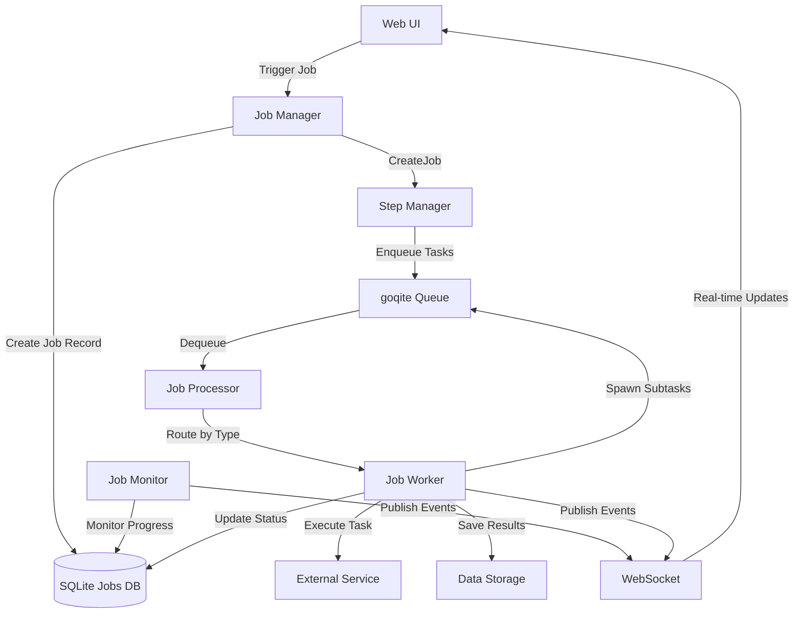
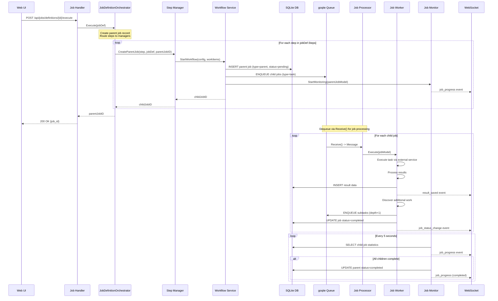

# Manager/Worker Architecture

**Version:** 1.2
**Last Updated:** 2025-01-16
**Replaces:** JOB_EXECUTOR_ARCHITECTURE.md, JOB_QUEUE_MANAGEMENT.md, QUEUE_ARCHITECTURE.md

## Executive Summary

Quaero's job system implements a **Manager/Worker pattern** for clear separation between orchestration and execution:

- **Managers** (`StepManager` interface) - Orchestrate workflows by creating jobs and defining execution strategies
- **Workers** (`JobWorker` interface) - Execute individual jobs pulled from the queue
- **Monitor** (`JobMonitor`) - Monitors job progress and aggregates execution statistics

This architecture provides:
- Clear responsibility separation between coordination and execution
- Scalable job processing with queue-based worker pools
- Real-time progress tracking and WebSocket updates
- Flexible job hierarchies and dependencies

## Architecture Overview



### Component Responsibilities

| Component | Layer | Responsibility |
|-----------|-------|----------------|
| **StepManager** | Manager (Orchestration) | Implements StepManager - Creates jobs, defines execution strategy, initiates workflows |
| **JobWorker** | Worker (Execution) | Implements JobWorker - Executes tasks, processes data, spawns subtasks for discovered work |
| **JobMonitor** | Monitoring | Implements JobMonitor interface - Tracks job progress, aggregates statistics, determines completion |
| **JobProcessor** | Queue (Routing) | Routes queued jobs to registered workers based on job type |
| **JobDefinitionOrchestrator** | Coordination (Workflow) | Routes job definition steps to StepManagers - Handles multi-step workflows, error strategies, parent job creation |

## Manager vs Worker Distinction

### StepManager Interface (Orchestration)

**File:** `internal/interfaces/job_interfaces.go` (centralized)

```go
// StepManager creates parent jobs, enqueues child jobs to the queue, and manages job orchestration
// for a specific action type (job definition step). Different implementations handle different action
// types (crawl, agent, database_maintenance, transform, reindex, places_search).
// This is distinct from interfaces.JobManager which handles job CRUD operations.
type StepManager interface {
    // CreateParentJob creates a parent job and spawns initial child jobs
    CreateParentJob(ctx context.Context, step models.JobStep, jobDef *models.JobDefinition, parentJobID string) (jobID string, err error)

    // GetManagerType returns the action type this manager handles (e.g., "crawl")
    GetManagerType() string
}
```

**Responsibilities:**
- Create parent job records in database
- Define work items and execution configuration
- Spawn initial child jobs into queue
- NO direct execution - delegates to workers

**Example Implementation:** Generic Manager

```go
// ExampleManager orchestrates a specific workflow type
type ExampleManager struct {
    workflowService interfaces.WorkflowService
    logger          arbor.ILogger
}

func (m *ExampleManager) CreateParentJob(ctx context.Context, step models.JobStep, jobDef *models.JobDefinition, parentJobID string) (string, error) {
    // 1. Extract configuration from job definition
    config := m.buildConfiguration(jobDef.Config)

    // 2. Create parent job via workflow service
    // This internally spawns child jobs for each work item
    jobID, err := m.workflowService.StartWorkflow(
        jobDef.SourceType, config.WorkItems, config.Options,
        jobDef.AuthID, parentJobID,
    )

    return jobID, err
}
```

**Concrete Implementations:** The codebase includes 6 manager implementations (CrawlerManager, AgentManager, DatabaseMaintenanceManager, TransformManager, ReindexManager, PlacesSearchManager), each following this pattern for their specific domain.

**Other Manager Implementations:**

All 6 managers follow the same pattern, implementing the `StepManager` interface:

- **DatabaseMaintenanceManager** (`internal/jobs/manager/database_maintenance_manager.go`) - Orchestrates database vacuum, analyze, reindex, and optimize operations
- **AgentManager** (`internal/jobs/manager/agent_manager.go`) - Orchestrates AI agent workflows for document processing (keyword extraction, summarization)
- **TransformManager** (`internal/jobs/manager/transform_manager.go`) - Orchestrates HTML-to-markdown transformation for existing documents
- **ReindexManager** (`internal/jobs/manager/reindex_manager.go`) - Orchestrates FTS5 full-text search index rebuilds
- **PlacesSearchManager** (`internal/jobs/manager/places_search_manager.go`) - Orchestrates Google Places API searches and document creation

Each manager creates a parent job and spawns child jobs specific to its domain.

### JobDefinitionOrchestrator (Workflow Coordination)

**File:** `internal/jobs/job_definition_orchestrator.go`

The JobDefinitionOrchestrator is the **entry point coordinator** for job definition execution. It sits above the Manager layer and routes multi-step workflows to appropriate StepManagers.

**Responsibilities:**
- Parse job definitions and execute steps sequentially
- Route each step to the appropriate StepManager based on action type (e.g., "crawl" → CrawlerManager)
- Create parent job records for workflow tracking
- Handle error strategies (fail, continue, retry) per step
- Manage error tolerance thresholds across child jobs
- Integrate with JobMonitor for crawler job progress tracking
- Persist job metadata (auth_id, job_definition_id) for child job access

**Key Methods:**
- `Execute(ctx, jobDef)` - Executes a job definition with all its steps
- `RegisterStepExecutor(mgr)` - Registers a StepManager for an action type

**Integration Points:**
- **Handlers** call `Execute()` when user triggers job definition
- **StepManagers** registered via `RegisterStepExecutor()` during app initialization
- **JobMonitor** started for crawler jobs to track child progress
- **JobManager** used for job CRUD operations (create, update status, add logs)

**Example Flow:**
```go
// 1. Handler receives job definition execution request
parentJobID, err := orchestrator.Execute(ctx, jobDef)

// 2. Orchestrator creates parent job record
parentJob := &Job{ID: parentJobID, Type: "parent", Status: "pending"}

// 3. Orchestrator executes each step sequentially
for _, step := range jobDef.Steps {
    // Route to appropriate manager
    mgr := orchestrator.stepExecutors[step.Action]
    childJobID, err := mgr.CreateParentJob(ctx, step, jobDef, parentJobID)

    // Handle errors based on step.OnError strategy
}

// 4. For crawler jobs, start monitoring
if isCrawlerJob {
    orchestrator.jobMonitor.StartMonitoring(ctx, parentJobModel)
}
```

**Distinction from StepManagers:**
- **JobDefinitionOrchestrator** - Routes steps across multiple domains (multi-step workflows)
- **StepManagers** - Orchestrate single domain (e.g., CrawlerManager handles only crawl steps)

**Registered StepManagers:**
During app initialization in `internal/app/app.go`, all 6 managers are registered:
- `"crawl"` → CrawlerManager
- `"agent"` → AgentManager
- `"database_maintenance"` → DatabaseMaintenanceManager
- `"transform"` → TransformManager
- `"reindex"` → ReindexManager
- `"places_search"` → PlacesSearchManager

### JobWorker Interface (Execution)

**File:** `internal/interfaces/job_interfaces.go` (centralized)

```go
// JobWorker executes individual jobs pulled from queue
type JobWorker interface {
    // Execute performs the actual work for a single job
    Execute(ctx context.Context, job *models.JobModel) error

    // GetWorkerType returns the job type this worker handles
    GetWorkerType() string

    // Validate validates job model compatibility
    Validate(job *models.JobModel) error
}
```

**Responsibilities:**
- Execute single job from queue
- Perform actual work (e.g., process data, call external services)
- Update job status (running, completed, failed)
- Spawn child jobs for discovered work (e.g., additional items)
- Save results to storage

**Example Implementation:** Generic Worker

```go
// ExampleWorker executes individual job tasks
type ExampleWorker struct {
    taskService     interfaces.TaskService
    dataStorage     interfaces.DataStorage
    jobMgr          *jobs.Manager
    queueMgr        *queue.Manager
    logger          arbor.ILogger
}

func (w *ExampleWorker) Execute(ctx context.Context, job *models.JobModel) error {
    // 1. Extract task parameters from job config
    taskParams, _ := job.GetConfigString("task_params")

    // 2. Execute task via external service
    result, err := w.taskService.ExecuteTask(ctx, taskParams)
    if err != nil {
        return fmt.Errorf("task execution failed: %w", err)
    }

    // 3. Process results
    processedData := w.processResults(result)

    // 4. Save results to storage
    dataRecord := NewDataRecord(job.ID, job.ParentID, processedData)
    w.dataStorage.Save(ctx, dataRecord)

    // 5. Discover additional work and spawn subtasks
    if shouldSpawnSubtasks(job, result) {
        for _, subtask := range result.DiscoveredWork {
            w.spawnChildJob(ctx, job, subtask)
        }
    }

    return nil
}
```

**Concrete Implementations:** The codebase includes 3 worker implementations (CrawlerWorker, AgentWorker, DatabaseMaintenanceWorker), each following this pattern for their specific execution logic.

## Orchestrator Responsibilities

### JobMonitor

**File:** `internal/jobs/monitor/job_monitor.go`

The monitor runs in a **separate goroutine** for non-blocking monitoring of job execution.

**Responsibilities:**
1. **Monitor Job Progress** - Poll database every 5 seconds for job status
2. **Aggregate Execution Statistics** - Calculate total, completed, failed, running, pending counts
3. **Determine Workflow Completion** - Mark parent as completed when all subtasks reach terminal state
4. **Real-Time Updates** - Publish WebSocket events for UI progress tracking
5. **Result Counting** - Track results saved across all subtasks

**Lifecycle:**

```go
// Started in separate goroutine (NOT enqueued)
monitor.StartMonitoring(ctx, parentJobModel)

// Monitoring loop (runs until all children complete or timeout)
func (m *JobMonitor) monitorChildJobs(ctx context.Context, job *models.JobModel) error {
    ticker := time.NewTicker(5 * time.Second)

    for {
        select {
        case <-ticker.C:
            stats, _ := o.jobMgr.GetChildJobStats(ctx, job.ID)

            if allChildrenComplete(stats) {
                o.jobMgr.UpdateJobStatus(ctx, job.ID, "completed")
                return nil
            }

            o.publishProgressUpdate(ctx, job.ID, stats)
        }
    }
}
```

**Event Subscriptions:**

The monitor subscribes to system events for real-time updates:

```go
// Subscribe to job status changes
eventService.Subscribe(EventJobStatusChange, func(ctx context.Context, event Event) error {
    // Increment progress counters in real-time
    stats := jobMgr.GetChildJobStats(ctx, parentID)
    publishProgressUpdate(ctx, parentID, stats)
})

// Subscribe to result saves
eventService.Subscribe(EventDocumentSaved, func(ctx context.Context, event Event) error {
    // Increment result count for parent job
    jobMgr.IncrementDocumentCount(ctx, parentJobID)
})
```

## Complete Job Execution Flow



### Flow Phases

#### Phase 1: Job Creation (Orchestration Layer)
1. User clicks "Execute" in Web UI
2. Handler calls `JobDefinitionOrchestrator.Execute(jobDef)`
3. Orchestrator creates parent job record in database
4. Orchestrator iterates through job definition steps sequentially
5. For each step, orchestrator routes to appropriate `StepManager.CreateParentJob()`
6. Manager calls `WorkflowService.StartWorkflow()` with configuration
7. Service creates parent job in database (type=`parent`)
8. Service spawns child jobs (type=`task`) and enqueues them
9. Service starts `JobMonitor` in separate goroutine (for crawler jobs)
10. Orchestrator returns parent job ID to handler
11. Handler returns parent job ID to UI

#### Phase 2: Job Execution (Worker Layer)
12. `JobProcessor` dequeues message from goqite via `Receive()` method (polling-based)
13. Processor routes to appropriate `JobWorker` based on job type
14. Worker executes task via external service
15. Worker processes task results
16. Worker saves results to storage (publishes `result_saved` event)
17. Worker discovers additional work and spawns subtasks (if depth < max_depth)
18. Worker updates job status to completed (publishes `job_status_change` event)

#### Phase 3: Progress Monitoring (Monitor Layer)
19. Monitor polls job execution statistics every 5 seconds
20. Monitor publishes `job_progress` events via WebSocket
21. When all subtasks reach terminal state (completed/failed/cancelled):
    - Monitor updates workflow status to completed
    - Monitor publishes final progress event
    - Monitoring loop exits

## Interface Definitions

### Current Interfaces (Migration Complete - ARCH-009, Centralized in refactor-job-interfaces)

**File:** `internal/interfaces/job_interfaces.go` (centralized location)

```go
// StepManager creates parent jobs and orchestrates job definition steps
// Renamed from JobManager to avoid conflict with interfaces.JobManager (job CRUD)
type StepManager interface {
    CreateParentJob(ctx context.Context, step models.JobStep, jobDef *models.JobDefinition, parentJobID string) (jobID string, err error)
    GetManagerType() string
}

// JobWorker executes individual jobs from the queue
type JobWorker interface {
    Execute(ctx context.Context, job *models.JobModel) error
    GetWorkerType() string
    Validate(job *models.JobModel) error
}

// JobMonitor monitors parent job progress
type JobMonitor interface {
    StartMonitoring(ctx context.Context, job *models.JobModel)
    SubscribeToChildStatusChanges()
}

// JobSpawner supports workers that spawn child jobs
type JobSpawner interface {
    // SpawnChildJob creates and enqueues a child job
    // The child job will be linked to the parent via ParentID
    SpawnChildJob(ctx context.Context, parentJob *models.JobModel, childType, childName string, config map[string]interface{}) error
}
```

### Implementations

The Manager/Worker pattern is implemented across multiple domains in Quaero. Each implementation follows the same architectural pattern but handles domain-specific logic:

**Example Manager Implementations:**
- ✅ `CrawlerManager` (internal/jobs/manager/crawler_manager.go)
- ✅ `DatabaseMaintenanceManager` (internal/jobs/manager/database_maintenance_manager.go)
- ✅ `AgentManager` (internal/jobs/manager/agent_manager.go)
- ✅ `TransformManager` (internal/jobs/manager/transform_manager.go)
- ✅ `ReindexManager` (internal/jobs/manager/reindex_manager.go)
- ✅ `PlacesSearchManager` (internal/jobs/manager/places_search_manager.go)

Each manager implements the `StepManager` interface and follows the orchestration pattern shown above.

**Example Worker Implementations:**
- ✅ `CrawlerWorker` (internal/jobs/worker/crawler_worker.go)
- ✅ `DatabaseMaintenanceWorker` (internal/jobs/worker/database_maintenance_worker.go)
- ✅ `AgentWorker` (internal/jobs/worker/agent_worker.go)

Each worker implements the `JobWorker` interface and follows the execution pattern shown above.

**Coordinators (Workflow Orchestration):**
- ✅ `JobDefinitionOrchestrator` (internal/jobs/job_definition_orchestrator.go) - Routes job definition steps to managers

**Monitors (Progress Tracking):**
- ✅ `JobMonitor` (internal/jobs/monitor/job_monitor.go) - Tracks child job progress and aggregates statistics

## File Structure Changes

### Migration Complete (ARCH-009)

**Final Directory Structure:**
- ✅ `internal/interfaces/` - Centralized interface definitions (refactor-job-interfaces)
  - ✅ `job_interfaces.go` - StepManager, JobWorker, JobOrchestrator, JobSpawner
- ✅ `internal/jobs/manager/` - 6 managers (orchestration, implement StepManager)
  - ✅ `crawler_manager.go` - Web crawling workflows
  - ✅ `database_maintenance_manager.go` - Database maintenance workflows
  - ✅ `agent_manager.go` - AI agent workflows
  - ✅ `transform_manager.go` - HTML→markdown transformation
  - ✅ `reindex_manager.go` - FTS5 index rebuild
  - ✅ `places_search_manager.go` - Google Places API search
- ✅ `internal/jobs/worker/` - 3 workers (execution, implement JobWorker)
  - ✅ `crawler_worker.go` - URL crawling execution
  - ✅ `database_maintenance_worker.go` - Database maintenance execution
  - ✅ `agent_worker.go` - AI agent execution
  - ✅ `job_processor.go` - Routes jobs to workers
- ✅ `internal/jobs/monitor/` - Job progress monitoring
  - ✅ `job_monitor.go` - Child job progress tracking (implements JobMonitor)
- ✅ `internal/jobs/` - Workflow coordination
  - ✅ `job_definition_orchestrator.go` - Routes job definition steps to managers (workflow coordinator)

**Deleted Directories/Files:**
- ❌ `internal/jobs/executor/` - 9 files deleted (migrated to manager/ + jobs/) [ARCH-009]
- ❌ `internal/interfaces/job_executor.go` - Duplicate interface removed [ARCH-009]
- ❌ `internal/jobs/manager/interfaces.go` - Removed, consolidated into `internal/interfaces/job_interfaces.go` [refactor-job-interfaces]
- ❌ `internal/jobs/orchestrator/interfaces.go` - Removed, consolidated into `internal/interfaces/job_interfaces.go` [refactor-job-interfaces]
- ❌ `internal/jobs/worker/interfaces.go` - Removed, consolidated into `internal/interfaces/job_interfaces.go` [refactor-job-interfaces]

**Migration Timeline:**
- Phase ARCH-001: ✅ Documentation created
- Phase ARCH-002: ✅ Interfaces renamed
- Phase ARCH-003: ✅ Directory structure created
- Phase ARCH-004: ✅ 3 managers migrated (crawler, database_maintenance, agent)
- Phase ARCH-005: ✅ Crawler worker migrated and merged
- Phase ARCH-006: ✅ Remaining worker files migrated (agent_worker.go, job_processor.go)
- Phase ARCH-007: ✅ Parent job orchestrator migrated
- Phase ARCH-008: ✅ Database maintenance worker split
- Phase ARCH-009: ✅ Final cleanup complete **(COMPLETED 2025-11-11)**
- Phase ARCH-010: ✅ End-to-end validation complete
- Phase refactor-job-interfaces: ✅ Interface consolidation complete
  - Moved all job interfaces to `internal/interfaces/job_interfaces.go`
  - Deleted `internal/jobs/manager/interfaces.go`
  - Deleted `internal/jobs/worker/interfaces.go`
  - Deleted `internal/jobs/orchestrator/interfaces.go`
  - Eliminated import cycles
  - Single source of truth for all job-related interfaces

### Final Cleanup (ARCH-009)

**Files Deleted (10 Total):**
1. `internal/jobs/executor/transform_step_executor.go` → Migrated to `manager/transform_manager.go`
2. `internal/jobs/executor/reindex_step_executor.go` → Migrated to `manager/reindex_manager.go`
3. `internal/jobs/executor/places_search_step_executor.go` → Migrated to `manager/places_search_manager.go`
4. `internal/jobs/executor/job_executor.go` → Relocated to `internal/jobs/job_definition_orchestrator.go`
5. `internal/jobs/executor/crawler_step_executor.go` → Already migrated in ARCH-004
6. `internal/jobs/executor/database_maintenance_step_executor.go` → Already migrated in ARCH-004
7. `internal/jobs/executor/agent_step_executor.go` → Already migrated in ARCH-004
8. `internal/jobs/executor/base_executor.go` → Unused
9. `internal/jobs/executor/interfaces.go` → Duplicate interface definitions
10. `internal/interfaces/job_executor.go` → Duplicate of JobWorker interface

**Interface Consolidation (refactor-job-interfaces):**
All job-related interfaces are now centralized in `internal/interfaces/job_interfaces.go`:
- `StepManager` - Manager interface for job orchestration (renamed from JobManager to avoid conflict with job CRUD operations)
- `JobWorker` - Worker interface for job execution
- `JobOrchestrator` - Orchestrator interface for progress monitoring
- `JobSpawner` - Optional interface for workers that spawn child jobs

This consolidation eliminates import cycles, follows the project's clean architecture pattern, and provides a single source of truth. All managers, workers, and orchestrators import from this centralized location.

### Manager Migration Pattern (ARCH-004 + ARCH-009)

All managers followed the standardized transformation pattern:

**Naming Convention:**
- Package: `executor` → `manager`
- Struct: `*StepExecutor` → `*Manager`
- Constructor: `New*StepExecutor` → `New*Manager`
- Receiver: `e` → `m` (manager convention)

**Migrated Managers:**
1. **CrawlerManager** - Web crawling workflows (ARCH-004)
2. **DatabaseMaintenanceManager** - Database maintenance workflows (ARCH-004)
3. **AgentManager** - AI agent workflows (ARCH-004)
4. **TransformManager** - HTML→markdown transformation (ARCH-009)
5. **ReindexManager** - FTS5 index rebuild (ARCH-009)
6. **PlacesSearchManager** - Google Places API search (ARCH-009)

**Import Path Updates:**
- `internal/app/app.go` - All 6 managers registered
- `internal/handlers/job_definition_handler.go` - Updated to use JobDefinitionOrchestrator

### Final Architecture Structure

**Note:** All interfaces are centralized in `internal/interfaces/job_interfaces.go` as of the refactor-job-interfaces phase. Individual `interfaces.go` files in subdirectories have been removed.

```
internal/
├── interfaces/
│   └── job_interfaces.go                 # StepManager, JobWorker, JobMonitor, JobSpawner
├── jobs/
│   ├── manager/                          # Managers (orchestration)
│   │   ├── crawler_manager.go            # Web crawling workflows
│   │   ├── database_maintenance_manager.go # Database maintenance workflows
│   │   ├── agent_manager.go              # AI agent workflows
│   │   ├── transform_manager.go          # HTML→markdown transformation
│   │   ├── reindex_manager.go            # FTS5 index rebuild
│   │   └── places_search_manager.go      # Google Places API search
│   ├── worker/                           # Workers (execution)
│   │   ├── crawler_worker.go             # URL crawling execution
│   │   ├── database_maintenance_worker.go # Database maintenance execution
│   │   ├── agent_worker.go               # AI agent execution
│   │   └── job_processor.go              # Routes jobs to workers
│   ├── monitor/                          # Monitors (monitoring)
│   │   └── job_monitor.go                # Child job progress tracking
│   └── job_definition_orchestrator.go    # Routes job definition steps to managers
```

### Architecture Benefits Achieved

1. **Clear Separation of Concerns:**
   - Coordinators (1) - Route multi-step workflows to managers
   - Managers (6) - Orchestrate domain-specific workflows, create parent jobs, spawn children
   - Workers (3) - Execute individual jobs from queue
   - Monitors (1) - Track progress, aggregate statistics

2. **Improved Maintainability:**
   - Eliminated duplicate files (10 files deleted)
   - Consolidated auth handling into single CrawlerWorker
   - Single source of truth for each interface

3. **Better Performance:**
   - JobMonitor runs in separate goroutine (non-blocking)
   - Queue-based worker pool scales with load
   - Real-time WebSocket updates without polling overhead

4. **Developer Experience:**
   - Intuitive naming (Manager/Worker/Monitor)
   - Clear file organization by responsibility
   - Import cycle resolution via local interfaces

## Database Schema

### Jobs Table

```sql
CREATE TABLE jobs (
    id TEXT PRIMARY KEY,
    parent_id TEXT,                    -- For child jobs, references parent job ID
    type TEXT NOT NULL,                -- 'parent', 'crawler_url', 'database_maintenance', etc.
    name TEXT NOT NULL,
    phase TEXT NOT NULL,               -- 'execution', 'orchestration'
    status TEXT NOT NULL,              -- 'pending', 'running', 'completed', 'failed', 'cancelled'
    error_message TEXT,
    progress_current INTEGER DEFAULT 0,
    progress_total INTEGER DEFAULT 0,
    payload TEXT,                      -- JSON-serialized JobModel
    depth INTEGER DEFAULT 0,           -- Crawl depth for hierarchical jobs
    created_at TIMESTAMP DEFAULT CURRENT_TIMESTAMP,
    updated_at TIMESTAMP DEFAULT CURRENT_TIMESTAMP,
    finished_at TIMESTAMP,
    FOREIGN KEY (parent_id) REFERENCES jobs(id) ON DELETE CASCADE
);
```

### Job Logs Table

```sql
CREATE TABLE job_logs (
    id INTEGER PRIMARY KEY AUTOINCREMENT,
    job_id TEXT NOT NULL,
    level TEXT NOT NULL,               -- 'info', 'warn', 'error', 'debug'
    message TEXT NOT NULL,
    timestamp TIMESTAMP DEFAULT CURRENT_TIMESTAMP,
    FOREIGN KEY (job_id) REFERENCES jobs(id) ON DELETE CASCADE
);
```

### Queue Table (goqite)

```sql
CREATE TABLE queue_messages (
    id INTEGER PRIMARY KEY AUTOINCREMENT,
    created TIMESTAMP NOT NULL DEFAULT CURRENT_TIMESTAMP,
    updated TIMESTAMP NOT NULL DEFAULT CURRENT_TIMESTAMP,
    message BLOB NOT NULL,             -- JSON-serialized queue.Message
    timeout TIMESTAMP,
    received INTEGER DEFAULT 0
);
```

## Configuration

### Queue Configuration

```toml
[queue]
max_receive = 1        # Process one job at a time
poll_timeout = "1s"    # Poll queue every second
visibility_timeout = "30m"  # Message visibility timeout
```

### Job Configuration

Job definitions stored in `job-definitions/` directory:

```yaml
# job-definitions/example-workflow.yaml
name: "Example Workflow"
source_type: "api"  # or "web", "database", etc.
base_url: "https://api.example.com"
auth_id: "auth_source_123"
tags: ["example", "workflow"]

steps:
  - name: "process_items"
    action: "task_type"  # e.g., "crawl", "agent", "transform"
    config:
      entity_type: "items"
      max_depth: 2
      max_items: 100
      follow_references: true
```

**Concrete Examples:** The `job-definitions/` directory contains real-world examples including:
- `jira-crawler.yaml` - Web crawling workflow for Jira issues
- `confluence-crawler.yaml` - Web crawling workflow for Confluence pages
- `keyword-extraction.yaml` - AI agent workflow for document processing
- `database-maintenance.yaml` - Database optimization workflow

Each follows this structure but with domain-specific configuration.

## API Endpoints

### Job Definition Endpoints

```
GET    /api/jobs/definitions           # List all job definitions
POST   /api/jobs/definitions           # Create job definition
GET    /api/jobs/definitions/{id}      # Get job definition
PUT    /api/jobs/definitions/{id}      # Update job definition
DELETE /api/jobs/definitions/{id}      # Delete job definition
POST   /api/jobs/definitions/{id}/execute  # Execute job definition
```

### Job Monitoring Endpoints

```
GET /api/jobs                      # List all jobs
GET /api/jobs/{id}                 # Get job details
GET /api/jobs/{id}/logs            # Get job logs
GET /api/jobs/{id}/children        # Get child jobs
DELETE /api/jobs/{id}              # Delete job
```

### Queue Management Endpoints

```
GET /api/queue/stats               # Queue statistics (pending, processing)
```

## Real-Time Updates

### WebSocket Events

The system publishes various event types via WebSocket for real-time UI updates. Event payloads vary by job type but follow consistent patterns:

#### 1. Job Progress

```json
{
  "type": "job_progress",
  "payload": {
    "job_id": "job_abc123",
    "status": "running",
    "total_subtasks": 150,
    "pending_subtasks": 66,
    "running_subtasks": 1,
    "completed_subtasks": 83,
    "failed_subtasks": 0,
    "cancelled_subtasks": 0,
    "progress_text": "66 pending, 1 running, 83 completed, 0 failed",
    "result_count": 83,
    "timestamp": "2025-11-11T10:30:45Z"
  }
}
```

#### 2. Task Progress

```json
{
  "type": "task_progress",
  "payload": {
    "job_id": "job_xyz789",
    "parent_id": "job_abc123",
    "status": "running",
    "job_type": "task",
    "current_item": "item_123",
    "current_activity": "Processing task data",
    "depth": 1,
    "timestamp": "2025-11-11T10:30:46Z"
  }
}
```

#### 3. Job Log

```json
{
  "type": "job_log",
  "payload": {
    "job_id": "job_abc123",
    "level": "info",
    "message": "Result saved: Processed Item (12345 bytes)",
    "timestamp": "2025-11-11T10:30:47Z",
    "metadata": {
      "item_id": "item_123",
      "depth": 1,
      "result_id": "res_123456",
      "title": "Processed Item",
      "result_size": 12345,
      "child_id": "job_xyz789"
    }
  }
}
```

#### 4. Job Status Change

```json
{
  "type": "job_status_change",
  "payload": {
    "job_id": "job_xyz789",
    "parent_id": "job_abc123",
    "status": "completed",
    "job_type": "task",
    "timestamp": "2025-11-11T10:30:48Z"
  }
}
```

#### 5. Result Saved

```json
{
  "type": "result_saved",
  "payload": {
    "result_id": "res_123456",
    "job_id": "job_xyz789",
    "parent_job_id": "job_abc123",
    "title": "Processed Item",
    "item_reference": "item_123",
    "timestamp": "2025-11-11T10:30:47Z"
  }
}
```

#### 6. Job Spawn

```json
{
  "type": "job_spawn",
  "payload": {
    "parent_job_id": "job_abc123",
    "discovered_by": "job_xyz789",
    "child_job_id": "job_new456",
    "job_type": "task",
    "item_reference": "item_456",
    "depth": 2,
    "timestamp": "2025-11-11T10:30:49Z"
  }
}
```

**Implementation Note:** Actual event payloads vary by job type. Crawler jobs include URLs and HTML metadata, agent jobs include AI model responses, maintenance jobs include database statistics, etc.

### WebSocket Client Usage

```javascript
// Connect to WebSocket
const ws = new WebSocket('ws://localhost:8085/ws');

// Subscribe to job progress
ws.onmessage = (event) => {
  const data = JSON.parse(event.data);

  switch (data.type) {
    case 'job_progress':
      updateJobProgress(data.payload);
      break;
    case 'job_log':
      appendLogMessage(data.payload);
      break;
    case 'result_saved':
      incrementResultCount(data.payload);
      break;
  }
};
```

## Best Practices

### Manager Design Guidelines

1. **Keep Managers Lightweight** - Managers should only orchestrate, not execute
2. **Use Domain Service** - Delegate job creation to appropriate service (e.g., CrawlerService, AgentService, MaintenanceService)
3. **No Direct Database Access** - Use service layer abstractions
4. **Configuration-Driven** - Extract work items from job definition config
5. **Validate Early** - Validate job definitions before creating jobs

### Worker Design Guidelines

1. **Single Responsibility** - Each worker handles one job type
2. **Idempotent Execution** - Workers should be safe to retry
3. **Update Job Status** - Always update status to running/completed/failed
4. **Publish Events** - Emit WebSocket events for real-time updates
5. **Handle Failures Gracefully** - Log errors, update job status, don't panic
6. **Spawn Subtasks Carefully** - Respect depth limits and max_items config

### Monitor Design Guidelines

1. **Run in Separate Goroutine** - Never block queue workers
2. **Poll Every 5 Seconds** - Balance responsiveness vs database load
3. **Subscribe to Events** - Use event subscriptions for real-time updates
4. **Handle Timeouts** - Enforce max wait time (30 minutes default)
5. **Aggregate Statistics Correctly** - Aggregate subtask statuses accurately

## Troubleshooting

### Jobs Stuck in Pending State

**Symptoms:** Jobs remain in `pending` status indefinitely

**Possible Causes:**
1. Job processor not started
2. No worker registered for job type
3. Queue timeout too short

**Solution:**
```bash
# Check job processor status
curl http://localhost:8085/api/queue/stats

# Check registered workers in logs
grep "Job worker registered" logs/quaero.log

# Verify queue configuration
cat bin/quaero.toml
```

### Jobs Never Complete

**Symptoms:** Jobs stuck in `running` status even when all subtasks are done

**Possible Causes:**
1. Monitor not monitoring job
2. Subtasks not updating status correctly
3. Database query returning incorrect stats

**Solution:**
```bash
# Check monitor logs
grep "Job monitoring" logs/quaero.log

# Query subtask statistics
sqlite3 bin/quaero.db "SELECT status, COUNT(*) FROM jobs WHERE parent_id='job_abc123' GROUP BY status;""

# Check if finished_at timestamp is set
sqlite3 bin/quaero.db "SELECT id, status, finished_at FROM jobs WHERE id='job_abc123';"
```

### WebSocket Events Not Publishing

**Symptoms:** UI doesn't show real-time progress updates

**Possible Causes:**
1. WebSocket connection not established
2. Event service not initialized
3. Events published before UI connects

**Solution:**
```javascript
// Check WebSocket connection status
console.log(ws.readyState); // Should be 1 (OPEN)

// Monitor WebSocket messages
ws.onmessage = (event) => {
  console.log('Received:', JSON.parse(event.data));
};

// Verify event service initialization in logs
grep "EventService" logs/quaero.log
```

### Workers Not Processing Items

**Symptoms:** Jobs complete but no results saved

**Possible Causes:**
1. External service not responding
2. Authentication not configured
3. Filter patterns exclude all items

**Solution:**
```bash
# Check worker execution logs
grep "Worker execution" logs/quaero.log

# Verify authentication configuration
grep "🔐" logs/quaero.log

# Check item filtering
grep "Item filtering" logs/quaero.log
```

## Comparison Table: Executor Pattern vs Manager/Worker Pattern

This table shows the architectural evolution from the original executor-based design to the current Manager/Worker pattern:

| Aspect | Old (Executor) | New (Manager/Worker) |
|--------|----------------|----------------------|
| **Terminology** | Confusing "executor" for both layers | Clear "manager/worker" distinction |
| **Directory Structure** | `executor/` + `processor/` mixed | `manager/` + `worker/` + `orchestrator/` separated |
| **Interface Names** | `StepExecutor` + `JobExecutor` | `JobManager` + `JobWorker` |
| **File Organization** | 14 files across 2 directories | Organized by responsibility |
| **Duplicate Files** | `crawler_executor.go` (2 files) | Merged into single `crawler_worker.go` |
| **Orchestrator Location** | Mixed in `processor/` | Dedicated `orchestrator/` directory |
| **Documentation** | 3 fragmented documents | Single comprehensive document |
| **Architecture Clarity** | Implicit separation | Explicit manager/worker/orchestrator layers |
| **Onboarding Time** | High (confusing terminology) | Low (intuitive naming) |

## Conclusion

The Manager/Worker architecture provides:

1. **Clear Separation of Concerns** - Orchestration (managers) vs Execution (workers) vs Monitoring (monitors)
2. **Intuitive Naming** - "Manager" creates jobs, "Worker" executes jobs, "Monitor" monitors progress
3. **Scalable Design** - Queue-based worker pools handle concurrent execution
4. **Real-Time Visibility** - WebSocket events provide live progress tracking
5. **Maintainable Code** - Organized file structure with single responsibilities

### Migration Benefits

- **Reduced Cognitive Load** - Clear terminology reduces confusion
- **Faster Onboarding** - New developers understand architecture immediately
- **Better Testing** - Separated concerns enable focused unit tests
- **Easier Debugging** - Clear responsibility boundaries simplify troubleshooting

### Next Steps

1. Apply pattern to new job types
2. Implement domain-specific managers and workers
3. Test job orchestration and execution
4. Update developer documentation and onboarding guides
5. Monitor production deployments for issues

For questions or issues, consult:
- Architecture documentation: `docs/architecture/`
- Agent guidelines: `AGENTS.md`
- Developer guide: `README.md`