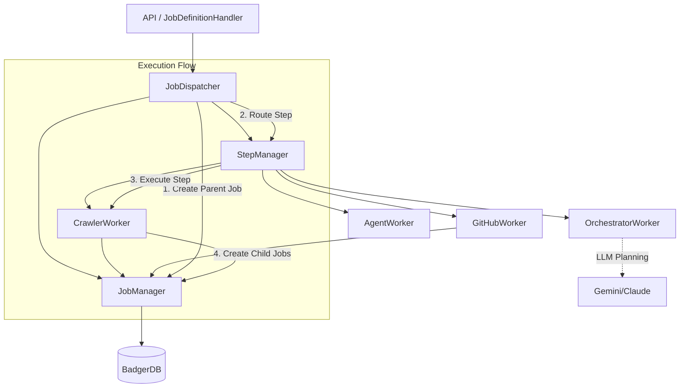
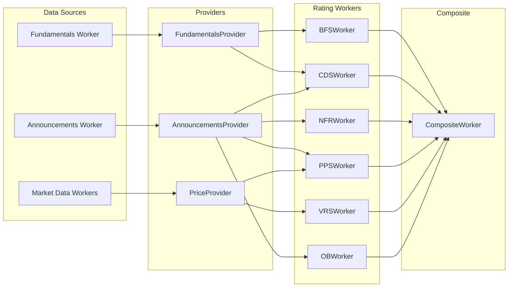

# Manager-Worker Architecture

## Overview

The Quaero queue system uses a decoupled architecture to separate job lifecycle management, step routing, and execution orchestration. This design ensures separation of concerns and scalability.

## Core Components

### 1. JobManager (`internal/queue/job_manager.go`)
**Responsibility:** Job Persistence and Status Management.
- Manages the lifecycle of a job record in the database (BadgerDB).
- Handles status updates (pending -> running -> completed/failed).
- Manages job metadata and configuration updates.
- Provides logging facilities (via `AddJobLog`).
- **Does NOT** handle worker routing or execution logic.

### 2. StepManager (`internal/queue/step_manager.go`)
**Responsibility:** Worker Registration and Routing.
- Maintains a registry of `DefinitionWorker` implementations keyed by `WorkerType`.
- Routes step execution requests to the appropriate worker.
- Validates step configuration against the registered worker.
- **Does NOT** manage job status or persistence.

### 3. JobDispatcher (`internal/queue/dispatcher.go`)
**Responsibility:** Execution Coordination.
- Coordinates the mechanical execution of a `JobDefinition`.
- Creates the parent "Manager Job".
- Iterates through steps, creating "Step Jobs".
- Uses `StepManager` to execute each step.
- Handles error tolerance, retries (future), and flow control.
- Manages the parent-child relationship and monitoring setup.

**Note:** The term "Orchestrator" is reserved for the AI-powered `OrchestratorWorker` which performs cognitive orchestration using LLM reasoning. `JobDispatcher` handles mechanical dispatch.

### 4. Workers (`internal/queue/workers/`)
**Responsibility:** Execution of specific tasks.
- Implement `JobWorker` (for queue execution) and `DefinitionWorker` (for step creation).
- **CrawlerWorker:** Crawls URLs.
- **GitHubRepoWorker:** Indexes GitHub repositories.
- **AgentWorker:** Executes agentic workflows.
- **PlacesWorker:** Searches for places.

## Data Flow

1.  **Job Submission:** API receives a request to execute a Job Definition.
2.  **Dispatch:** `JobDefinitionHandler` calls `JobDispatcher.ExecuteJobDefinition`.
3.  **Manager Job Creation:** `JobDispatcher` creates a parent job via `JobManager`.
4.  **Step Execution:**
    - `JobDispatcher` iterates through steps.
    - Creates a step job via `JobManager`.
    - Calls `StepManager.Execute` with the step configuration.
5.  **Worker Routing:** `StepManager` looks up the worker for the step type and calls `worker.CreateJobs`.
6.  **Job Spawning:** The worker creates actual queue jobs (e.g., "crawl_url") if applicable.
7.  **Monitoring:** `JobMonitor` and `StepMonitor` track the progress of spawned jobs and update the parent/step job status.

## Logging

Logging is context-aware but currently tightly coupled to `JobManager.AddJobLog()`.

**Current Flow:**
- Workers call `jobMgr.AddJobLog(ctx, jobID, level, message)`
- `AddJobLog` stores to BadgerDB and publishes to WebSocket via `EventJobLog`
- Context (step_name, manager_id) is resolved via `resolveJobContext()` which walks the parent chain

**Planned Improvements:**
See `docs/fix/queue_manager/03_logging_architecture_review.md` for proposed:
- Centralized `LogCollector` service
- Explicit `JobContext` in context.Context (no magic resolution)
- Enhanced `JobLogEntry` schema with step_id, manager_id, worker_type
- Client-side filtering in UI for step-specific log display

## Worker-to-Worker Communication

The codebase uses two complementary patterns for worker-to-worker communication. Choose the appropriate pattern based on your use case.

### Pattern Overview

| Pattern | Use Case | Returns | On-Demand Generation |
|---------|----------|---------|---------------------|
| **DocumentProvisioner** | Cross-domain data needs | Document IDs | Yes |
| **Data Provider** | Rating/analysis workers | Document directly | Yes |
| **Direct Lookup** | Sequential pipelines | N/A (reads directly) | No |

---

## Pattern 1: DocumentProvisioner Interface

Use this pattern when Worker A needs data from Worker B's domain, with on-demand generation capability.

### Interface Definition

Defined in `internal/interfaces/document_provisioner.go`:

```go
// DocumentProvisionOptions configures document provisioning behavior.
type DocumentProvisionOptions struct {
    CacheHours   int  // Freshness window for cached documents (0 = always fetch)
    ForceRefresh bool // Bypasses cache and always generates fresh documents
}

// DocumentProvisioner is implemented by workers that can provision documents for other workers.
type DocumentProvisioner interface {
    // EnsureDocuments checks cache and creates/updates if needed.
    // Returns a map of identifier -> document ID.
    EnsureDocuments(ctx context.Context, identifiers []string, options DocumentProvisionOptions) (map[string]string, error)
}
```

### Flow

1. **Caller Worker** depends on `interfaces.DocumentProvisioner` (not concrete type)
2. **Provider Worker** implements `DocumentProvisioner`:
   - Checks if document exists and is fresh (cache check)
   - If missing or stale, fetches from external source and saves document
   - Returns document ID(s) to caller
3. **Caller Worker** uses returned document ID(s) to retrieve document content via DocumentStorage

### Workers Implementing DocumentProvisioner

| Worker | File | Identifiers | Description |
|--------|------|-------------|-------------|
| DataWorker | `internal/workers/market/data_worker.go` | Ticker strings (e.g., "ASX:GNP") | Market price and technical data |

### Workers Consuming DocumentProvisioner

| Worker | File | Provider | Usage |
|--------|------|----------|-------|
| AnnouncementsWorker | `internal/workers/market/announcements_worker.go` | DataWorker | Price data for signal analysis |

### Example: DataWorker implements DocumentProvisioner

```go
// DataWorker implements DocumentProvisioner
var _ interfaces.DocumentProvisioner = (*DataWorker)(nil)

// EnsureDocuments implements the DocumentProvisioner interface.
func (w *DataWorker) EnsureDocuments(ctx context.Context, identifiers []string, options interfaces.DocumentProvisionOptions) (map[string]string, error) {
    // Parse identifiers to domain-specific types
    tickers := make([]common.Ticker, 0, len(identifiers))
    for _, id := range identifiers {
        ticker := common.ParseTicker(id)
        if ticker.Code != "" {
            tickers = append(tickers, ticker)
        }
    }
    // Check cache, fetch if needed, return document IDs
    return w.EnsureMarketData(ctx, tickers, options.CacheHours, options.ForceRefresh)
}
```

### Example: AnnouncementsWorker consumes DocumentProvisioner

```go
// AnnouncementsWorker depends on interface, not concrete DataWorker
type AnnouncementsWorker struct {
    documentProvisioner interfaces.DocumentProvisioner
    // ...
}

// Constructor accepts interface
func NewAnnouncementsWorker(
    // ...
    documentProvisioner interfaces.DocumentProvisioner,
    // ...
) *AnnouncementsWorker

// Usage in worker
func (w *AnnouncementsWorker) loadPriceData(ctx context.Context, ticker common.Ticker) []OHLCV {
    docIDs, err := w.documentProvisioner.EnsureDocuments(ctx, []string{ticker.String()}, interfaces.DocumentProvisionOptions{
        CacheHours:   24,
        ForceRefresh: false,
    })
    if err != nil {
        return nil // Handle error or proceed without price data
    }

    // Use document IDs to retrieve content
    docID := docIDs[ticker.String()]
    doc, err := w.documentStorage.GetDocument(docID)
    // Extract needed data from document
}
```

### Key Principles

- **Interface Dependency**: Workers depend on `DocumentProvisioner` interface, not concrete types
- **No Data Exchange**: Workers do NOT pass data structures to each other
- **Document IDs Only**: Communication is via document identifiers
- **Single Source of Truth**: Documents are the single source of truth
- **Ownership**: Each worker owns its data domain and caching logic

---

## Pattern 2: Data Provider Interfaces

Use this pattern when workers need convenient access to market data with caching, returning the document directly.

### Interfaces

Defined in `internal/interfaces/ticker_data_providers.go`:

```go
// FundamentalsDataProvider provides fundamental data for tickers.
type FundamentalsDataProvider interface {
    GetFundamentals(ctx context.Context, ticker string) (*TickerDataResult, error)
}

// PriceDataProvider provides price data for tickers.
type PriceDataProvider interface {
    GetPriceData(ctx context.Context, ticker string, period string) (*TickerDataResult, error)
}

// AnnouncementDataProvider provides announcement data for tickers.
type AnnouncementDataProvider interface {
    GetAnnouncements(ctx context.Context, ticker string, limit int) (*TickerDataResult, error)
}
```

### Providers Implementing These Interfaces

| Provider | File | Interface | Wraps Worker |
|----------|------|-----------|--------------|
| FundamentalsProvider | `internal/workers/market/ticker_data_providers.go` | FundamentalsDataProvider | FundamentalsWorker |
| PriceProvider | `internal/workers/market/ticker_data_providers.go` | PriceDataProvider | DataWorker |
| AnnouncementsProvider | `internal/workers/market/ticker_data_providers.go` | AnnouncementDataProvider | AnnouncementsWorker |

### Workers Consuming Data Providers

| Worker | File | Provider(s) Used |
|--------|------|------------------|
| BFSWorker | `internal/workers/rating/bfs_worker.go` | FundamentalsProvider |
| CDSWorker | `internal/workers/rating/cds_worker.go` | FundamentalsProvider, AnnouncementsProvider |
| NFRWorker | `internal/workers/rating/nfr_worker.go` | AnnouncementsProvider |
| PPSWorker | `internal/workers/rating/pps_worker.go` | AnnouncementsProvider, PriceProvider |
| VRSWorker | `internal/workers/rating/vrs_worker.go` | PriceProvider |
| OBWorker | `internal/workers/rating/ob_worker.go` | AnnouncementsProvider |

### When to Use Data Providers

- Rating workers that need convenient access to document content directly
- Workers that may need to trigger on-demand generation
- Cases where returning the document (not just ID) is more convenient

---

## Pattern 3: Direct Document Lookup

Use this pattern for workers in **sequential pipelines** where predecessor workers have already generated required documents.

### When to Use Direct Lookup

- Worker B runs AFTER Worker A in a defined pipeline sequence
- Document is guaranteed to exist from previous step
- No need for on-demand generation
- Simpler code, appropriate for deterministic pipelines

### Workers Using Direct Lookup

| Worker | Reads From | Source Type | Reason |
|--------|------------|-------------|--------|
| SignalWorker | Stock collector output | `asx_stock_collector` | Sequential pipeline |
| SignalWorker | XJO benchmark | `market_data` | Benchmark reference |
| PortfolioWorker | Holdings data | `navexa_holdings` | Sequential pipeline |
| PortfolioWorker | Signal documents | `signal_computer` | Sequential pipeline |
| AssessorWorker | Signal documents | `signal_computer` | Sequential pipeline |
| CompositeWorker | Rating components | `rating_bfs`, etc. | Sequential pipeline |
| OBWorker | BFS score | `rating_bfs` | Dependency lookup |

### Example: Direct Lookup in SignalWorker

```go
// SignalWorker reads from previous step's output
sourceDoc, err := w.documentStorage.GetDocumentBySource("asx_stock_collector", sourceID)
if err != nil {
    return nil, fmt.Errorf("source document not found: %w", err)
}
```

---

## Anti-Patterns (DO NOT)

- Worker A depends on concrete type (e.g., `*DataWorker`) instead of interface
- Worker A directly reads Worker B's documents when they're in different domains
- Worker A calls external APIs for data that Worker B owns
- Workers pass data structures between each other
- Relying solely on pipeline ordering when on-demand generation is needed

## Correct Patterns (DO)

**For cross-domain data (DocumentProvisioner):**
- Worker A depends on `interfaces.DocumentProvisioner`
- Worker A calls `EnsureDocuments()` with string identifiers
- Provider returns document IDs
- Worker A retrieves documents by ID
- All caching logic stays in the provider worker

**For rating workers (Data Providers):**
- Worker uses `interfaces.FundamentalsDataProvider` etc.
- Provider handles caching and on-demand generation
- Worker receives document directly in result

**For sequential pipelines (Direct Lookup):**
- Worker reads from DocumentStorage directly
- Pipeline definition ensures ordering
- No on-demand generation needed

## Diagrams

### Core Architecture



### Worker-to-Worker Communication Patterns

```mermaid
graph TD
    subgraph "Pattern 1: DocumentProvisioner"
        W_Ann[AnnouncementsWorker] -- "1. EnsureDocuments()" --> W_Data[DataWorker: DocumentProvisioner]
        W_Data -- "2. Check cache / Fetch" --> DB1[(BadgerDB)]
        W_Data -- "3. Return doc IDs" --> W_Ann
        W_Ann -- "4. GetDocument(id)" --> DB1
    end

    subgraph "Pattern 2: Data Providers"
        W_BFS[BFSWorker] -- "GetFundamentals()" --> FP[FundamentalsProvider]
        FP -- "Wraps" --> W_Fund[FundamentalsWorker]
        W_Fund -- "Fetch/Cache" --> DB2[(BadgerDB)]
        FP -- "Return TickerDataResult" --> W_BFS

        W_PPS[PPSWorker] -- "GetAnnouncements()" --> AP[AnnouncementsProvider]
        AP -- "Wraps" --> W_Ann2[AnnouncementsWorker]
        W_Ann2 -- "Fetch/Cache" --> DB2
        AP -- "Return TickerDataResult" --> W_PPS
    end

    subgraph "Pattern 3: Sequential Pipeline"
        W_DataColl[DataCollectionWorker] -- "1. Creates" --> Doc1[stock_collector doc]
        Doc1 -- "Stored in" --> DB3[(BadgerDB)]
        W_Signal[SignalWorker] -- "2. Reads" --> Doc1
        W_Signal -- "3. Creates" --> Doc2[signal doc]
        Doc2 -- "Stored in" --> DB3
        W_Port[PortfolioWorker] -- "4. Reads" --> Doc2
    end
```



### Rating Workers Data Flow


