# Manager/Worker Architecture

**Version:** 1.1
**Last Updated:** 2025-01-15
**Replaces:** JOB_EXECUTOR_ARCHITECTURE.md, JOB_QUEUE_MANAGEMENT.md, QUEUE_ARCHITECTURE.md

## Executive Summary

Quaero's job system implements a **Manager/Worker pattern** for clear separation between orchestration and execution:

- **Managers** (`StepManager` interface) - Orchestrate workflows by creating parent jobs and spawning child job hierarchies
- **Workers** (`JobWorker` interface) - Execute individual jobs pulled from the queue
- **Orchestrator** (`JobOrchestrator`) - Monitors parent job progress and aggregates child job statistics

This architecture provides:
- Clear responsibility separation between coordination and execution
- Scalable job processing with queue-based worker pools
- Real-time progress tracking and WebSocket updates
- Flexible job hierarchies (parent → children)

## Architecture Overview


### Component Responsibilities

| Component | Layer | Responsibility |
|-----------|-------|----------------|
| **CrawlerManager** | Manager (Orchestration) | Implements StepManager - Creates parent jobs, defines seed URLs, initiates crawls |
| **CrawlerWorker** | Worker (Execution) | Implements JobWorker - Renders pages, extracts content, spawns child jobs for links |
| **JobOrchestrator** | Orchestration (Monitoring) | Implements JobOrchestrator interface - Tracks child job progress, aggregates statistics, determines completion |
| **JobProcessor** | Queue (Routing) | Routes queued jobs to registered workers based on job type |

## Manager vs Worker Distinction

### StepManager Interface (Orchestration)

**File:** `internal/interfaces/job_interfaces.go` (centralized)

```go
// StepManager creates parent jobs, enqueues child jobs to the queue, and manages job orchestration
// for a specific action type (job definition step). Different implementations handle different action
// types (crawl, agent, database_maintenance, transform, reindex, places_search).
// This is distinct from interfaces.JobManager which handles job CRUD operations.
type StepManager interface {
    // CreateParentJob creates a parent job and spawns initial child jobs
    CreateParentJob(ctx context.Context, step models.JobStep, jobDef *models.JobDefinition, parentJobID string) (jobID string, err error)

    // GetManagerType returns the action type this manager handles (e.g., "crawl")
    GetManagerType() string
}
```

**Responsibilities:**
- Create parent job records in database
- Define seed URLs and crawl configuration
- Spawn initial child jobs into queue
- NO direct execution - delegates to workers

**Example Implementation:** `CrawlerManager`

```go
// CrawlerManager orchestrates web crawling workflows
type CrawlerManager struct {
    crawlerService interfaces.CrawlerService
    logger         arbor.ILogger
}

func (m *CrawlerManager) CreateParentJob(ctx context.Context, step models.JobStep, jobDef *models.JobDefinition, parentJobID string) (string, error) {
    // 1. Build seed URLs from job definition
    seedURLs := m.buildSeedURLs(jobDef.BaseURL, jobDef.SourceType, entityType)

    // 2. Create parent job via crawler service
    // This internally spawns child jobs for each seed URL
    jobID, err := m.crawlerService.StartCrawl(
        sourceType, entityType, seedURLs, crawlConfig,
        jobDef.AuthID, false, nil, nil, parentJobID,
    )

    return jobID, err
}
```

**Other Manager Implementations:**

All 6 managers follow the same pattern, implementing the `StepManager` interface:

- **DatabaseMaintenanceManager** (`internal/jobs/manager/database_maintenance_manager.go`) - Orchestrates database vacuum, analyze, reindex, and optimize operations
- **AgentManager** (`internal/jobs/manager/agent_manager.go`) - Orchestrates AI agent workflows for document processing (keyword extraction, summarization)
- **TransformManager** (`internal/jobs/manager/transform_manager.go`) - Orchestrates HTML-to-markdown transformation for existing documents
- **ReindexManager** (`internal/jobs/manager/reindex_manager.go`) - Orchestrates FTS5 full-text search index rebuilds
- **PlacesSearchManager** (`internal/jobs/manager/places_search_manager.go`) - Orchestrates Google Places API searches and document creation

Each manager creates a parent job and spawns child jobs specific to its domain.

### JobWorker Interface (Execution)

**File:** `internal/interfaces/job_interfaces.go` (centralized)

```go
// JobWorker executes individual jobs pulled from queue
type JobWorker interface {
    // Execute performs the actual work for a single job
    Execute(ctx context.Context, job *models.JobModel) error

    // GetWorkerType returns the job type this worker handles
    GetWorkerType() string

    // Validate validates job model compatibility
    Validate(job *models.JobModel) error
}
```

**Responsibilities:**
- Execute single job from queue
- Perform actual work (e.g., render page, process content)
- Update job status (running, completed, failed)
- Spawn child jobs for discovered work (e.g., links)
- Save results to storage

**Example Implementation:** `CrawlerWorker`

```go
// CrawlerWorker executes individual URL crawling jobs
type CrawlerWorker struct {
    crawlerService   *crawler.Service
    documentStorage  interfaces.DocumentStorage
    jobMgr           *jobs.Manager
    queueMgr         *queue.Manager
    logger           arbor.ILogger
}

func (w *CrawlerWorker) Execute(ctx context.Context, job *models.JobModel) error {
    // 1. Extract URL from job config
    seedURL, _ := job.GetConfigString("seed_url")

    // 2. Render page with ChromeDP
    htmlContent, statusCode, err := w.renderPageWithChromeDp(ctx, browserCtx, seedURL, logger)

    // 3. Process HTML and convert to markdown
    processedContent, err := w.contentProcessor.ProcessHTML(htmlContent, seedURL)

    // 4. Save document to storage
    crawledDoc := crawler.NewCrawledDocument(job.ID, parentJobID, seedURL, processedContent, tags)
    docPersister.SaveCrawledDocument(crawledDoc)

    // 5. Discover links and spawn child jobs
    if crawlConfig.FollowLinks && job.Depth < crawlConfig.MaxDepth {
        for _, link := range processedContent.Links {
            w.spawnChildJob(ctx, job, link, crawlConfig, sourceType, entityType, i, logger)
        }
    }

    return nil
}
```

## Orchestrator Responsibilities

### JobOrchestrator

**File:** `internal/jobs/orchestrator/job_orchestrator.go`

The orchestrator runs in a **separate goroutine** (NOT via queue) to avoid blocking queue workers with long-running monitoring loops.

**Responsibilities:**
1. **Monitor Child Progress** - Poll database every 5 seconds for child job status
2. **Aggregate Statistics** - Calculate total, completed, failed, running, pending counts
3. **Determine Completion** - Mark parent as completed when all children reach terminal state
4. **Real-Time Updates** - Publish WebSocket events for UI progress tracking
5. **Document Counting** - Track documents saved across all child jobs

**Lifecycle:**

```go
// Started in separate goroutine (NOT enqueued)
orchestrator.StartMonitoring(ctx, parentJobModel)

// Monitoring loop (runs until all children complete or timeout)
func (o *JobOrchestrator) monitorChildJobs(ctx context.Context, job *models.JobModel) error {
    ticker := time.NewTicker(5 * time.Second)

    for {
        select {
        case <-ticker.C:
            stats, _ := o.jobMgr.GetChildJobStats(ctx, job.ID)

            if allChildrenComplete(stats) {
                o.jobMgr.UpdateJobStatus(ctx, job.ID, "completed")
                return nil
            }

            o.publishProgressUpdate(ctx, job.ID, stats)
        }
    }
}
```

**Event Subscriptions:**

The orchestrator subscribes to system events for real-time updates:

```go
// Subscribe to child status changes
eventService.Subscribe(EventJobStatusChange, func(ctx context.Context, event Event) error {
    // Increment progress counters in real-time
    stats := jobMgr.GetChildJobStats(ctx, parentID)
    publishProgressUpdate(ctx, parentID, stats)
})

// Subscribe to document saves
eventService.Subscribe(EventDocumentSaved, func(ctx context.Context, event Event) error {
    // Increment document count for parent job
    jobMgr.IncrementDocumentCount(ctx, parentJobID)
})
```

## Complete Job Execution Flow

```mermaid
sequenceDiagram
    participant UI as Web UI
    participant Handler as Job Handler
    participant Manager as Crawler Manager
    participant Service as Crawler Service
    participant DB as SQLite DB
    participant Queue as goqite Queue
    participant Processor as Job Processor
    participant Worker as Crawler Worker
    participant Orchestrator as Parent Job Orchestrator
    participant WS as WebSocket

    %% Phase 1: Job Creation (Orchestration Layer)
    UI->>Handler: POST /api/jobs/definitions/{id}/execute
    Handler->>Manager: CreateParentJob(step, jobDef, parentJobID)
    Manager->>Service: StartCrawl(sourceType, entityType, seedURLs, config)
    Service->>DB: INSERT parent job (type=parent, status=pending)
    Service->>Queue: ENQUEUE child jobs (type=crawler_url)
    Service->>Orchestrator: StartMonitoring(parentJobModel)
    Orchestrator-->>WS: parent_job_progress event
    Service-->>Handler: parentJobID
    Handler-->>UI: 200 OK {job_id}

    %% Phase 2: Job Execution (Worker Layer)
    loop For each child job
        Queue->>Processor: Receive() -> Message
        Processor->>Worker: Execute(jobModel)
        Worker->>Worker: Render page (ChromeDP)
        Worker->>Worker: Process HTML → Markdown
        Worker->>DB: INSERT document
        Worker-->>WS: document_saved event
        Worker->>Worker: Discover links
        Worker->>Queue: ENQUEUE child jobs (depth+1)
        Worker->>DB: UPDATE job status=completed
        Worker-->>WS: job_status_change event
    end

    %% Phase 3: Progress Monitoring (Orchestration Layer)
    loop Every 5 seconds
        Orchestrator->>DB: SELECT child job statistics
        Orchestrator-->>WS: parent_job_progress event
        alt All children complete
            Orchestrator->>DB: UPDATE parent status=completed
            Orchestrator-->>WS: parent_job_progress (completed)
        end
    end
```



### Flow Phases

#### Phase 1: Job Creation (Manager Layer)
1. User clicks "Execute" in Web UI
2. Handler calls `CrawlerManager.CreateParentJob()`
3. Manager calls `CrawlerService.StartCrawl()` with seed URLs
4. Service creates parent job in database (type=`parent`)
5. Service spawns child jobs (type=`crawler_url`) and enqueues them
6. Service starts `JobOrchestrator` in separate goroutine
7. Handler returns parent job ID to UI

#### Phase 2: Job Execution (Worker Layer)
8. `JobProcessor` dequeues message from goqite
9. Processor routes to `CrawlerWorker` based on job type
10. Worker renders page with ChromeDP
11. Worker processes HTML → Markdown
12. Worker saves document to storage (publishes `document_saved` event)
13. Worker discovers links and spawns child jobs (if depth < max_depth)
14. Worker updates job status to completed (publishes `job_status_change` event)

#### Phase 3: Progress Monitoring (Orchestrator Layer)
15. Orchestrator polls child job statistics every 5 seconds
16. Orchestrator publishes `parent_job_progress` events via WebSocket
17. When all children reach terminal state (completed/failed/cancelled):
    - Orchestrator updates parent job status to completed
    - Orchestrator publishes final progress event
    - Monitoring loop exits

## Interface Definitions

### Current Interfaces (Migration Complete - ARCH-009, Centralized in refactor-job-interfaces)

**File:** `internal/interfaces/job_interfaces.go` (centralized location)

```go
// StepManager creates parent jobs and orchestrates job definition steps
// Renamed from JobManager to avoid conflict with interfaces.JobManager (job CRUD)
type StepManager interface {
    CreateParentJob(ctx context.Context, step models.JobStep, jobDef *models.JobDefinition, parentJobID string) (jobID string, err error)
    GetManagerType() string
}

// JobWorker executes individual jobs from the queue
type JobWorker interface {
    Execute(ctx context.Context, job *models.JobModel) error
    GetWorkerType() string
    Validate(job *models.JobModel) error
}

// JobOrchestrator monitors parent job progress
type JobOrchestrator interface {
    StartMonitoring(ctx context.Context, job *models.JobModel)
    SubscribeToChildStatusChanges()
}

// JobSpawner supports workers that spawn child jobs
type JobSpawner interface {
    // SpawnChildJob creates and enqueues a child job
    // The child job will be linked to the parent via ParentID
    SpawnChildJob(ctx context.Context, parentJob *models.JobModel, childType, childName string, config map[string]interface{}) error
}
```

### Implementations

**Managers (Orchestration):**
- ✅ `CrawlerManager` (internal/jobs/manager/crawler_manager.go)
- ✅ `DatabaseMaintenanceManager` (internal/jobs/manager/database_maintenance_manager.go)
- ✅ `AgentManager` (internal/jobs/manager/agent_manager.go)
- ✅ `TransformManager` (internal/jobs/manager/transform_manager.go)
- ✅ `ReindexManager` (internal/jobs/manager/reindex_manager.go)
- ✅ `PlacesSearchManager` (internal/jobs/manager/places_search_manager.go)

**Workers (Execution):**
- ✅ `CrawlerWorker` (internal/jobs/worker/crawler_worker.go)
- ✅ `DatabaseMaintenanceWorker` (internal/jobs/worker/database_maintenance_worker.go)
- ✅ `AgentWorker` (internal/jobs/worker/agent_worker.go)

**Orchestrators (Monitoring):**
- ✅ `JobOrchestrator` (internal/jobs/orchestrator/job_orchestrator.go)
- ✅ `JobDefinitionOrchestrator` (internal/jobs/job_definition_orchestrator.go)

## File Structure Changes

### Migration Complete (ARCH-009)

**Final Directory Structure:**
- ✅ `internal/interfaces/` - Centralized interface definitions (refactor-job-interfaces)
  - ✅ `job_interfaces.go` - StepManager, JobWorker, JobOrchestrator, JobSpawner
- ✅ `internal/jobs/manager/` - 6 managers (orchestration, implement StepManager)
  - ✅ `crawler_manager.go` - Web crawling workflows
  - ✅ `database_maintenance_manager.go` - Database maintenance workflows
  - ✅ `agent_manager.go` - AI agent workflows
  - ✅ `transform_manager.go` - HTML→markdown transformation
  - ✅ `reindex_manager.go` - FTS5 index rebuild
  - ✅ `places_search_manager.go` - Google Places API search
- ✅ `internal/jobs/worker/` - 3 workers (execution, implement JobWorker)
  - ✅ `crawler_worker.go` - URL crawling execution
  - ✅ `database_maintenance_worker.go` - Database maintenance execution
  - ✅ `agent_worker.go` - AI agent execution
  - ✅ `job_processor.go` - Routes jobs to workers
- ✅ `internal/jobs/orchestrator/` - Parent job monitoring
  - ✅ `job_orchestrator.go` - Child job progress tracking (implements JobOrchestrator)
- ✅ `internal/jobs/` - Job definition routing
  - ✅ `job_definition_orchestrator.go` - Routes job definition steps to managers

**Deleted Directories/Files:**
- ❌ `internal/jobs/executor/` - 9 files deleted (migrated to manager/ + jobs/) [ARCH-009]
- ❌ `internal/interfaces/job_executor.go` - Duplicate interface removed [ARCH-009]
- ❌ `internal/jobs/manager/interfaces.go` - Removed, consolidated into `internal/interfaces/job_interfaces.go` [refactor-job-interfaces]
- ❌ `internal/jobs/orchestrator/interfaces.go` - Removed, consolidated into `internal/interfaces/job_interfaces.go` [refactor-job-interfaces]
- ❌ `internal/jobs/worker/interfaces.go` - Removed, consolidated into `internal/interfaces/job_interfaces.go` [refactor-job-interfaces]

**Migration Timeline:**
- Phase ARCH-001: ✅ Documentation created
- Phase ARCH-002: ✅ Interfaces renamed
- Phase ARCH-003: ✅ Directory structure created
- Phase ARCH-004: ✅ 3 managers migrated (crawler, database_maintenance, agent)
- Phase ARCH-005: ✅ Crawler worker migrated and merged
- Phase ARCH-006: ✅ Remaining worker files migrated (agent_worker.go, job_processor.go)
- Phase ARCH-007: ✅ Parent job orchestrator migrated
- Phase ARCH-008: ✅ Database maintenance worker split
- Phase ARCH-009: ✅ Final cleanup complete **(COMPLETED 2025-11-11)**
- Phase ARCH-010: ✅ End-to-end validation complete
- Phase refactor-job-interfaces: ✅ Interface consolidation complete
  - Moved all job interfaces to `internal/interfaces/job_interfaces.go`
  - Deleted `internal/jobs/manager/interfaces.go`
  - Deleted `internal/jobs/worker/interfaces.go`
  - Deleted `internal/jobs/orchestrator/interfaces.go`
  - Eliminated import cycles
  - Single source of truth for all job-related interfaces

### Final Cleanup (ARCH-009)

**Files Deleted (10 Total):**
1. `internal/jobs/executor/transform_step_executor.go` → Migrated to `manager/transform_manager.go`
2. `internal/jobs/executor/reindex_step_executor.go` → Migrated to `manager/reindex_manager.go`
3. `internal/jobs/executor/places_search_step_executor.go` → Migrated to `manager/places_search_manager.go`
4. `internal/jobs/executor/job_executor.go` → Relocated to `internal/jobs/job_definition_orchestrator.go`
5. `internal/jobs/executor/crawler_step_executor.go` → Already migrated in ARCH-004
6. `internal/jobs/executor/database_maintenance_step_executor.go` → Already migrated in ARCH-004
7. `internal/jobs/executor/agent_step_executor.go` → Already migrated in ARCH-004
8. `internal/jobs/executor/base_executor.go` → Unused
9. `internal/jobs/executor/interfaces.go` → Duplicate interface definitions
10. `internal/interfaces/job_executor.go` → Duplicate of JobWorker interface

**Interface Consolidation (refactor-job-interfaces):**
All job-related interfaces are now centralized in `internal/interfaces/job_interfaces.go`:
- `StepManager` - Manager interface for job orchestration (renamed from JobManager to avoid conflict with job CRUD operations)
- `JobWorker` - Worker interface for job execution
- `JobOrchestrator` - Orchestrator interface for progress monitoring
- `JobSpawner` - Optional interface for workers that spawn child jobs

This consolidation eliminates import cycles, follows the project's clean architecture pattern, and provides a single source of truth. All managers, workers, and orchestrators import from this centralized location.

### Manager Migration Pattern (ARCH-004 + ARCH-009)

All managers followed the standardized transformation pattern:

**Naming Convention:**
- Package: `executor` → `manager`
- Struct: `*StepExecutor` → `*Manager`
- Constructor: `New*StepExecutor` → `New*Manager`
- Receiver: `e` → `m` (manager convention)

**Migrated Managers:**
1. **CrawlerManager** - Web crawling workflows (ARCH-004)
2. **DatabaseMaintenanceManager** - Database maintenance workflows (ARCH-004)
3. **AgentManager** - AI agent workflows (ARCH-004)
4. **TransformManager** - HTML→markdown transformation (ARCH-009)
5. **ReindexManager** - FTS5 index rebuild (ARCH-009)
6. **PlacesSearchManager** - Google Places API search (ARCH-009)

**Import Path Updates:**
- `internal/app/app.go` - All 6 managers registered
- `internal/handlers/job_definition_handler.go` - Updated to use JobDefinitionOrchestrator

### Final Architecture Structure

**Note:** All interfaces are centralized in `internal/interfaces/job_interfaces.go` as of the refactor-job-interfaces phase. Individual `interfaces.go` files in subdirectories have been removed.

```
internal/
├── interfaces/
│   └── job_interfaces.go                 # StepManager, JobWorker, JobOrchestrator, JobSpawner
├── jobs/
│   ├── manager/                          # Managers (orchestration)
│   │   ├── crawler_manager.go            # Web crawling workflows
│   │   ├── database_maintenance_manager.go # Database maintenance workflows
│   │   ├── agent_manager.go              # AI agent workflows
│   │   ├── transform_manager.go          # HTML→markdown transformation
│   │   ├── reindex_manager.go            # FTS5 index rebuild
│   │   └── places_search_manager.go      # Google Places API search
│   ├── worker/                           # Workers (execution)
│   │   ├── crawler_worker.go             # URL crawling execution
│   │   ├── database_maintenance_worker.go # Database maintenance execution
│   │   ├── agent_worker.go               # AI agent execution
│   │   └── job_processor.go              # Routes jobs to workers
│   ├── orchestrator/                     # Orchestrators (monitoring)
│   │   └── job_orchestrator.go    # Child job progress tracking
│   └── job_definition_orchestrator.go    # Routes job definition steps to managers
```

### Architecture Benefits Achieved

1. **Clear Separation of Concerns:**
   - Managers (6) - Orchestrate workflows, create parent jobs, spawn children
   - Workers (3) - Execute individual jobs from queue
   - Orchestrators (2) - Monitor progress, route job definitions

2. **Improved Maintainability:**
   - Eliminated duplicate files (10 files deleted)
   - Consolidated auth handling into single CrawlerWorker
   - Single source of truth for each interface

3. **Better Performance:**
   - JobOrchestrator runs in separate goroutine (non-blocking)
   - Queue-based worker pool scales with load
   - Real-time WebSocket updates without polling overhead

4. **Developer Experience:**
   - Intuitive naming (Manager/Worker/Orchestrator)
   - Clear file organization by responsibility
   - Import cycle resolution via local interfaces

## Database Schema

### Jobs Table

```sql
CREATE TABLE jobs (
    id TEXT PRIMARY KEY,
    parent_id TEXT,                    -- For child jobs, references parent job ID
    type TEXT NOT NULL,                -- 'parent', 'crawler_url', 'database_maintenance', etc.
    name TEXT NOT NULL,
    phase TEXT NOT NULL,               -- 'execution', 'orchestration'
    status TEXT NOT NULL,              -- 'pending', 'running', 'completed', 'failed', 'cancelled'
    error_message TEXT,
    progress_current INTEGER DEFAULT 0,
    progress_total INTEGER DEFAULT 0,
    payload TEXT,                      -- JSON-serialized JobModel
    depth INTEGER DEFAULT 0,           -- Crawl depth for hierarchical jobs
    created_at TIMESTAMP DEFAULT CURRENT_TIMESTAMP,
    updated_at TIMESTAMP DEFAULT CURRENT_TIMESTAMP,
    finished_at TIMESTAMP,
    FOREIGN KEY (parent_id) REFERENCES jobs(id) ON DELETE CASCADE
);
```

### Job Logs Table

```sql
CREATE TABLE job_logs (
    id INTEGER PRIMARY KEY AUTOINCREMENT,
    job_id TEXT NOT NULL,
    level TEXT NOT NULL,               -- 'info', 'warn', 'error', 'debug'
    message TEXT NOT NULL,
    timestamp TIMESTAMP DEFAULT CURRENT_TIMESTAMP,
    FOREIGN KEY (job_id) REFERENCES jobs(id) ON DELETE CASCADE
);
```

### Queue Table (goqite)

```sql
CREATE TABLE queue_messages (
    id INTEGER PRIMARY KEY AUTOINCREMENT,
    created TIMESTAMP NOT NULL DEFAULT CURRENT_TIMESTAMP,
    updated TIMESTAMP NOT NULL DEFAULT CURRENT_TIMESTAMP,
    message BLOB NOT NULL,             -- JSON-serialized queue.Message
    timeout TIMESTAMP,
    received INTEGER DEFAULT 0
);
```

## Configuration

### Queue Configuration

```toml
[queue]
max_receive = 1        # Process one job at a time
poll_timeout = "1s"    # Poll queue every second
visibility_timeout = "30m"  # Message visibility timeout
```

### Job Configuration

Job definitions stored in `job-definitions/` directory:

```yaml
# job-definitions/jira-crawler.yaml
name: "Jira Crawler"
source_type: "jira"
base_url: "https://jira.example.com"
auth_id: "auth_source_123"
tags: ["jira", "issues"]

steps:
  - name: "crawl_issues"
    action: "crawl"
    config:
      entity_type: "issues"
      max_depth: 2
      max_pages: 100
      follow_links: true
```

## API Endpoints

### Job Definition Endpoints

```
GET    /api/jobs/definitions           # List all job definitions
POST   /api/jobs/definitions           # Create job definition
GET    /api/jobs/definitions/{id}      # Get job definition
PUT    /api/jobs/definitions/{id}      # Update job definition
DELETE /api/jobs/definitions/{id}      # Delete job definition
POST   /api/jobs/definitions/{id}/execute  # Execute job definition
```

### Job Monitoring Endpoints

```
GET /api/jobs                      # List all jobs
GET /api/jobs/{id}                 # Get job details
GET /api/jobs/{id}/logs            # Get job logs
GET /api/jobs/{id}/children        # Get child jobs
DELETE /api/jobs/{id}              # Delete job
```

### Queue Management Endpoints

```
GET /api/queue/stats               # Queue statistics (pending, processing)
```

## Real-Time Updates

### WebSocket Events

All real-time updates published via WebSocket at `/ws`:

#### 1. Parent Job Progress

```json
{
  "type": "parent_job_progress",
  "payload": {
    "job_id": "job_abc123",
    "status": "running",
    "total_children": 150,
    "pending_children": 66,
    "running_children": 1,
    "completed_children": 83,
    "failed_children": 0,
    "cancelled_children": 0,
    "progress_text": "66 pending, 1 running, 83 completed, 0 failed",
    "document_count": 83,
    "timestamp": "2025-11-11T10:30:45Z"
  }
}
```

#### 2. Crawler Job Progress

```json
{
  "type": "crawler_job_progress",
  "payload": {
    "job_id": "job_xyz789",
    "parent_id": "job_abc123",
    "status": "running",
    "job_type": "crawler_url",
    "current_url": "https://example.com/page",
    "current_activity": "Processing HTML content and converting to markdown",
    "depth": 1,
    "source_type": "web",
    "timestamp": "2025-11-11T10:30:46Z"
  }
}
```

#### 3. Crawler Job Log

```json
{
  "type": "crawler_job_log",
  "payload": {
    "job_id": "job_abc123",
    "level": "info",
    "message": "Document saved: Example Page (12345 bytes)",
    "timestamp": "2025-11-11T10:30:47Z",
    "metadata": {
      "url": "https://example.com/page",
      "depth": 1,
      "document_id": "doc_123456",
      "title": "Example Page",
      "content_size": 12345,
      "child_id": "job_xyz789"
    }
  }
}
```

#### 4. Job Status Change

```json
{
  "type": "job_status_change",
  "payload": {
    "job_id": "job_xyz789",
    "parent_id": "job_abc123",
    "status": "completed",
    "job_type": "crawler_url",
    "timestamp": "2025-11-11T10:30:48Z"
  }
}
```

#### 5. Document Saved

```json
{
  "type": "document_saved",
  "payload": {
    "document_id": "doc_123456",
    "job_id": "job_xyz789",
    "parent_job_id": "job_abc123",
    "title": "Example Page",
    "url": "https://example.com/page",
    "timestamp": "2025-11-11T10:30:47Z"
  }
}
```

#### 6. Job Spawn

```json
{
  "type": "job_spawn",
  "payload": {
    "parent_job_id": "job_abc123",
    "discovered_by": "job_xyz789",
    "child_job_id": "job_new456",
    "job_type": "crawler_url",
    "url": "https://example.com/child-page",
    "depth": 2,
    "timestamp": "2025-11-11T10:30:49Z"
  }
}
```

### WebSocket Client Usage

```javascript
// Connect to WebSocket
const ws = new WebSocket('ws://localhost:8085/ws');

// Subscribe to parent job progress
ws.onmessage = (event) => {
  const data = JSON.parse(event.data);

  switch (data.type) {
    case 'parent_job_progress':
      updateJobProgress(data.payload);
      break;
    case 'crawler_job_log':
      appendLogMessage(data.payload);
      break;
    case 'document_saved':
      incrementDocumentCount(data.payload);
      break;
  }
};
```

## Best Practices

### Manager Design Guidelines

1. **Keep Managers Lightweight** - Managers should only orchestrate, not execute
2. **Use Crawler Service** - Delegate job creation to `CrawlerService.StartCrawl()`
3. **No Direct Database Access** - Use service layer abstractions
4. **Configuration-Driven** - Build seed URLs from job definition config
5. **Validate Early** - Validate job definitions before creating jobs

### Worker Design Guidelines

1. **Single Responsibility** - Each worker handles one job type
2. **Idempotent Execution** - Workers should be safe to retry
3. **Update Job Status** - Always update status to running/completed/failed
4. **Publish Events** - Emit WebSocket events for real-time updates
5. **Handle Failures Gracefully** - Log errors, update job status, don't panic
6. **Spawn Children Carefully** - Respect depth limits and max_pages config

### Orchestrator Design Guidelines

1. **Run in Separate Goroutine** - Never block queue workers
2. **Poll Every 5 Seconds** - Balance responsiveness vs database load
3. **Subscribe to Events** - Use event subscriptions for real-time updates
4. **Handle Timeouts** - Enforce max wait time (30 minutes default)
5. **Calculate Status Correctly** - Aggregate child statuses accurately

## Troubleshooting

### Jobs Stuck in Pending State

**Symptoms:** Jobs remain in `pending` status indefinitely

**Possible Causes:**
1. Job processor not started
2. No worker registered for job type
3. Queue timeout too short

**Solution:**
```bash
# Check job processor status
curl http://localhost:8085/api/queue/stats

# Check registered executors in logs
grep "Job executor registered" logs/quaero.log

# Verify queue configuration
cat bin/quaero.toml
```

### Parent Jobs Never Complete

**Symptoms:** Parent jobs stuck in `running` status even when all children are done

**Possible Causes:**
1. Orchestrator not monitoring parent job
2. Child jobs not updating status correctly
3. Database query returning incorrect stats

**Solution:**
```bash
# Check orchestrator logs
grep "Parent job monitoring" logs/quaero.log

# Query child job statistics
sqlite3 bin/quaero.db "SELECT status, COUNT(*) FROM jobs WHERE parent_id='job_abc123' GROUP BY status;""

# Check if finished_at timestamp is set
sqlite3 bin/quaero.db "SELECT id, status, finished_at FROM jobs WHERE id='job_abc123';"
```

### WebSocket Events Not Publishing

**Symptoms:** UI doesn't show real-time progress updates

**Possible Causes:**
1. WebSocket connection not established
2. Event service not initialized
3. Events published before UI connects

**Solution:**
```javascript
// Check WebSocket connection status
console.log(ws.readyState); // Should be 1 (OPEN)

// Monitor WebSocket messages
ws.onmessage = (event) => {
  console.log('Received:', JSON.parse(event.data));
};

// Verify event service initialization in logs
grep "EventService" logs/quaero.log
```

### Crawler Workers Not Finding Pages

**Symptoms:** Crawler jobs complete but no documents saved

**Possible Causes:**
1. ChromeDP not rendering JavaScript
2. Authentication cookies not injected
3. URL patterns exclude all pages

**Solution:**
```bash
# Check ChromeDP rendering logs
grep "ChromeDP" logs/quaero.log

# Verify authentication cookies
grep "🔐" logs/quaero.log

# Check URL pattern filtering
grep "Link filtering" logs/quaero.log
```

## Comparison Table: Old vs New Architecture

| Aspect | Old (Executor) | New (Manager/Worker) |
|--------|----------------|----------------------|
| **Terminology** | Confusing "executor" for both layers | Clear "manager/worker" distinction |
| **Directory Structure** | `executor/` + `processor/` mixed | `manager/` + `worker/` + `orchestrator/` separated |
| **Interface Names** | `StepExecutor` + `JobExecutor` | `JobManager` + `JobWorker` |
| **File Organization** | 14 files across 2 directories | Organized by responsibility |
| **Duplicate Files** | `crawler_executor.go` (2 files) | Merged into single `crawler_worker.go` |
| **Orchestrator Location** | Mixed in `processor/` | Dedicated `orchestrator/` directory |
| **Documentation** | 3 fragmented documents | Single comprehensive document |
| **Architecture Clarity** | Implicit separation | Explicit manager/worker/orchestrator layers |
| **Onboarding Time** | High (confusing terminology) | Low (intuitive naming) |

## Conclusion

The Manager/Worker architecture provides:

1. **Clear Separation of Concerns** - Orchestration (managers) vs Execution (workers) vs Monitoring (orchestrators)
2. **Intuitive Naming** - "Manager" creates jobs, "Worker" executes jobs, "Orchestrator" monitors progress
3. **Scalable Design** - Queue-based worker pools handle concurrent execution
4. **Real-Time Visibility** - WebSocket events provide live progress tracking
5. **Maintainable Code** - Organized file structure with single responsibilities

### Migration Benefits

- **Reduced Cognitive Load** - Clear terminology reduces confusion
- **Faster Onboarding** - New developers understand architecture immediately
- **Better Testing** - Separated concerns enable focused unit tests
- **Easier Debugging** - Clear responsibility boundaries simplify troubleshooting

### Next Steps

1. Complete migration phases 2-8 (interface rename through validation)
2. Update all tests to use new terminology
3. Verify no functional regressions
4. Update developer documentation and onboarding guides
5. Monitor production deployments for issues

For questions or issues, consult:
- Architecture documentation: `docs/architecture/`
- Agent guidelines: `AGENTS.md`
- Developer guide: `README.md`