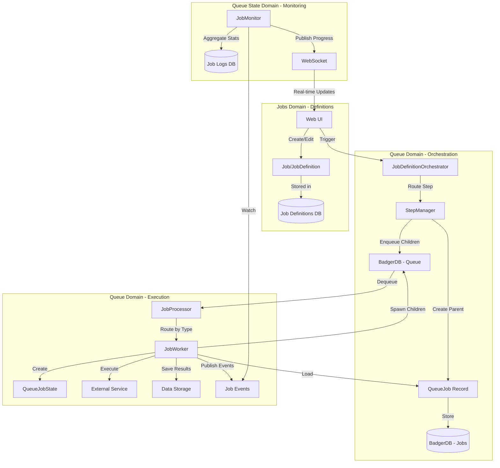

# Manager/Worker Architecture V2

**Version:** 2.0 (Revised Naming - IMPLEMENTED)
**Last Updated:** 2025-11-24
**Replaces:** MANAGER_WORKER_ARCHITECTURE.md v1.2
**Migration Status:** ✅ Complete - All phases finished (Steps 0-12)

## Executive Summary

Quaero's job system implements a **Manager/Worker/Monitor pattern** with clear separation between job states and operations:

### Three Domains

1. **Jobs Domain** - User-defined workflows (JobDefinition or Job)
2. **Queue Domain** - Immutable queued work (QueueJob)
3. **Queue State Domain** - Runtime execution information (QueueJobState)

### Three Job Operations

1. **JobManager (StepManager)** - Orchestrates job execution, creates parent jobs
2. **JobWorker** - Executes individual jobs from queue
3. **JobMonitor** - Watches job logs/events, stores runtime state against worker ID

## Key Architectural Principles

**Immutability:** Once a job is enqueued (`QueueJob`), it is immutable. Runtime state (Status, Progress) is tracked via job logs/events, NOT in the stored job.

**Separation of Concerns:**
- **Job/JobDefinition** = What to do (user-defined workflow)
- **QueueJob** = Work to be done (immutable task definition)
- **QueueJobState** = How it's going (runtime state, in-memory only)

**Clear Naming:**
- **Jobs** prefix = Job definitions and workflows
- **Queue** prefix = Queue-related operations and state

**Event-Driven State:** Job status changes are published as events and stored in job logs. The `JobMonitor` aggregates these events to track overall job progress.

## Architecture Overview



## Job State Lifecycle

```
1. User creates Job/JobDefinition via UI (Jobs Domain)
   ↓
2. User triggers job execution
   ↓
3. JobDefinitionOrchestrator routes to StepManager
   ↓
4. StepManager creates QueueJob (parent) and stores in BadgerDB (Queue Domain)
   ↓
5. StepManager enqueues child QueueJob records to queue
   ↓
6. JobProcessor dequeues QueueJob from queue
   ↓
7. JobWorker loads QueueJob and creates QueueJobState (in-memory, Queue State Domain)
   ↓
8. JobWorker executes task, publishes status events
   ↓
9. JobMonitor watches events, updates job logs (Queue State Domain)
   ↓
10. JobWorker completes, publishes completion event
   ↓
11. JobMonitor aggregates child stats, determines parent completion
```

## Core Data Structures

### JobDefinition (User-Defined Workflow)

**File:** `internal/models/job_definition.go`

```go
type JobDefinition struct {
    ID          string    `json:"id"`
    Name        string    `json:"name"`
    Type        JobDefinitionType `json:"type"` // crawler, agent, places, custom
    Description string    `json:"description"`
    Schedule    string    `json:"schedule"` // Cron expression (optional)
    Steps       []JobStep `json:"steps"`    // Workflow steps
    Enabled     bool      `json:"enabled"`
    AuthID      string    `json:"auth_id"`  // Authentication credentials
    CreatedAt   time.Time `json:"created_at"`
    UpdatedAt   time.Time `json:"updated_at"`
}
```

**Purpose:** Defines WHAT work to do and HOW to orchestrate it
**Storage:** BadgerDB (job_definitions table)
**Mutability:** Editable by user via UI

### QueueJob (Immutable Queued Job)

**File:** `internal/models/job_model.go`

```go
// QueueJob represents the immutable job sent to the queue and stored in the database.
// Once created and enqueued, this job should not be modified.
type QueueJob struct {
    // Core identification
    ID       string  `json:"id"`        // Unique job ID (UUID)
    ParentID *string `json:"parent_id"` // Parent job ID (nil for root)

    // Job classification
    Type string `json:"type"` // Job type: "crawler", "agent", etc.
    Name string `json:"name"` // Human-readable name

    // Configuration (immutable snapshot at creation time)
    Config   map[string]interface{} `json:"config"`
    Metadata map[string]interface{} `json:"metadata"`

    // Timestamps
    CreatedAt time.Time `json:"created_at"`

    // Hierarchy tracking
    Depth int `json:"depth"` // 0 for root, 1+ for children
}
```

**Purpose:** Immutable work definition sent to queue
**Storage:** BadgerDB (jobs table) - stores ONLY this, no runtime state
**Mutability:** IMMUTABLE after creation
**Key Methods:**
- `NewQueueJob()` - Create root job
- `NewQueueJobChild()` - Create child job
- `Validate()` - Validate job structure
- `GetConfigString/Int/Bool()` - Extract config values

### QueueJobState (Runtime Execution State)

**File:** `internal/models/job_model.go`

```go
// QueueJobState represents runtime execution state for a queued job (in-memory only)
// This combines the immutable QueueJob fields with mutable runtime state
// Runtime state (Status, Progress) should be tracked via job logs/events, not stored in database
type QueueJobState struct {
    // Fields from QueueJob (immutable)
    ID        string
    ParentID  *string
    Type      string
    Name      string
    Config    map[string]interface{}
    Metadata  map[string]interface{}
    CreatedAt time.Time
    Depth     int

    // Mutable runtime state (tracked via job logs/events)
    Status        JobStatus   `json:"status"`        // pending, running, completed, failed
    Progress      JobProgress `json:"progress"`      // Execution progress
    StartedAt     *time.Time  `json:"started_at"`
    CompletedAt   *time.Time  `json:"completed_at"`
    Error         string      `json:"error"`
    ResultCount   int         `json:"result_count"`
    FailedCount   int         `json:"failed_count"`
}
```

**Purpose:** In-memory runtime state during execution
**Storage:** NOT stored in database (reconstructed from QueueJob + job logs)
**Mutability:** Mutable during execution
**Key Methods:**
- `NewQueueJobState(queueJob *QueueJob)` - Create from queued job
- `ToQueueJob()` - Extract immutable job
- `MarkStarted/Completed/Failed()` - Update status
- `UpdateProgress()` - Update progress counters

## Interface Definitions

### StepManager (Job Orchestration)

**File:** `internal/interfaces/job_interfaces.go`

```go
// StepManager creates parent jobs and orchestrates job definition steps
type StepManager interface {
    // CreateParentJob creates a parent job and spawns initial child jobs
    CreateParentJob(ctx context.Context, step models.JobStep, jobDef *models.JobDefinition, parentJobID string) (jobID string, err error)

    // GetManagerType returns the action type this manager handles (e.g., "crawl")
    GetManagerType() string
}
```

**Implementations:**
- `CrawlerManager` - Handles "crawl" action
- `AgentManager` - Handles "agent" action
- `DatabaseMaintenanceManager` - Handles "database_maintenance" action
- `TransformManager` - Handles "transform" action
- `ReindexManager` - Handles "reindex" action
- `PlacesSearchManager` - Handles "places_search" action

**Responsibilities:**
1. Create parent `JobQueued` record in database
2. Define work items (e.g., URLs to crawl, documents to process)
3. Enqueue child `JobQueued` records to queue
4. NO direct execution - delegates to workers

### JobWorker (Job Execution)

**File:** `internal/interfaces/job_interfaces.go`

```go
// JobWorker executes individual jobs from the queue
type JobWorker interface {
    // Execute processes a single job from the queue
    Execute(ctx context.Context, job *models.QueueJob) error

    // GetWorkerType returns the job type this worker handles
    GetWorkerType() string

    // Validate validates that the job is compatible with this worker
    Validate(job *models.QueueJob) error
}
```

**Implementations:**
- `CrawlerWorker` - Executes crawler jobs
- `AgentWorker` - Executes agent jobs
- `DatabaseMaintenanceWorker` - Executes maintenance jobs

**Responsibilities:**
1. Load `JobQueued` from queue
2. Create `JobExecutionState` for in-memory tracking
3. Execute task (fetch URL, run agent, etc.)
4. Publish status events (started, progress, completed)
5. Spawn child jobs if needed (URL discovery)
6. Save results to storage

### JobMonitor (Progress Monitoring)

**File:** `internal/interfaces/job_interfaces.go`

```go
// JobMonitor monitors parent job progress and aggregates child statistics
type JobMonitor interface {
    // StartMonitoring begins monitoring a parent job
    StartMonitoring(ctx context.Context, parentJobID string) error

    // StopMonitoring stops monitoring a parent job
    StopMonitoring(parentJobID string) error

    // GetJobProgress returns current progress for a job
    GetJobProgress(ctx context.Context, jobID string) (*JobProgress, error)
}
```

**Implementation:** `internal/jobs/monitor/job_monitor.go`

**Responsibilities:**
1. Subscribe to job events (started, progress, completed)
2. Aggregate child job statistics
3. Determine parent job completion
4. Publish progress updates via WebSocket
5. Store job logs in database

## Storage Architecture

### BadgerDB Tables

**jobs** - Stores `QueueJob` (immutable queued jobs)
```
Key: job_id (string)
Value: QueueJob struct (JSON serialized)
```

**job_logs** - Stores job events and status changes
```
Key: log_id (string)
Value: JobLog struct with job_id, event_type, payload, timestamp
```

**queue** - Stores queued messages for worker processing
```
Key: message_id (string)
Value: QueueMessage struct with job_id, job_type, visibility_timeout
```

### Key Storage Principle

**CRITICAL:** BadgerDB stores ONLY `QueueJob` (immutable job definition), NOT `QueueJobState` (runtime state).

Runtime state is tracked via:
1. Job events published by workers
2. Job logs stored in `job_logs` table
3. JobMonitor aggregating events into progress statistics

This solves the BadgerHold serialization issue by avoiding complex nested structs with runtime state.

## Migration Plan (Incremental Steps)

See separate document: `docs/architecture/MIGRATION_V1_TO_V2.md`

