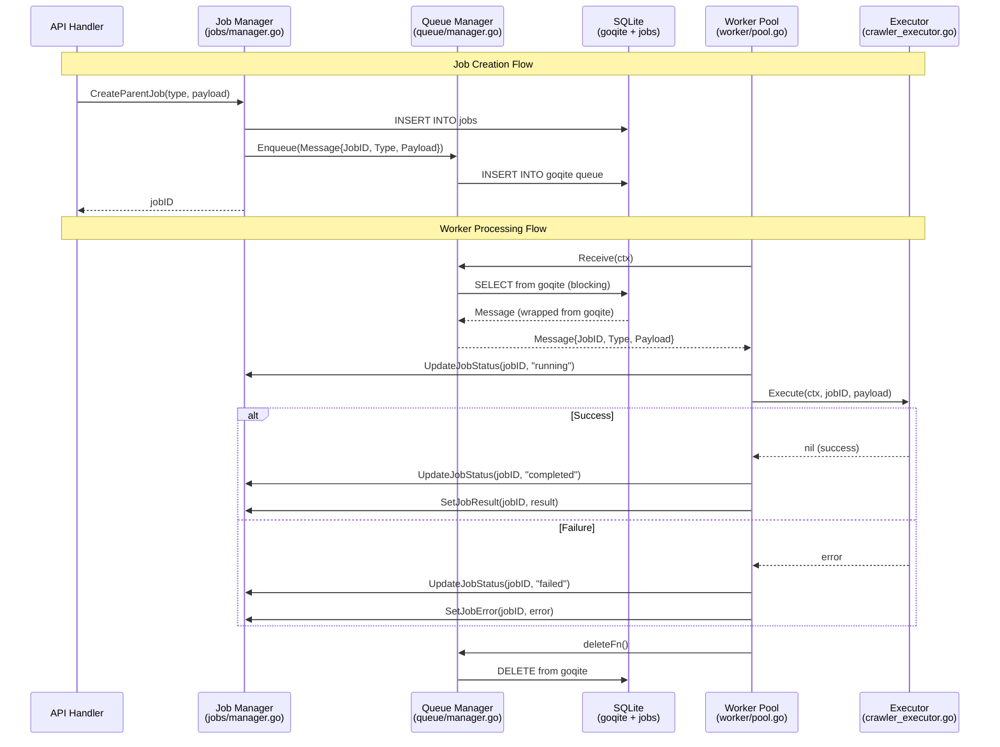

# Queue Architecture Documentation

**Status:** Post-Refactor (Transition Complete)
**Last Updated:** 2025-11-03
**Version:** 0.1.1656

## Executive Summary

The Quaero queue system has undergone a **major architectural refactoring** from a complex, tightly-coupled system to a simplified, loosely-coupled architecture based on goqite and the Executor pattern.

**Key Changes:**
- ✅ Complex JobMessage (8+ fields) → Simple Message (3 fields)
- ✅ JobHandler pattern → Executor pattern
- ✅ Monolithic job manager → Separated Queue/Job/Worker concerns
- ✅ Custom queue implementation → goqite (SQLite-backed persistent queue)
- ✅ WorkerPool moved from `internal/queue/` → `internal/worker/`

**Current State:**
- Core infrastructure: **Complete and working**
- Business logic (executors): **Placeholder implementations**
- Database schema: **Requires migration** (crawl_jobs → jobs table mismatch)
- UI: **Requires updates** for queue management

---

## Architecture Overview

### Component Diagram

```
┌─────────────────────────────────────────────────────────┐
│                    Application Layer                      │
│  internal/app/app.go - Dependency Injection & Init       │
└─────────────────────────────────────────────────────────┘
                            │
        ┌───────────────────┼───────────────────┐
        │                   │                   │
        ▼                   ▼                   ▼
┌──────────────┐    ┌──────────────┐   ┌──────────────┐
│Queue Manager │    │ Job Manager  │   │ Worker Pool  │
│queue/        │    │ jobs/        │   │ worker/      │
│manager.go    │    │ manager.go   │   │ pool.go      │
└──────────────┘    └──────────────┘   └──────────────┘
        │                   │                   │
        │                   │                   └──────┐
        ▼                   ▼                          ▼
┌──────────────────────────────────┐         ┌─────────────────┐
│         SQLite Database          │         │   Executors     │
│  ┌────────┐      ┌────────┐     │         │  (Pluggable)    │
│  │ goqite │      │  jobs  │     │         │                 │
│  │ queue  │      │ table  │     │         │ CrawlerExecutor │
│  └────────┘      └────────┘     │         │ (placeholder)   │
└──────────────────────────────────┘         └─────────────────┘
```

---

## Core Components

### 1. Queue Manager (`internal/queue/manager.go`)

**Purpose:** Thin wrapper around goqite for message queue operations

**API:**
```go
func NewManager(db *sql.DB, queueName string) (*Manager, error)
func (m *Manager) Enqueue(ctx context.Context, msg Message) error
func (m *Manager) Receive(ctx context.Context) (*Message, func() error, error)
func (m *Manager) Extend(ctx context.Context, messageID goqite.ID, duration time.Duration) error
func (m *Manager) Close() error
```

**Design Principles:**
- No business logic - pure queue operations only
- Delegates to goqite for all persistence
- Returns queue.Message (wrapped from goqite) with custom delete function
- Stateless - Close() properly shuts down goqite

**Message Structure:**
```go
// internal/queue/types.go
type Message struct {
    JobID   string          // References jobs.id in database
    Type    string          // Job type for executor routing
    Payload json.RawMessage // Job-specific data (opaque to queue)
}
```

**Key Insight:** This is a **major simplification** from the old `JobMessage` which had URL, Depth, ParentID, JobDefinitionID, Config, and Metadata fields. The new design pushes all business logic into the payload.

---

### 2. Job Manager (`internal/jobs/manager.go`)

**Purpose:** CRUD operations for job metadata tracking

**API:**
```go
func NewManager(db *sql.DB, queueMgr *queue.Manager) *Manager
func (m *Manager) CreateParentJob(ctx context.Context, jobType string, payload interface{}) (string, error)
func (m *Manager) CreateChildJob(ctx context.Context, parentID, jobType, phase string, payload interface{}) (string, error)
func (m *Manager) GetJob(ctx context.Context, jobID string) (*Job, error)
func (m *Manager) ListParentJobs(ctx context.Context, limit, offset int) ([]Job, error)
func (m *Manager) ListChildJobs(ctx context.Context, parentID string) ([]Job, error)
func (m *Manager) UpdateJobStatus(ctx context.Context, jobID, status string) error
func (m *Manager) UpdateJobProgress(ctx context.Context, jobID string, current, total int) error
func (m *Manager) SetJobError(ctx context.Context, jobID string, errorMsg string) error
func (m *Manager) SetJobResult(ctx context.Context, jobID string, result interface{}) error
func (m *Manager) AddJobLog(ctx context.Context, jobID, level, message string) error
func (m *Manager) GetJobLogs(ctx context.Context, jobID string, limit int) ([]JobLog, error)
```

**Job Structure:**
```go
type Job struct {
    ID              string
    ParentID        *string
    Type            string
    Phase           string
    Status          string
    CreatedAt       time.Time
    StartedAt       *time.Time
    CompletedAt     *time.Time
    Payload         string
    Result          string
    Error           *string
    ProgressCurrent int
    ProgressTotal   int
}
```

**Design Note:** Much simpler than the old CrawlJob model. Uses generic Payload/Result fields instead of domain-specific fields.

---

### 3. Worker Pool (`internal/worker/pool.go`)

**Purpose:** Concurrent job execution with pluggable executors

**API:**
```go
func NewWorkerPool(queue *queue.Manager, jobs *jobs.Manager, logger arbor.ILogger, numWorkers int) *WorkerPool
func (wp *WorkerPool) RegisterExecutor(jobType string, executor Executor)
func (wp *WorkerPool) Start()
func (wp *WorkerPool) Stop()
```

**Executor Interface:**
```go
type Executor interface {
    Execute(ctx context.Context, jobID string, payload []byte) error
}
```

**Worker Loop:**
```go
1. Receive message from queue (blocks on poll)
2. Parse message (JobID, Type, Payload)
3. Update job status → "running"
4. Route to appropriate Executor based on Type
5. Execute job
6. Update job status → "completed" or "failed"
7. Add result/error to job record
8. Delete message from queue
9. Repeat
```

**Graceful Shutdown:**
- `Stop()` signals all workers to stop
- Workers finish current job before exiting
- Uses `sync.WaitGroup` to wait for all workers

---

### 4. Executor Pattern (`internal/worker/`)

**Current Executors:**

#### CrawlerExecutor (`internal/worker/crawler_executor.go`)
**Status:** ⚠️ Placeholder implementation

```go
type CrawlerExecutor struct {
    crawlerService *crawler.Service
    logger         arbor.ILogger
}

func (e *CrawlerExecutor) Execute(ctx context.Context, jobID string, payload []byte) error {
    // Parse payload
    var crawlPayload CrawlerPayload
    json.Unmarshal(payload, &crawlPayload)

    // TODO: Implement actual crawler execution
    return fmt.Errorf("crawler executor not yet fully implemented")
}
```

**Integration Point:** Needs to call `crawlerService` methods for actual URL crawling

**Future Executors:**
- SummarizerExecutor - Document summarization
- CleanupExecutor - Old data cleanup
- EmbeddingExecutor - Generate embeddings for documents

---

## Data Flow

**Note:** Queue management UI is not yet implemented. Data flows begin at API handlers (e.g., `/api/jobs/create`) rather than a dedicated queue UI. The current job management UI at `pages/jobs.html` focuses on authentication, sources, and job definitions, but lacks queue execution controls.

### Job Creation & Execution Flow



---

## Initialization Sequence

From `internal/app/app.go` (lines 288-353):

```go
// 1. Queue Manager (goqite wrapper)
queueMgr, err := queue.NewManager(db, config.Queue.QueueName)
a.QueueManager = queueMgr

// 2. Job Manager (job metadata CRUD)
jobMgr := jobs.NewManager(db, queueMgr)
a.JobManager = jobMgr

// 3. Worker Pool (job execution)
workerPool := worker.NewWorkerPool(queueMgr, jobMgr, logger, config.Queue.Concurrency)
a.WorkerPool = workerPool

// 4. Register Executors
crawlerExecutor := worker.NewCrawlerExecutor(a.CrawlerService, a.Logger)
workerPool.RegisterExecutor("crawler", crawlerExecutor)

// 5. Start Workers
workerPool.Start()
```

**Note:** Services that depend on queue components receive `nil` during transition:
- `CrawlerService` - receives `nil` QueueManager (line 316)
- `JobHandler` - receives `nil` JobManager (line 512)

This is intentional during the refactor to decouple services from queue implementation.

---

## Database Schema

### ⚠️ CRITICAL: Schema Mismatch

**Schema Definition** (`internal/storage/sqlite/schema.go` lines 114-137):
```sql
CREATE TABLE crawl_jobs (
    id TEXT PRIMARY KEY,
    parent_id TEXT,
    job_type TEXT NOT NULL,
    name TEXT,
    description TEXT,
    source_type TEXT,
    entity_type TEXT,
    config_json TEXT,
    source_config_snapshot TEXT,
    auth_snapshot TEXT,
    refresh_source INTEGER DEFAULT 0,
    seed_urls TEXT,
    status TEXT NOT NULL DEFAULT 'pending',
    progress_json TEXT,
    metadata TEXT,
    created_at TIMESTAMP DEFAULT CURRENT_TIMESTAMP,
    started_at TIMESTAMP,
    completed_at TIMESTAMP,
    last_heartbeat TIMESTAMP,
    error TEXT,
    result_count INTEGER DEFAULT 0,
    failed_count INTEGER DEFAULT 0
)
```

**Code Uses** (`internal/jobs/manager.go` lines 64-67):
```sql
INSERT INTO jobs (id, parent_id, job_type, phase, status, created_at, payload)
VALUES (?, NULL, ?, 'core', 'pending', ?, ?)
```

**Impact:**
- ❌ Job creation will fail with "no such table: jobs"
- ❌ Need migration to create `jobs` table
- ❌ Need migration to port data from `crawl_jobs` → `jobs`
- ❌ Schema file needs update to reflect new structure

### Supporting Tables

#### job_logs Table (`internal/storage/sqlite/schema.go` lines 160-173)
```sql
CREATE TABLE IF NOT EXISTS job_logs (
    id INTEGER PRIMARY KEY AUTOINCREMENT,
    job_id TEXT NOT NULL,
    timestamp TEXT NOT NULL,
    level TEXT NOT NULL,
    message TEXT NOT NULL,
    created_at INTEGER NOT NULL,
    FOREIGN KEY (job_id) REFERENCES crawl_jobs(id) ON DELETE CASCADE
);
CREATE INDEX IF NOT EXISTS idx_job_logs_job_id ON job_logs(job_id, created_at DESC);
CREATE INDEX IF NOT EXISTS idx_job_logs_level ON job_logs(level, created_at DESC);
```

**Purpose:** Stores unlimited job execution logs with structured indexing

**Key Features:**
- Foreign key with CASCADE DELETE - logs removed when job deleted
- Composite index on (job_id, created_at DESC) for efficient log retrieval
- Level index for filtering by log severity
- Supports job correlation via job_id

#### job_seen_urls Table (`internal/storage/sqlite/schema.go` lines 146-158)
```sql
CREATE TABLE IF NOT EXISTS job_seen_urls (
    job_id TEXT NOT NULL,
    url TEXT NOT NULL,
    created_at INTEGER NOT NULL,
    PRIMARY KEY (job_id, url),
    FOREIGN KEY (job_id) REFERENCES crawl_jobs(id) ON DELETE CASCADE
);
CREATE INDEX IF NOT EXISTS idx_job_seen_urls_job_id ON job_seen_urls(job_id);
```

**Purpose:** URL deduplication for crawler jobs to prevent re-processing

**Key Features:**
- Composite primary key (job_id, url) ensures uniqueness per job
- Foreign key with CASCADE DELETE - URLs cleaned up when job deleted
- Index on job_id for efficient job-specific lookups
- Used by crawler executors to track visited URLs

### goqite Tables

**Note:** The goqite library creates its own tables during `goqite.Setup()`:
- `goqite_messages` - Queue messages with visibility timeout
- `goqite_config` - Queue configuration and metadata

These tables are managed by goqite internally and should not be modified directly.

**Recommended Migration:**
1. Create `jobs` table with new simplified structure
2. Migrate existing `crawl_jobs` data (if any)
3. Update `schema.go` to document `jobs` table
4. Optionally: Keep `crawl_jobs` for backward compatibility

---

## Configuration

From `internal/common/config.go`:

```toml
[queue]
queue_name = "quaero_jobs"           # goqite queue name
concurrency = 4                       # Number of worker goroutines
poll_interval = "1s"                  # How often to poll queue
visibility_timeout = "5m"             # Message lock duration
max_receive = 3                       # Max times to retry failed job
```

**goqite Configuration:**
- Uses SQLite transactions for atomic operations
- Messages invisible to other workers during processing
- Auto-cleanup of old messages via goqite maintenance

---

## WebSocket Real-Time Updates

### Overview

The WebSocket infrastructure provides real-time job status updates to connected clients (UI).

**Handler:** `internal/handlers/websocket.go`

### Architecture

```
┌─────────────────────┐
│  WebSocket Clients  │ (Browser UI)
└──────────┬──────────┘
           │ WS Connection
           ▼
┌─────────────────────┐
│  WebSocketHandler   │
│  - Client registry  │
│  - Broadcaster      │
│  - Event subscriber │
└──────────┬──────────┘
           │
           ▼
┌─────────────────────┐
│   EventService      │ (Pub/Sub)
│  - Job lifecycle    │
│  - Status changes   │
└─────────────────────┘
```

### Initialization

From `internal/app/app.go` (lines 684-699):

```go
// 1. Create WebSocket handler
wsHandler := handlers.NewWebSocketHandler(logger)
a.WSHandler = wsHandler

// 2. Subscribe to job lifecycle events
if a.EventService != nil {
    a.EventService.Subscribe("job:*", wsHandler)
}
```

**EventSubscriber Pattern:** WebSocketHandler implements the `EventSubscriber` interface to receive job lifecycle events (created, started, completed, failed) and broadcast them to connected clients.

### WebSocket Messages

**Job Status Updates:**
```json
{
    "type": "job_status",
    "data": {
        "job_id": "abc123",
        "status": "running",
        "progress": {
            "current": 50,
            "total": 100
        }
    }
}
```

**Job Logs:**
```json
{
    "type": "job_log",
    "data": {
        "job_id": "abc123",
        "level": "info",
        "message": "Processing URL...",
        "timestamp": "2025-11-03T12:00:00Z"
    }
}
```

### Current Implementation Status

**✅ Implemented:**
- WebSocket connection handling
- Client registry management
- Log streaming via `SendLog()` method
- Event subscriber pattern

**⚠️ Partially Implemented:**
- Queue stats broadcaster (commented out in app.go line 688)
- Job lifecycle event broadcasting (EventService subscription exists but needs testing)

**❌ Not Implemented:**
- Queue job status WebSocket updates (no queue UI yet)
- Real-time progress updates from executors
- Job cancellation via WebSocket

### Usage Example

**Server Side (in Executor):**
```go
func (e *CrawlerExecutor) Execute(ctx context.Context, jobID string, payload []byte) error {
    // Send log to WebSocket clients
    e.wsHandler.SendLog(jobID, "info", "Starting crawl job")

    // Do work...

    e.wsHandler.SendLog(jobID, "info", "Completed crawl job")
    return nil
}
```

**Client Side (JavaScript):**
```javascript
const ws = new WebSocket('ws://localhost:8085/ws');

ws.onmessage = (event) => {
    const msg = JSON.parse(event.data);

    if (msg.type === 'job_log') {
        console.log(`[${msg.data.level}] ${msg.data.message}`);
    }
};
```

---

## What Was Removed

### Old Architecture Components

#### 1. Complex JobMessage Structure
**OLD** (`internal/queue/types.go` - deleted):
```go
type JobMessage struct {
    ID              string
    Type            string
    URL             string
    Depth           int
    ParentID        string
    JobDefinitionID string
    Config          map[string]interface{}
    Metadata        map[string]interface{}
}
```

**Replaced With:**
```go
type Message struct {
    JobID   string
    Type    string
    Payload json.RawMessage
}
```

#### 2. Job Types Package
**OLD:** `internal/jobs/types/` with:
- `BaseJob` - Base functionality for all job types
- `CrawlerJob` - URL crawling jobs
- `SummarizerJob` - Document summarization
- `CleanupJob` - Old data cleanup
- `JobLogger` - Context-aware correlation logging

**NEW:** Simple Executor interface - each executor implements its own logic

#### 3. JobExecutor System
**OLD** (`internal/services/jobs/executor.go` - commented out in app.go:374-399):
- JobRegistry for action handlers
- Multi-step workflow orchestration
- Complex parent-child hierarchy

**NEW:** Simple Executor pattern - one Execute() method

#### 4. Complex JobHandler Pattern
**OLD:** JobHandler interface with OnStart, OnProgress, OnComplete, OnError
**NEW:** Executor interface with single Execute() method

---

## Current State Assessment

### ✅ Working Components

1. **Queue Manager** - goqite wrapper operational
2. **Job Manager** - CRUD operations implemented
3. **Worker Pool** - Concurrent execution working
4. **Message Flow** - Enqueue → Process → Delete works
5. **Job Tracking** - Status, progress, logs functional

### ⚠️ Incomplete/Placeholder Components

1. **CrawlerExecutor** - Returns "not yet fully implemented" error
2. **Database Schema** - crawl_jobs vs jobs table mismatch
3. **Other Executors** - Summarizer, Cleanup, Embedding not created
4. **Parent-Child Hierarchy** - Minimally supported via `parent_id` field. Job creation (`CreateChildJob`) and listing (`ListChildJobs`) work, but higher-level features like progress roll-up and parent-child UI display are not implemented.
5. **Progress Tracking** - Simple counters only, no URL-level detail
6. **Error Tolerance** - Not implemented (was in old system)

### ❌ Missing Components

1. **Queue Management UI** - pages/queue.html not found/linked
2. **Job Execution Monitoring** - No real-time updates
3. **WebSocket Integration** - No live job status updates
4. **Job Logs Viewer** - UI for viewing job logs
5. **Retry Logic** - Relies on goqite max_receive only

---

## Testing Status

### Unit Tests: ✅ Passing
- `internal/handlers/*_test.go` - Handler tests pass
- `internal/services/search/*_test.go` - Search service tests pass

### Integration Tests: ⚠️ Disabled
- `test/api/job_error_tolerance_test.go.disabled` - References old `internal/jobs/types` package (removed)
- Needs rewrite to use new Executor pattern

### Build Status: ✅ Passing
- Version: 0.1.1656
- Build: 11-03-11-56-42
- Output: 25.22 MB executable

---

## Migration Path to Production

### Phase 1: Database Schema Migration ⚠️ REQUIRED
**Priority:** Critical - System won't work without this

1. Create `jobs` table migration
2. Port data from `crawl_jobs` (if needed)
3. Update `schema.go` to document both tables
4. Test CRUD operations

**Estimated Effort:** 2-4 hours

### Phase 2: Complete CrawlerExecutor
**Priority:** High - Core functionality

1. Integrate with `crawler.Service`
2. Implement URL fetching logic
3. Add document extraction
4. Test end-to-end crawl job

**Estimated Effort:** 8-16 hours

### Phase 3: Add More Executors
**Priority:** Medium - Nice to have

1. SummarizerExecutor - Document summarization
2. CleanupExecutor - Old data removal
3. EmbeddingExecutor - Generate embeddings

**Estimated Effort:** 4-8 hours per executor

### Phase 4: UI Development
**Priority:** Medium - Improves usability

1. Queue management page
2. Job execution monitor
3. WebSocket real-time updates
4. Job logs viewer

**Estimated Effort:** 16-24 hours

### Phase 5: Advanced Features
**Priority:** Low - Future enhancements

1. Parent-child job hierarchies
2. Detailed progress tracking (per-URL)
3. Error tolerance policies
4. Job scheduling (cron-like)
5. Job priorities

**Estimated Effort:** 24-40 hours

---

## Architecture Comparison

| Aspect | Old System | New System | Impact |
|--------|-----------|------------|--------|
| **Message** | JobMessage (8+ fields) | Message (3 fields) | ✅ Simpler, more flexible |
| **Worker** | JobHandler (4 callbacks) | Executor (1 method) | ✅ Easier to implement |
| **Job Manager** | Complex (services/jobs) | Simple (jobs/manager) | ✅ Less coupling |
| **Queue** | Custom implementation | goqite (SQLite) | ✅ More reliable, persistent |
| **Job Types** | Hardcoded (CrawlerJob, etc.) | Pluggable executors | ✅ More extensible |
| **Hierarchy** | Built-in parent-child | Simple parent_id field | ⚠️ Less features, needs rebuild |
| **Progress** | Detailed (URL-level) | Simple counters | ⚠️ Less visibility |
| **Logging** | Context-aware JobLogger | Basic AddJobLog | ⚠️ Less correlation |
| **UI** | Queue management | Job definitions | ❌ Missing monitoring |
| **Table** | crawl_jobs (complex) | jobs (simple) | ⚠️ Migration needed |

---

## Key Design Decisions

### 1. Why goqite?
- **SQLite-backed** - No additional dependencies
- **Persistent** - Survives restarts
- **Transactional** - ACID guarantees
- **Simple** - No complex setup

### 2. Why Executor Pattern?
- **Pluggable** - Easy to add new job types
- **Testable** - Simple interface to mock
- **Isolated** - Each executor is independent
- **Flexible** - No rigid callback structure

### 3. Why Simplify Message?
- **Opaque Payload** - Queue doesn't need to understand job details
- **Type Routing** - Simple string matching for executor selection
- **Extensible** - Add new job types without changing queue
- **Decoupled** - Queue logic separate from business logic

### 4. Why Separate Queue/Job/Worker?
- **Single Responsibility** - Each component has one job
- **Testable** - Can test components independently
- **Flexible** - Can swap implementations
- **Maintainable** - Smaller, focused codebases

---

## Common Patterns

### Creating a Job

```go
// 1. Define payload
payload := map[string]interface{}{
    "url": "https://example.com",
    "max_depth": 2,
}

// 2. Create parent job (also enqueues to queue)
jobID, err := jobManager.CreateParentJob(ctx, "crawler", payload)
if err != nil {
    return err
}

// 3. Job is now in queue and will be processed by workers
```

### Implementing an Executor

```go
type MyExecutor struct {
    service *SomeService
    logger  arbor.ILogger
}

func (e *MyExecutor) Execute(ctx context.Context, jobID string, payload []byte) error {
    // 1. Parse payload
    var params MyParams
    if err := json.Unmarshal(payload, &params); err != nil {
        return fmt.Errorf("invalid payload: %w", err)
    }

    // 2. Do work
    result, err := e.service.DoWork(ctx, params)
    if err != nil {
        return err
    }

    // 3. Return success
    e.logger.Info().Str("job_id", jobID).Msg("Job completed")
    return nil
}
```

### Monitoring Job Status

```go
// Get job
job, err := jobManager.GetJob(ctx, jobID)
if err != nil {
    return err
}

// Check status
switch job.Status {
case "pending":
    fmt.Println("Waiting in queue")
case "running":
    fmt.Println("Processing...")
case "completed":
    fmt.Println("Done!")
case "failed":
    if job.Error != nil {
        fmt.Printf("Failed: %s\n", *job.Error)
    }
}

// Check progress
if job.ProgressTotal > 0 {
    pct := float64(job.ProgressCurrent) / float64(job.ProgressTotal) * 100
    fmt.Printf("Progress: %.1f%%\n", pct)
}
```

---

## Troubleshooting

### "no such table: jobs"
**Cause:** Database schema not migrated
**Solution:** Run migration to create `jobs` table (Phase 1)

### "crawler executor not yet fully implemented"
**Cause:** CrawlerExecutor is placeholder
**Solution:** Complete implementation (Phase 2)

### Workers not processing jobs
**Check:**
1. Worker pool started? (`workerPool.Start()` called)
2. Executors registered? (`RegisterExecutor()` called)
3. Queue has messages? (check goqite table)
4. Database connection ok?

### Jobs stuck in "running" status
**Cause:** Worker crashed mid-execution
**Solution:** goqite visibility timeout will expire and job becomes available again

---

## Future Enhancements

### Short Term
- [ ] Complete CrawlerExecutor implementation
- [ ] Migrate database schema (crawl_jobs → jobs)
- [ ] Add more executors (summarizer, cleanup)
- [ ] Build queue management UI

### Medium Term
- [ ] Re-implement parent-child hierarchy
- [ ] Add detailed progress tracking
- [ ] Implement error tolerance policies
- [ ] Add WebSocket real-time updates

### Long Term
- [ ] Job scheduling (cron-like)
- [ ] Job priorities/weights
- [ ] Distributed workers (multi-machine)
- [ ] Job cancellation API
- [ ] Job retry with backoff

---

## References

### Core Files
- **Queue:** `internal/queue/manager.go`, `internal/queue/types.go`
- **Jobs:** `internal/jobs/manager.go`
- **Workers:** `internal/worker/pool.go`
- **Executors:** `internal/worker/crawler_executor.go`
- **App:** `internal/app/app.go` (lines 288-353, 684-699)
- **Schema:** `internal/storage/sqlite/schema.go` (lines 114-173)
- **Config:** `internal/common/config.go` (QueueConfig struct)

### Related Documentation
- **Queue Refactor Plan:** `docs/refactor-queue-manager/`
- **Test Results:** `test/results/`
- **Build Logs:** `scripts/logs/`

### External Dependencies
- **goqite:** https://github.com/maragudk/goqite (SQLite-backed persistent queue)
- **SQLite:** https://sqlite.org/ (Database engine)

---

## Conclusion

The queue system refactor is **functionally complete at the infrastructure level** but requires finishing touches for production use:

**✅ Complete:**
- Core queue, job, and worker components
- Message flow and persistence
- Graceful shutdown
- Basic job tracking

**⚠️ In Progress:**
- Database schema migration
- Executor implementations
- UI development

**❌ Not Started:**
- Advanced features (error tolerance, priorities, etc.)
- Distributed workers
- Job scheduling

**Recommended Next Steps:**
1. **Phase 1 (Database Migration)** - Critical for system to work
2. **Phase 2 (Complete CrawlerExecutor)** - Core functionality
3. **Phase 4 (UI)** - User-facing features
4. **Phase 3 (More Executors)** - Expand capabilities

The refactoring successfully **simplified the architecture** while maintaining **extensibility and reliability**. The new system is easier to understand, test, and maintain compared to the old complex implementation.

---

**Document Version:** 1.0
**Last Reviewed:** 2025-11-03
**Next Review:** After Phase 1 completion
