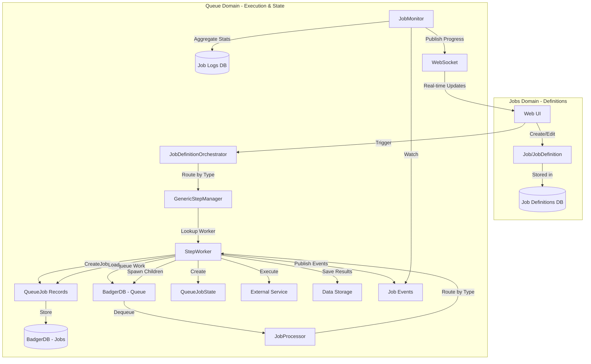
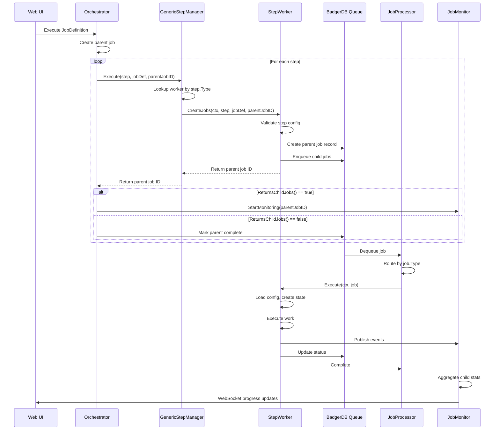

# Manager/Worker Architecture

**Version:** 3.0 (Job Type Workers Refactor - IMPLEMENTED)
**Last Updated:** 2025-11-29
**Migration Status:** ✅ Complete - Type-based worker routing implemented
**Migration Details:** See `docs/feature/20251129-job-type-workers/plan.md`

## Executive Summary

Quaero's job system implements a **Type-Based Worker Pattern** with unified job creation and execution:

### Two Domains

1. **Jobs Domain** - User-defined workflows (JobDefinition or Job)
   - Located in: `internal/jobs/` (definition management)
   - Orchestrator in: `internal/queue/orchestrator.go` (execution logic)
2. **Queue Domain** - Job execution including immutable work and runtime state
   - Located in: `internal/queue/`
   - Includes: Queue operations, managers, workers, and state tracking

### Key Architectural Changes (v3.0)

**Before (v2.1):**
- Separate StepManager (job creation) and JobWorker (execution)
- Action-based routing with multiple manager implementations
- Complex two-phase workflow with different interfaces

**After (v3.0):**
- Unified StepWorker interface handles both creation and execution
- Type-based routing through GenericStepManager
- Single worker per job type with consistent interface
- Simplified registration and routing logic

### Three Job Operations (all within Queue Domain)

1. **GenericStepManager** - Routes steps to workers based on step.Type
2. **StepWorker** - Creates jobs AND executes them (unified interface)
3. **JobMonitor** - Watches job logs/events, tracks runtime state

## Key Architectural Principles

**Type-Based Routing:** Steps are routed to workers based on their `step.Type` field (e.g., "agent", "crawler", "places_search"). The GenericStepManager maintains a registry of workers and delegates to the appropriate worker for each step type.

**Unified Worker Interface:** Each StepWorker implementation handles both job creation (CreateJobs) and execution (Execute). This eliminates the split between managers and workers, reducing code duplication and cognitive overhead.

**Immutability:** Once a job is enqueued (`QueueJob`), it is immutable. Runtime state (Status, Progress) is tracked via job logs/events, NOT in the stored job.

**Separation of Concerns:**
- **Job/JobDefinition** = What to do (user-defined workflow) - **Jobs Domain**
- **QueueJob** = Work to be done (immutable task definition) - **Queue Domain**
- **QueueJobState** = How it's going (runtime state, in-memory only) - **Queue Domain**

**Clear Naming:**
- **Jobs** = User-defined workflows (what to execute)
- **Queue** = Execution system (how to execute, including state tracking)
- **Step Types** = Explicit type enumeration (StepType enum)

**Event-Driven State:** Job status changes are published as events and stored in job logs. The `JobMonitor` aggregates these events to track overall job progress.

**Domain-Based Organization:** The folder structure enforces the two-domain model with clear boundaries:
- **Jobs Domain** - User-defined workflows
- **Queue Domain** - All execution concerns (operations AND state)

## Folder Structure

The job system is organized into two distinct domains:

### Jobs Domain - Definition Management (`internal/jobs/`)
- Job definition CRUD operations
- Validation and TOML parsing
- **Note:** `JobDefinitionOrchestrator` is in Queue Domain (`internal/queue/orchestrator.go`)

### Queue Domain - Execution (`internal/queue/`)

All queue operations and state tracking are unified under the queue domain:

- **`badger_manager.go`** - Badger-backed queue manager
  - Message queue operations (Enqueue, Receive, Extend, Close)
  - Visibility timeout management

- **`lifecycle.go`** - Job lifecycle management
  - Job creation (`CreateJob`, `CreateChildJob`)
  - Job retrieval (`GetJob`, `ListJobs`)
  - Queue enqueue/dequeue operations

- **`generic_manager.go`** - Generic step manager (NEW in v3.0)
  - Type-based routing to StepWorker implementations
  - Worker registration and lookup
  - Replaces action-based routing from v2.1

- **`orchestrator.go`** - Job definition orchestrator
  - Coordinates job definition execution
  - Routes steps to GenericStepManager
  - Manages parent job creation and monitoring

- **`workers/`** - StepWorker implementations (UNIFIED in v3.0)
  - `job_processor.go` - Routes queued jobs to workers for execution
  - `agent_worker.go` - Handles "agent" type (creation + execution)
  - `crawler_worker.go` - Handles "crawler" type (creation + execution)
  - `places_worker.go` - Handles "places_search" type (creation + execution)
  - `web_search_worker.go` - Handles "web_search" type (creation + execution)
  - `github_repo_worker.go` - Handles "github_repo" type (creation + execution)
  - `github_log_worker.go` - Handles "github_actions" type (creation + execution)
  - `transform_worker.go` - Handles "transform" type (creation + execution)
  - `reindex_worker.go` - Handles "reindex" type (creation + execution)
  - `database_maintenance_worker.go` - Handles "database_maintenance" type (creation + execution)

- **`state/`** - Runtime state tracking (part of queue domain)
  - `runtime.go` - Status and error management
    - `UpdateJobStatus` - Update job execution status
    - `MarkJobStarted/Completed/Failed` - Status transitions
    - `SetJobError` - Error tracking
  - `progress.go` - Progress tracking
    - `UpdateJobProgress` - Update progress counters
    - `IncrementProcessed/Failed` - Atomic counter updates
  - `stats.go` - Statistics aggregation
    - `GetJobStats` - Aggregate statistics for parent jobs
    - `CalculateCompletionPercentage` - Progress calculations
  - `monitor.go` - `JobMonitor` implementation
    - Job completion monitoring
    - Event aggregation and WebSocket publishing

### Responsibility Separation

**Queue Operations (`lifecycle.go`, `badger_manager.go`)** - Immutable operations:
- Creating jobs (parent and child)
- Retrieving jobs
- Enqueuing/dequeuing messages
- NO status updates or mutations

**Worker Operations (`workers/*_worker.go`)** - Unified job handling:
- Job creation (CreateJobs) - defines work items to be queued
- Job execution (Execute) - performs the actual work
- Validation (Validate) - validates step configuration
- Type declaration (GetType) - identifies which step type this worker handles

**State Tracking (`state/`)** - Mutable operations (part of queue domain):
- Status updates and transitions
- Progress tracking and counters
- Error recording
- Statistics aggregation
- NO job creation or retrieval

This separation ensures:
- Clear domain boundaries (Jobs vs Queue)
- State tracking is recognized as part of the queue domain
- Immutable queue operations separate from mutable state tracking
- Workers handle complete lifecycle (creation → execution)
- Easy testing and maintenance
- Enforcement of architectural principles at the folder level

## Architecture Overview



## Job State Lifecycle

```
1. User creates Job/JobDefinition via UI (Jobs Domain)
   ↓
2. User triggers job execution
   ↓
3. JobDefinitionOrchestrator routes to GenericStepManager (Queue Domain)
   ↓
4. GenericStepManager looks up StepWorker based on step.Type
   ↓
5. StepWorker.CreateJobs() creates QueueJob records and enqueues to queue
   ↓
6. JobProcessor dequeues QueueJob from queue (Queue Domain)
   ↓
7. JobProcessor routes to StepWorker based on job.Type
   ↓
8. StepWorker.Execute() loads QueueJob and creates QueueJobState (in-memory)
   ↓
9. StepWorker executes task, publishes status events (Queue Domain)
   ↓
10. JobMonitor watches events, updates job logs (Queue Domain - state/)
   ↓
11. StepWorker completes, publishes completion event (Queue Domain)
   ↓
12. JobMonitor aggregates child stats, determines parent completion (Queue Domain - state/)
```

## Core Data Structures

### JobDefinition (User-Defined Workflow)

**File:** `internal/models/job_definition.go`

```go
type JobDefinition struct {
    ID          string    `json:"id"`
    Name        string    `json:"name"`
    Type        JobDefinitionType `json:"type"` // crawler, agent, places, custom, fetch, web_search
    Description string    `json:"description"`
    Schedule    string    `json:"schedule"` // Cron expression (optional)
    Steps       []JobStep `json:"steps"`    // Workflow steps
    Enabled     bool      `json:"enabled"`
    AuthID      string    `json:"auth_id"`  // Authentication credentials
    CreatedAt   time.Time `json:"created_at"`
    UpdatedAt   time.Time `json:"updated_at"`
}
```

**Purpose:** Defines WHAT work to do and HOW to orchestrate it
**Storage:** BadgerDB (job_definitions table)
**Mutability:** Editable by user via UI

### JobStep (Workflow Step Definition)

**File:** `internal/models/job_definition.go`

```go
type JobStep struct {
    Name        string                 `json:"name"`                  // Step identifier/name
    Type        StepType               `json:"type"`                  // Step type for routing (REQUIRED)
    Description string                 `json:"description,omitempty"` // Human-readable description
    Action      string                 `json:"action,omitempty"`      // DEPRECATED: Use Type instead
    Config      map[string]interface{} `json:"config"`                // Step-specific configuration
    OnError     ErrorStrategy          `json:"on_error"`              // Error handling strategy
    Depends     string                 `json:"depends,omitempty"`     // Comma-separated dependencies
    Condition   string                 `json:"condition,omitempty"`   // Conditional execution (future)
}
```

**Purpose:** Defines a single execution step within a job definition
**Key Field:** `Type` (StepType) - Routes to appropriate StepWorker
**Migration:** `Action` field is deprecated but kept for backward compatibility

### StepType (Type Enumeration)

**File:** `internal/models/step_type.go`

```go
type StepType string

const (
    StepTypeAgent               StepType = "agent"
    StepTypeCrawler             StepType = "crawler"
    StepTypePlacesSearch        StepType = "places_search"
    StepTypeWebSearch           StepType = "web_search"
    StepTypeGitHubRepo          StepType = "github_repo"
    StepTypeGitHubActions       StepType = "github_actions"
    StepTypeTransform           StepType = "transform"
    StepTypeReindex             StepType = "reindex"
    StepTypeDatabaseMaintenance StepType = "database_maintenance"
)
```

**Purpose:** Explicit enumeration of supported step types
**Validation:** `IsValid()` method checks if type is recognized
**Usage:** Workers register themselves with a specific StepType

### QueueJob (Immutable Queued Job)

**File:** `internal/models/job_model.go`

```go
// QueueJob represents the immutable job sent to the queue and stored in the database.
// Once created and enqueued, this job should not be modified.
type QueueJob struct {
    // Core identification
    ID       string  `json:"id"`        // Unique job ID (UUID)
    ParentID *string `json:"parent_id"` // Parent job ID (nil for root)

    // Job classification
    Type string `json:"type"` // Job type: "crawler", "agent", etc. (matches StepType)
    Name string `json:"name"` // Human-readable name

    // Configuration (immutable snapshot at creation time)
    Config   map[string]interface{} `json:"config"`
    Metadata map[string]interface{} `json:"metadata"`

    // Timestamps
    CreatedAt time.Time `json:"created_at"`

    // Hierarchy tracking
    Depth int `json:"depth"` // 0 for root, 1+ for children
}
```

**Purpose:** Immutable work definition sent to queue
**Storage:** BadgerDB (jobs table) - stores ONLY this, no runtime state
**Mutability:** IMMUTABLE after creation
**Key Methods:**
- `NewQueueJob()` - Create root job
- `NewQueueJobChild()` - Create child job
- `Validate()` - Validate job structure
- `GetConfigString/Int/Bool()` - Extract config values

### QueueJobState (Runtime Execution State)

**File:** `internal/models/job_model.go`

```go
// QueueJobState represents runtime execution state for a queued job (in-memory only)
// This combines the immutable QueueJob fields with mutable runtime state
// Runtime state (Status, Progress) should be tracked via job logs/events, not stored in database
type QueueJobState struct {
    // Fields from QueueJob (immutable)
    ID        string
    ParentID  *string
    Type      string
    Name      string
    Config    map[string]interface{}
    Metadata  map[string]interface{}
    CreatedAt time.Time
    Depth     int

    // Mutable runtime state (tracked via job logs/events)
    Status        JobStatus   `json:"status"`        // pending, running, completed, failed
    Progress      JobProgress `json:"progress"`      // Execution progress
    StartedAt     *time.Time  `json:"started_at"`
    CompletedAt   *time.Time  `json:"completed_at"`
    Error         string      `json:"error"`
    ResultCount   int         `json:"result_count"`
    FailedCount   int         `json:"failed_count"`
}
```

**Purpose:** In-memory runtime state during execution
**Storage:** NOT stored in database (reconstructed from QueueJob + job logs)
**Mutability:** Mutable during execution
**Key Methods:**
- `NewQueueJobState(queueJob *QueueJob)` - Create from queued job
- `ToQueueJob()` - Extract immutable job
- `MarkStarted/Completed/Failed()` - Update status
- `UpdateProgress()` - Update progress counters

## Interface Definitions

### StepWorker (Unified Job Creation + Execution)

**File:** `internal/interfaces/job_interfaces.go`

```go
// StepWorker handles both job creation and execution for a specific step type.
// This unified interface replaces the separate StepManager and JobWorker patterns.
type StepWorker interface {
    // GetType returns the StepType this worker handles.
    // Used by GenericStepManager for routing steps to the correct worker.
    GetType() StepType

    // CreateJobs creates queue jobs for the step and returns the parent job ID.
    // The worker is responsible for creating job records and enqueueing work items.
    // Parameters:
    //   - ctx: Context for cancellation and timeouts
    //   - step: The job step definition containing configuration
    //   - jobDef: The parent job definition containing source info
    //   - parentJobID: ID of the parent job for tracking
    // Returns:
    //   - parentJobID: ID of the created parent job (may be same as input)
    //   - error: Any error during job creation
    CreateJobs(ctx context.Context, step JobStep, jobDef JobDefinition, parentJobID string) (string, error)

    // ReturnsChildJobs indicates whether this worker creates child jobs.
    // If true, the orchestrator will monitor child job completion.
    // If false, the parent job is marked complete immediately after CreateJobs.
    ReturnsChildJobs() bool

    // Validate validates the step configuration before execution.
    // Called during job definition validation to catch errors early.
    Validate(step JobStep) error

    // Execute processes a single queued job.
    // Called by JobProcessor when a job is dequeued.
    // The worker should update job status, execute work, and publish events.
    Execute(ctx context.Context, job QueueJob) error
}
```

**Purpose:** Unified interface for job creation and execution per step type

**Key Design Decisions:**
1. **Single Interface:** Combines creation and execution in one worker
2. **Type-Based Routing:** GetType() enables automatic routing
3. **Child Job Control:** ReturnsChildJobs() determines monitoring strategy
4. **Early Validation:** Validate() catches errors before execution
5. **Context Propagation:** All methods receive context for cancellation

**Implementations:** (Located in `internal/queue/workers/`)
- `AgentWorker` - Handles StepTypeAgent
- `CrawlerWorker` - Handles StepTypeCrawler
- `PlacesSearchWorker` - Handles StepTypePlacesSearch
- `WebSearchWorker` - Handles StepTypeWebSearch
- `GitHubRepoWorker` - Handles StepTypeGitHubRepo
- `GitHubActionsWorker` - Handles StepTypeGitHubActions
- `TransformWorker` - Handles StepTypeTransform
- `ReindexWorker` - Handles StepTypeReindex
- `DatabaseMaintenanceWorker` - Handles StepTypeDatabaseMaintenance

**Worker Responsibilities:**
1. **Type Declaration:** Return StepType via GetType()
2. **Job Creation:** Create parent job and enqueue child jobs via CreateJobs()
3. **Validation:** Validate step config via Validate()
4. **Execution:** Execute queued work via Execute()
5. **State Management:** Update status and progress during execution
6. **Event Publishing:** Publish started/progress/completed events
7. **Child Job Control:** Declare if spawning children via ReturnsChildJobs()

### GenericStepManager (Type-Based Router)

**File:** `internal/queue/generic_manager.go`

```go
type GenericStepManager struct {
    workers map[StepType]StepWorker
    logger  arbor.ILogger
}

func (m *GenericStepManager) RegisterWorker(worker StepWorker) {
    stepType := worker.GetType()
    m.workers[stepType] = worker
}

func (m *GenericStepManager) Execute(ctx context.Context, step JobStep, jobDef JobDefinition, parentJobID string) (string, error) {
    worker, exists := m.workers[step.Type]
    if !exists {
        return "", fmt.Errorf("no worker registered for step type: %s", step.Type)
    }
    return worker.CreateJobs(ctx, step, jobDef, parentJobID)
}
```

**Purpose:** Routes steps to appropriate workers based on step.Type

**Key Features:**
1. **Worker Registry:** Maintains map of StepType → StepWorker
2. **Dynamic Registration:** Workers register at startup
3. **Type-Safe Routing:** Compile-time type checking via StepType enum
4. **Error Handling:** Returns error if no worker found for type
5. **Logging:** Tracks worker registration and routing decisions

**Benefits Over Action-Based Routing:**
- Single manager replaces multiple action-specific managers
- Type safety via StepType enum
- Simpler registration logic
- Easier to add new worker types
- Reduced code duplication

### JobMonitor (Progress Monitoring)

**File:** `internal/interfaces/job_interfaces.go`

```go
// JobMonitor monitors parent job progress and aggregates child statistics
type JobMonitor interface {
    // StartMonitoring begins monitoring a parent job
    StartMonitoring(ctx context.Context, parentJobID string) error

    // StopMonitoring stops monitoring a parent job
    StopMonitoring(parentJobID string) error

    // GetJobProgress returns current progress for a job
    GetJobProgress(ctx context.Context, jobID string) (*JobProgress, error)
}
```

**Implementation:** `internal/queue/state/monitor.go`

**Responsibilities:**
1. Subscribe to job events (started, progress, completed)
2. Aggregate child job statistics (via `state/stats.go`)
3. Determine parent job completion
4. Publish progress updates via WebSocket
5. Store job logs in database
6. Coordinate with `state/runtime.go` for status updates
7. Use `state/progress.go` for progress tracking

## TOML Schema

Job definitions are configured using TOML files with the following structure:

### Top-Level Fields

```toml
id = "unique-job-identifier"
name = "Human Readable Job Name"
type = "agent" | "crawler" | "places" | "fetch" | "web_search" | "custom"
job_type = "system" | "user"
description = "What this job does"
tags = ["tag1", "tag2"]
schedule = "0 0 * * *"  # Cron expression (optional)
timeout = "30m"
enabled = true | false
auto_start = true | false
```

### Step Definition Format

**New Format (v3.0 - Type-Based):**
```toml
[step.step_name]
type = "agent" | "crawler" | "places_search" | "web_search" | "github_repo" | "github_actions" | "transform" | "reindex" | "database_maintenance"
description = "What this step does"
on_error = "continue" | "fail" | "retry"
depends = "step1,step2"  # Optional comma-separated dependencies

# Type-specific configuration fields follow...
```

**Old Format (v2.1 - Action-Based) - DEPRECATED:**
```toml
[step.step_name]
action = "crawl" | "agent" | "places_search" | "github_repo_fetch" | ...
on_error = "continue" | "fail" | "retry"
# Action-specific fields...
```

**Migration Path:** The `action` field is still parsed for backward compatibility but should be replaced with `type` in all new job definitions.

### Error Tolerance Configuration

```toml
[error_tolerance]
max_child_failures = 50          # Maximum failures before stopping
failure_action = "continue" | "stop_all" | "mark_warning"
```

## Step Types Reference

### 1. Agent - AI Document Processing

**Type:** `"agent"`
**Purpose:** Process documents using AI agents (summarization, keyword extraction, generation)

**Configuration Fields:**
```toml
[step.process_documents]
type = "agent"
description = "Extract keywords from technical documentation"
on_error = "continue"

# Agent configuration
operation_type = "process" | "generate"
agent_type = "keyword_extractor" | "summary_generator" | "custom"
api_key = "{google_gemini_api_key}"  # Supports placeholders
prompt = "Extract key technical terms and concepts from the following document..."

# Document filtering
filter_source_type = "crawler" | "github" | "places"
filter_tags = ["technical", "documentation"]
filter_limit = 100
filter_updated_after = "2025-01-01T00:00:00Z"
```

**Worker:** `AgentWorker` (`internal/queue/workers/agent_worker.go`)
**Returns Child Jobs:** Yes (one per document)

### 2. Crawler - Web Crawling

**Type:** `"crawler"`
**Purpose:** Crawl websites and extract content

**Configuration Fields:**
```toml
[step.crawl_website]
type = "crawler"
description = "Crawl technical documentation site"
on_error = "continue"

# Crawler configuration
start_urls = ["https://example.com/docs"]
include_patterns = [".*\\.html"]
exclude_patterns = ["/archive/.*"]
max_depth = 3
max_pages = 1000
concurrency = 5
follow_links = true
refresh_source = true
```

**Worker:** `CrawlerWorker` (`internal/queue/workers/crawler_worker.go`)
**Returns Child Jobs:** Yes (one per URL discovered)

### 3. Places Search - Google Places API

**Type:** `"places_search"`
**Purpose:** Search for places using Google Places API

**Configuration Fields:**
```toml
[step.find_restaurants]
type = "places_search"
description = "Find nearby restaurants"
on_error = "fail"

# Search configuration
search_query = "restaurants near Wheelers Hill"
search_type = "nearby_search" | "text_search"
max_results = 20
list_name = "Wheelers Hill Restaurants"

# Location (for nearby search)
location_latitude = -37.9167
location_longitude = 145.1833
location_radius = 2000

# Filters
filter_type = "restaurant"
filter_min_rating = 3.5
```

**Worker:** `PlacesSearchWorker` (`internal/queue/workers/places_search_worker.go`)
**Returns Child Jobs:** No (processes all results in single job)

### 4. Web Search - Gemini Web Search

**Type:** `"web_search"`
**Purpose:** Search the web using Gemini with grounding

**Configuration Fields:**
```toml
[step.search_web]
type = "web_search"
description = "Search for market research"
on_error = "fail"

# Search configuration
query = "ASX listed companies in technology sector"
max_results = 50
api_key = "{google_gemini_api_key}"
model = "gemini-1.5-pro"
```

**Worker:** `WebSearchWorker` (`internal/queue/workers/web_search_worker.go`)
**Returns Child Jobs:** No

### 5. GitHub Repo - Repository Fetching

**Type:** `"github_repo"`
**Purpose:** Fetch repository content from GitHub

**Configuration Fields:**
```toml
[step.fetch_repo]
type = "github_repo"
description = "Import source code from repository"
on_error = "continue"

# Repository configuration
connector_id = "{github_connector_id}"
owner = "organization"
repo = "repository-name"
branches = ["main", "develop"]
extensions = [".go", ".ts", ".md"]
exclude_paths = ["vendor/", "node_modules/"]
max_files = 1000
concurrency = 10
```

**Worker:** `GitHubRepoWorker` (`internal/queue/workers/github_repo_worker.go`)
**Returns Child Jobs:** Yes (one per file)

### 6. GitHub Actions - Actions Log Fetching

**Type:** `"github_actions"`
**Purpose:** Fetch GitHub Actions workflow logs

**Configuration Fields:**
```toml
[step.fetch_logs]
type = "github_actions"
description = "Import CI/CD logs"
on_error = "continue"

# Actions configuration
connector_id = "{github_connector_id}"
owner = "organization"
repo = "repository-name"
workflow_name = "CI"
max_runs = 100
```

**Worker:** `GitHubActionsWorker` (`internal/queue/workers/github_actions_worker.go`)
**Returns Child Jobs:** Yes (one per workflow run)

### 7. Transform - Data Transformation

**Type:** `"transform"`
**Purpose:** Transform document data

**Configuration Fields:**
```toml
[step.transform_data]
type = "transform"
description = "Normalize document metadata"
on_error = "fail"

# Transform configuration
transform_type = "normalize" | "enrich" | "clean"
source_filter = "type:crawler"
```

**Worker:** `TransformWorker` (`internal/queue/workers/transform_worker.go`)
**Returns Child Jobs:** No

### 8. Reindex - Database Reindexing

**Type:** `"reindex"`
**Purpose:** Rebuild search indexes

**Configuration Fields:**
```toml
[step.reindex]
type = "reindex"
description = "Rebuild document search index"
on_error = "fail"

# Reindex configuration
index_name = "documents"
force_rebuild = false
```

**Worker:** `ReindexWorker` (`internal/queue/workers/reindex_worker.go`)
**Returns Child Jobs:** No

### 9. Database Maintenance - DB Maintenance

**Type:** `"database_maintenance"`
**Purpose:** Perform database maintenance tasks

**Configuration Fields:**
```toml
[step.cleanup]
type = "database_maintenance"
description = "Clean up old job logs"
on_error = "continue"

# Maintenance configuration
operation = "cleanup" | "vacuum" | "compact"
retention_days = 30
```

**Worker:** `DatabaseMaintenanceWorker` (`internal/queue/workers/database_maintenance_worker.go`)
**Returns Child Jobs:** No

## Execution Flow

### Step Execution Flow (v3.0)



### Key Flow Changes from v2.1

**Before (v2.1 - Action-Based):**
1. Orchestrator routes step to action-specific manager
2. Manager creates jobs and enqueues
3. Processor routes to separate worker for execution
4. Separate interfaces for StepManager and JobWorker

**After (v3.0 - Type-Based):**
1. Orchestrator routes step to GenericStepManager
2. GenericStepManager looks up worker by step.Type
3. Worker handles both creation (CreateJobs) and execution (Execute)
4. Single StepWorker interface for complete lifecycle

**Benefits:**
- Fewer moving parts (single manager, unified interface)
- Type-safe routing via StepType enum
- Workers own complete lifecycle (creation → execution)
- Easier to add new worker types (just implement StepWorker)
- Reduced cognitive overhead (one pattern instead of two)

## Data Flow Between Domains

```
┌─────────────────────────────────────────────────────────────────────┐
│ Jobs Domain (internal/jobs/)                                        │
│                                                                      │
│ Definition management (CRUD, validation, TOML parsing)              │
│   └─> JobDefinition models in internal/models/                      │
└──────────────────────────┬───────────────────────────────────────────┘
                           │
                           v
┌─────────────────────────────────────────────────────────────────────┐
│ Queue Domain (internal/queue/)                                      │
│                                                                      │
│ badger_manager.go - Queue Manager                                   │
│   ├─> Enqueue() - Add message to queue                              │
│   ├─> Receive() - Get message from queue                            │
│   ├─> Extend() - Extend visibility timeout                          │
│   └─> Close() - Shutdown queue                                      │
│                                                                      │
│ lifecycle.go - Job Lifecycle (Immutable Operations)                 │
│   ├─> CreateJob() - Create parent QueueJob                          │
│   ├─> CreateChildJob() - Create child QueueJob                      │
│   ├─> EnqueueJob() - Add to queue                                   │
│   ├─> DequeueJob() - Get from queue                                 │
│   └─> GetJob() - Retrieve QueueJob                                  │
│                                                                      │
│ generic_manager.go - GenericStepManager (NEW v3.0)                  │
│   ├─> RegisterWorker() - Register StepWorker                        │
│   ├─> Execute() - Route to worker by step.Type                      │
│   └─> workers map[StepType]StepWorker - Worker registry             │
│                                                                      │
│ orchestrator.go - JobDefinitionOrchestrator                         │
│   ├─> Execute() - Coordinate job definition execution               │
│   ├─> RegisterStepWorker() - Register workers with GenericManager   │
│   └─> resolvePlaceholders() - Resolve {key} placeholders            │
│                                                                      │
│ workers/ - StepWorker implementations (UNIFIED v3.0)                │
│   ├─> job_processor.go - Routes queued jobs to workers              │
│   ├─> agent_worker.go - Agent document processing                   │
│   ├─> crawler_worker.go - Web crawling                              │
│   ├─> places_search_worker.go - Google Places search                │
│   ├─> web_search_worker.go - Gemini web search                      │
│   ├─> github_repo_worker.go - GitHub repo fetching                  │
│   ├─> github_actions_worker.go - GitHub Actions logs                │
│   ├─> transform_worker.go - Data transformation                     │
│   ├─> reindex_worker.go - Database reindexing                       │
│   └─> database_maintenance_worker.go - DB maintenance               │
│                                                                      │
│ state/ - Runtime State Tracking (part of Queue Domain)              │
│   │                                                                  │
│   ├─> runtime.go - State Manager (Mutable Operations)               │
│   │   ├─> UpdateJobStatus() - Change status                         │
│   │   ├─> MarkJobStarted() - Start execution                        │
│   │   ├─> MarkJobCompleted() - Complete execution                   │
│   │   ├─> MarkJobFailed() - Record failure                          │
│   │   └─> SetJobError() - Store error                               │
│   │                                                                  │
│   ├─> progress.go - Progress Tracking                               │
│   │   ├─> UpdateJobProgress() - Update counters                     │
│   │   ├─> IncrementProcessed() - Increment success                  │
│   │   └─> IncrementFailed() - Increment failures                    │
│   │                                                                  │
│   ├─> stats.go - Statistics Aggregation                             │
│   │   ├─> GetJobStats() - Aggregate child stats                     │
│   │   └─> CalculateCompletionPercentage()                           │
│   │                                                                  │
│   └─> monitor.go - JobMonitor                                       │
│       ├─> StartMonitoring() - Begin monitoring                      │
│       ├─> StopMonitoring() - End monitoring                         │
│       ├─> GetJobProgress() - Get current progress                   │
│       └─> Uses runtime.go, progress.go, stats.go                    │
└─────────────────────────────────────────────────────────────────────┘
```

### Interaction Flow

1. **Job Creation Flow** (Jobs Domain → Queue Domain)
   ```
   JobDefinitionOrchestrator → GenericStepManager → StepWorker → lifecycle.go
   ```

2. **Job Execution Flow** (Within Queue Domain)
   ```
   lifecycle.go → JobProcessor → StepWorker → state/runtime.go → state/progress.go
   ```

3. **Monitoring Flow** (Within Queue Domain)
   ```
   state/monitor.go → state/stats.go → state/runtime.go → state/progress.go
   ```

4. **Status Update Flow** (Within Queue Domain)
   ```
   StepWorker → state/runtime.go → state/progress.go → state/monitor.go
   ```

## Storage Architecture

### BadgerDB Tables

**jobs** - Stores `QueueJob` (immutable queued jobs)
```
Key: job_id (string)
Value: QueueJob struct (JSON serialized)
```

**job_logs** - Stores job events and status changes
```
Key: log_id (string)
Value: JobLog struct with job_id, event_type, payload, timestamp
```

**queue** - Stores queued messages for worker processing
```
Key: message_id (string)
Value: QueueMessage struct with job_id, job_type, visibility_timeout
```

**job_definitions** - Stores JobDefinition (user workflows)
```
Key: definition_id (string)
Value: JobDefinition struct (JSON serialized)
```

### Key Storage Principle

**CRITICAL:** BadgerDB stores ONLY `QueueJob` (immutable job definition), NOT `QueueJobState` (runtime state).

Runtime state is tracked via:
1. Job events published by workers
2. Job logs stored in `job_logs` table
3. JobMonitor aggregating events into progress statistics

This solves the BadgerHold serialization issue by avoiding complex nested structs with runtime state.

## Benefits of Type-Based Architecture (v3.0)

### 1. Simplified Routing

**Before (v2.1):**
- Multiple action-specific managers
- Action string matching
- Separate registration for managers and workers

**After (v3.0):**
- Single GenericStepManager
- Type-safe enum matching
- Unified worker registration

### 2. Unified Worker Interface

**Before (v2.1):**
- StepManager interface for job creation
- JobWorker interface for execution
- Duplicate validation logic
- Split responsibilities

**After (v3.0):**
- Single StepWorker interface
- Handles creation + execution
- Validation in one place
- Complete lifecycle ownership

### 3. Easier Extensibility

**Adding a New Worker Type:**

**v2.1 Approach:**
1. Create new StepManager implementation
2. Create new JobWorker implementation
3. Register manager with orchestrator
4. Register worker with processor
5. Update action string constants

**v3.0 Approach:**
1. Add new StepType constant
2. Create single StepWorker implementation
3. Register worker with orchestrator
4. Done!

### 4. Type Safety

- StepType enum provides compile-time checking
- No more string-based action matching
- Refactoring tools can track usage
- IDE autocomplete for step types

### 5. Reduced Code Duplication

- Single validation implementation per worker
- Shared job creation logic
- Common error handling patterns
- Less boilerplate

### 6. Improved Testability

- Single interface to mock per worker type
- Test creation and execution together
- Easier integration testing
- Clearer test structure

### 7. Better Developer Experience

- Single file per worker type
- Clear ownership of lifecycle
- Easier to understand flow
- Simpler mental model

## Migration Guide (v2.1 → v3.0)

### For Job Definition Authors

**Step 1: Update Step Type Field**

Old format (action-based):
```toml
[step.my_step]
action = "crawl"
on_error = "continue"
# ...config...
```

New format (type-based):
```toml
[step.my_step]
type = "crawler"
description = "Crawl website for documentation"
on_error = "continue"
# ...config...
```

**Step 2: Map Action to Type**

| Old Action | New Type |
|-----------|----------|
| `crawl` | `crawler` |
| `agent` | `agent` |
| `places_search` | `places_search` |
| `web_search` | `web_search` |
| `github_repo_fetch` | `github_repo` |
| `github_actions_fetch` | `github_actions` |
| `transform` | `transform` |
| `reindex` | `reindex` |
| `database_maintenance` | `database_maintenance` |

**Step 3: Add Description (Optional)**

```toml
[step.my_step]
type = "crawler"
description = "Crawl product documentation and API reference"
on_error = "continue"
```

**Backward Compatibility:**
- Old `action` field is still supported but deprecated
- Validation checks both `type` and `action` fields
- `type` field takes precedence if both present
- Plan to remove `action` support in v4.0

### For Worker Developers

**Step 1: Implement StepWorker Interface**

Before (separate interfaces):
```go
type MyManager struct { ... }
func (m *MyManager) CreateParentJob(...) (string, error) { ... }
func (m *MyManager) GetManagerType() string { return "my_action" }

type MyWorker struct { ... }
func (w *MyWorker) Execute(...) error { ... }
func (w *MyWorker) GetWorkerType() string { return "my_action" }
```

After (unified interface):
```go
type MyWorker struct { ... }

func (w *MyWorker) GetType() models.StepType {
    return models.StepTypeMyType
}

func (w *MyWorker) CreateJobs(ctx context.Context, step models.JobStep, jobDef *models.JobDefinition, parentJobID string) (string, error) {
    // Job creation logic (previously in manager)
}

func (w *MyWorker) ReturnsChildJobs() bool {
    return true // or false
}

func (w *MyWorker) Validate(step models.JobStep) error {
    // Validation logic
}

func (w *MyWorker) Execute(ctx context.Context, job *models.QueueJob) error {
    // Execution logic (previously in worker)
}
```

**Step 2: Define StepType Constant**

Add to `internal/models/step_type.go`:
```go
const (
    // ... existing types ...
    StepTypeMyType StepType = "my_type"
)
```

**Step 3: Register Worker**

Before (two registrations):
```go
orchestrator.RegisterStepExecutor(myManager)
processor.RegisterWorker(myWorker)
```

After (single registration):
```go
orchestrator.RegisterStepWorker(myWorker)
```

**Step 4: Update Tests**

- Update test to cover both CreateJobs and Execute
- Test validation logic
- Test ReturnsChildJobs behavior
- Remove separate manager/worker tests

### For System Maintainers

**Monitoring Type-Based Routing:**
- Check logs for worker registration events
- Monitor for "no worker registered" errors
- Track step.Type usage in job definitions
- Validate StepType enum completeness

**Deprecation Timeline:**
- v3.0: Type field added, action field deprecated
- v3.1: Warning logs for action-based configs
- v3.2: Action field marked for removal
- v4.0: Action field removed completely

## Version History

### v3.0 (2025-11-29) - Job Type Workers Refactor
- Introduced unified StepWorker interface
- Added GenericStepManager for type-based routing
- Defined StepType enum for all worker types
- Migrated all workers to new interface
- Added `type` field to JobStep (required)
- Deprecated `action` field (backward compatible)
- Updated TOML schema documentation

### v2.1 (2025-11-26) - Agent/Queue Refactor
- Reverted queue job type from "ai" to "agent"
- Reorganized folders into two-domain architecture
- Consolidated state tracking into Queue domain
- Improved folder structure clarity

### v2.0 - Manager/Worker Pattern
- Introduced separation between StepManager and JobWorker
- Action-based routing system
- Multiple manager implementations
- Job lifecycle management

### v1.0 - Initial Architecture
- Basic job execution system
- Monolithic job processing
- Limited extensibility
