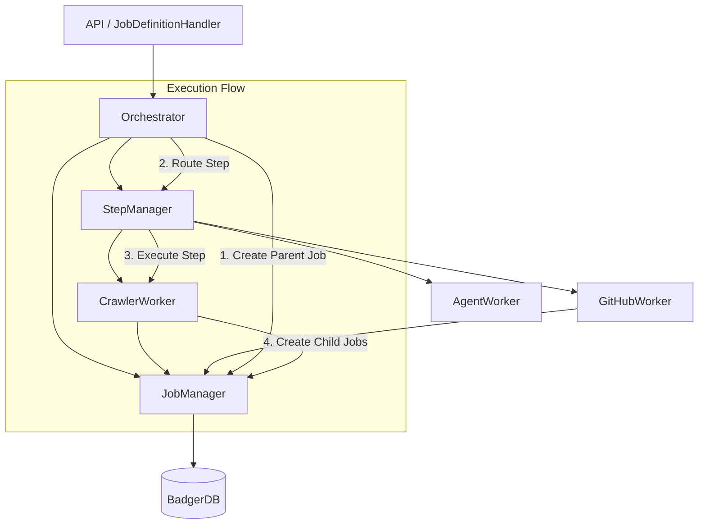

# Manager-Worker Architecture

## Overview

The Quaero queue system uses a decoupled architecture to separate job lifecycle management, step routing, and execution orchestration. This design ensures separation of concerns and scalability.

## Core Components

### 1. JobManager (`internal/queue/job_manager.go`)
**Responsibility:** Job Persistence and Status Management.
- Manages the lifecycle of a job record in the database (BadgerDB).
- Handles status updates (pending -> running -> completed/failed).
- Manages job metadata and configuration updates.
- Provides logging facilities (via `AddJobLog`).
- **Does NOT** handle worker routing or execution logic.

### 2. StepManager (`internal/queue/step_manager.go`)
**Responsibility:** Worker Registration and Routing.
- Maintains a registry of `DefinitionWorker` implementations keyed by `WorkerType`.
- Routes step execution requests to the appropriate worker.
- Validates step configuration against the registered worker.
- **Does NOT** manage job status or persistence.

### 3. Orchestrator (`internal/queue/orchestrator.go`)
**Responsibility:** Execution Coordination.
- Coordinates the execution of a `JobDefinition`.
- Creates the parent "Manager Job".
- Iterates through steps, creating "Step Jobs".
- Uses `StepManager` to execute each step.
- Handles error tolerance, retries (future), and flow control.
- Manages the parent-child relationship and monitoring setup.

### 4. Workers (`internal/queue/workers/`)
**Responsibility:** Execution of specific tasks.
- Implement `JobWorker` (for queue execution) and `DefinitionWorker` (for step creation).
- **CrawlerWorker:** Crawls URLs.
- **GitHubRepoWorker:** Indexes GitHub repositories.
- **AgentWorker:** Executes agentic workflows.
- **PlacesWorker:** Searches for places.

## Data Flow

1.  **Job Submission:** API receives a request to execute a Job Definition.
2.  **Orchestration:** `JobDefinitionHandler` calls `Orchestrator.ExecuteJobDefinition`.
3.  **Manager Job Creation:** `Orchestrator` creates a parent job via `JobManager`.
4.  **Step Execution:**
    - `Orchestrator` iterates through steps.
    - Creates a step job via `JobManager`.
    - Calls `StepManager.Execute` with the step configuration.
5.  **Worker Routing:** `StepManager` looks up the worker for the step type and calls `worker.CreateJobs`.
6.  **Job Spawning:** The worker creates actual queue jobs (e.g., "crawl_url") if applicable.
7.  **Monitoring:** `JobMonitor` and `StepMonitor` track the progress of spawned jobs and update the parent/step job status.

## Logging

Logging is context-aware but currently tightly coupled to `JobManager.AddJobLog()`.

**Current Flow:**
- Workers call `jobMgr.AddJobLog(ctx, jobID, level, message)`
- `AddJobLog` stores to BadgerDB and publishes to WebSocket via `EventJobLog`
- Context (step_name, manager_id) is resolved via `resolveJobContext()` which walks the parent chain

**Planned Improvements:**
See `docs/fix/queue_manager/03_logging_architecture_review.md` for proposed:
- Centralized `LogCollector` service
- Explicit `JobContext` in context.Context (no magic resolution)
- Enhanced `JobLogEntry` schema with step_id, manager_id, worker_type
- Client-side filtering in UI for step-specific log display

## Diagram

