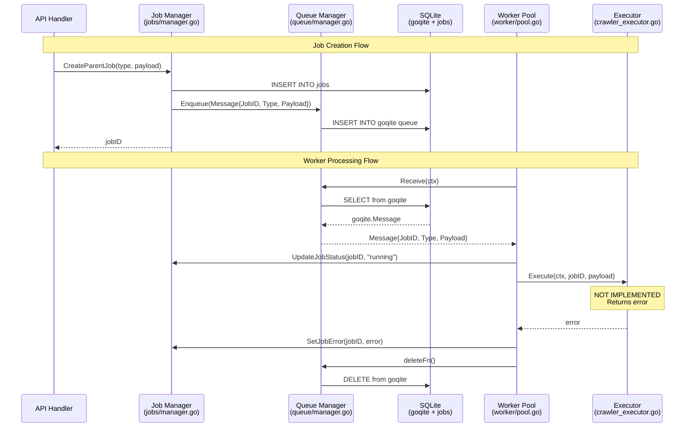

I have created the following plan after thorough exploration and analysis of the codebase. Follow the below plan verbatim. Trust the files and references. Do not re-verify what's written in the plan. Explore only when absolutely necessary. First implement all the proposed file changes and then I'll review all the changes together at the end.

### Observations

## Codebase Review - Significant Changes Detected

After reviewing the codebase again, I've identified **major architectural changes** from the previous exploration:

### **CRITICAL CHANGES:**

1. **Queue Architecture Completely Redesigned:**
   - **OLD**: Complex system with `queue.JobMessage` (ID, Type, URL, Depth, ParentID, JobDefinitionID, Config, Metadata)
   - **NEW**: Simplified `queue.Message` with only 3 fields (JobID, Type, Payload as json.RawMessage)
   - Location: `internal/queue/types.go` now has minimal Message struct

2. **WorkerPool Moved to New Package:**
   - **OLD**: Expected in `internal/queue/worker.go` (file was empty)
   - **NEW**: Moved to `internal/worker/pool.go` with completely different architecture
   - Uses Executor pattern instead of JobHandler pattern
   - Only one executor registered: CrawlerExecutor (not fully implemented)

3. **Job Management Simplified:**
   - **OLD**: Complex JobManager in `internal/services/jobs/manager.go` with CrawlJob model
   - **NEW**: Simple JobManager in `internal/jobs/manager.go` with basic Job struct
   - Uses `jobs` table (not `crawl_jobs` table)
   - Much simpler CRUD operations

4. **Job Types Package Removed:**
   - **OLD**: `internal/jobs/types/` with CrawlerJob, SummarizerJob, CleanupJob, etc.
   - **NEW**: Package doesn't exist or not being used
   - Only `internal/worker/crawler_executor.go` exists (placeholder, not implemented)

5. **JobExecutor Disabled:**
   - Lines 374-399 in `app.go` show JobExecutor system is commented out
   - Comment says: "OLD JOB EXECUTOR SYSTEM DISABLED - Uses deleted internal/services/jobs package"

6. **UI Changed:**
   - **OLD**: `pages/queue.html` with complex job queue management
   - **NEW**: `pages/jobs.html` focuses on authentication, sources, and job definitions
   - No queue management UI visible

### **Current State:**

**What Works:**
- Basic queue infrastructure (goqite wrapper in `internal/queue/manager.go`)
- WorkerPool with Executor pattern (`internal/worker/pool.go`)
- Simple job metadata tracking (`internal/jobs/manager.go`)
- Authentication and source management UI

**What's Missing/Incomplete:**
- CrawlerExecutor is a placeholder (line 48: "not yet fully implemented")
- No job types implementation
- JobExecutor system disabled
- Queue management UI not found
- Real URL processing not implemented

**Database Schema:**
- Still uses `crawl_jobs` table (from schema.go lines 114-137)
- But code uses `jobs` table (from manager.go lines 64-67)
- **Mismatch between schema and code**

### Approach

Create architecture documentation that accurately reflects the **current simplified state** of the queue system:

1. **Document the NEW simplified architecture** (not the old complex one)
2. **Highlight the transition state** - system is being refactored
3. **Identify implementation gaps** clearly
4. **Show what's working vs. what's placeholder**
5. **Document the schema mismatch** (crawl_jobs vs jobs table)
6. **Provide migration path** from old to new system

The documentation will serve as a **snapshot of the current transition state** and help developers understand:
- What was removed
- What's being built
- What needs to be completed
- How the new system differs from the old

### Reasoning

Re-explored the codebase after user requested review. Discovered major refactoring in progress:
- Read new `internal/queue/types.go` (simplified Message)
- Found `internal/worker/pool.go` (new location for WorkerPool)
- Read `internal/jobs/manager.go` (simplified JobManager)
- Checked `internal/worker/crawler_executor.go` (placeholder implementation)
- Reviewed `internal/app/app.go` (JobExecutor disabled)
- Examined `pages/jobs.html` (different UI focus)
- Compared with schema.go (found table mismatch)

## Proposed File Changes

### docs\architecture\QUEUE_ARCHITECTURE.md(NEW)

References: 

- internal\queue\manager.go
- internal\queue\types.go
- internal\worker\pool.go
- internal\worker\crawler_executor.go
- internal\jobs\manager.go
- internal\app\app.go
- internal\storage\sqlite\schema.go
- pages\jobs.html

Create comprehensive documentation of the **current simplified queue architecture** (in transition state):

**1. Executive Summary**
- System is undergoing major refactoring from complex to simple architecture
- Current state: Partially implemented, some components are placeholders
- Old complex system (JobMessage with many fields) being replaced with simple Message (3 fields)
- WorkerPool moved from `internal/queue/` to `internal/worker/`
- Job types system removed, replaced with Executor pattern

**2. Current Architecture (Simplified)**

**2.1 Queue Manager** (`internal/queue/manager.go`)
- Thin wrapper around goqite
- Methods: NewManager, Enqueue, Receive, Extend, Close
- Uses simplified Message struct (JobID, Type, Payload)
- No business logic, pure queue operations

**2.2 Message Structure** (`internal/queue/types.go`)
```go
type Message struct {
    JobID   string          // References jobs.id
    Type    string          // Job type for executor routing
    Payload json.RawMessage // Job-specific data (passed through)
}
```
Note: This is a **major simplification** from the old JobMessage with URL, Depth, ParentID, Config, etc.

**2.3 Worker Pool** (`internal/worker/pool.go`)
- Manages concurrent job processing
- Uses Executor pattern (not JobHandler pattern)
- Methods: NewWorkerPool, RegisterExecutor, Start, Stop
- Worker loop: polls queue → executes via Executor → updates job status → deletes message
- Currently only CrawlerExecutor registered (placeholder)

**2.4 Executor Pattern** (`internal/worker/crawler_executor.go`)
- Interface: Execute(ctx, jobID, payload)
- CrawlerExecutor exists but **not fully implemented** (line 48)
- TODO: Integrate with crawler.Service

**2.5 Job Manager** (`internal/jobs/manager.go`)
- Simple CRUD operations for job metadata
- Methods: CreateParentJob, CreateChildJob, GetJob, ListParentJobs, ListChildJobs, UpdateJobStatus, UpdateJobProgress, SetJobError, SetJobResult, AddJobLog, GetJobLogs
- Uses `jobs` table (NOT `crawl_jobs` table)
- Much simpler than old JobManager

**3. Database Schema Mismatch**

**Schema defines** (`internal/storage/sqlite/schema.go` lines 114-137):
- `crawl_jobs` table with complex structure
- Fields: id, parent_id, job_type, name, description, source_type, entity_type, config_json, source_config_snapshot, auth_snapshot, refresh_source, seed_urls, status, progress_json, metadata, created_at, started_at, completed_at, last_heartbeat, error, result_count, failed_count

**Code uses** (`internal/jobs/manager.go` lines 64-67):
- `jobs` table with simple structure
- Fields: id, parent_id, job_type, phase, status, created_at, started_at, completed_at, payload, result, error, progress_current, progress_total

**CRITICAL**: Schema and code are **out of sync**. Migration needed.

**4. Data Flow (Current)**

Sequence diagram:


**5. What's Removed/Disabled**

**5.1 Old Job Types System**
- `internal/jobs/types/` package (CrawlerJob, SummarizerJob, CleanupJob, etc.) - **REMOVED**
- BaseJob with correlation logging - **REMOVED**
- JobLogger with context-aware logging - **REMOVED**
- Complex parent-child hierarchy tracking - **REMOVED**

**5.2 JobExecutor System**
- `internal/services/jobs/executor.go` - **DISABLED** (lines 374-399 in app.go)
- JobRegistry and action handlers - **DISABLED**
- Multi-step workflow orchestration - **DISABLED**
- Comment: "OLD JOB EXECUTOR SYSTEM DISABLED - Uses deleted internal/services/jobs package"

**5.3 Complex JobMessage**
- Old structure with URL, Depth, ParentID, JobDefinitionID, Config, Metadata - **REMOVED**
- Replaced with simple Message (JobID, Type, Payload)

**6. What's Working**

✅ Queue Manager (goqite wrapper)
✅ Worker Pool (Executor pattern)
✅ Simple Job Manager (CRUD operations)
✅ Message enqueue/dequeue
✅ Job status tracking
✅ Job logs storage

**7. What's Not Working/Incomplete**

❌ CrawlerExecutor (placeholder, not implemented)
❌ No other executors (summarizer, cleanup, etc.)
❌ No real URL processing
❌ No parent-child job hierarchy
❌ No progress tracking beyond simple counters
❌ No WebSocket real-time updates
❌ No queue management UI
❌ Schema/code mismatch (crawl_jobs vs jobs table)

**8. UI State**

**Current UI** (`pages/jobs.html`):
- Authentication management
- Source configuration
- Job definitions management
- No queue/job execution monitoring

**Missing UI**:
- Queue management (old `pages/queue.html` not found or not linked)
- Job execution monitoring
- Real-time status updates
- Job logs viewing

**9. Configuration**

From `internal/common/config.go` (queue section):
```toml
[queue]
queue_name = "quaero_jobs"
concurrency = 4
poll_interval = "1s"
visibility_timeout = "5m"
max_receive = 3
```

**10. Migration Path**

To complete the refactoring:

**Phase 1: Schema Migration**
1. Create migration to add `jobs` table
2. Migrate data from `crawl_jobs` to `jobs`
3. Update schema.go to reflect new structure

**Phase 2: Implement Executors**
1. Complete CrawlerExecutor implementation
2. Integrate with crawler.Service
3. Add SummarizerExecutor, CleanupExecutor as needed

**Phase 3: UI Development**
1. Create queue management UI
2. Add job execution monitoring
3. Implement WebSocket updates
4. Add job logs viewer

**Phase 4: Advanced Features**
1. Re-implement parent-child hierarchy (if needed)
2. Add progress tracking
3. Implement error tolerance
4. Add graceful shutdown

**11. Key Differences: Old vs New**

| Aspect | Old System | New System |
|--------|-----------|------------|
| Message | JobMessage (8+ fields) | Message (3 fields) |
| Worker | JobHandler pattern | Executor pattern |
| Job Manager | Complex (services/jobs) | Simple (jobs/manager) |
| Job Types | Multiple (crawler, summarizer, etc.) | Placeholder only |
| Hierarchy | Flat parent-child | Not implemented |
| Progress | Detailed (URLs, depth) | Simple counters |
| Logging | Context-aware JobLogger | Basic AddJobLog |
| UI | Queue management | Job definitions |
| Table | crawl_jobs | jobs |

**12. References**

Key files:
- Queue: `internal/queue/manager.go`, `internal/queue/types.go`
- Worker: `internal/worker/pool.go`, `internal/worker/crawler_executor.go`
- Jobs: `internal/jobs/manager.go`
- App: `internal/app/app.go` (lines 300-351)
- Schema: `internal/storage/sqlite/schema.go` (lines 114-173)
- UI: `pages/jobs.html`

**13. Conclusion**

The queue system is in a **transition state**:
- Old complex system has been removed
- New simplified system is partially implemented
- Core infrastructure works (queue, worker pool, job tracking)
- Business logic not implemented (executors are placeholders)
- Schema and code are out of sync
- UI needs to be rebuilt

This is a **work in progress** - not production ready.