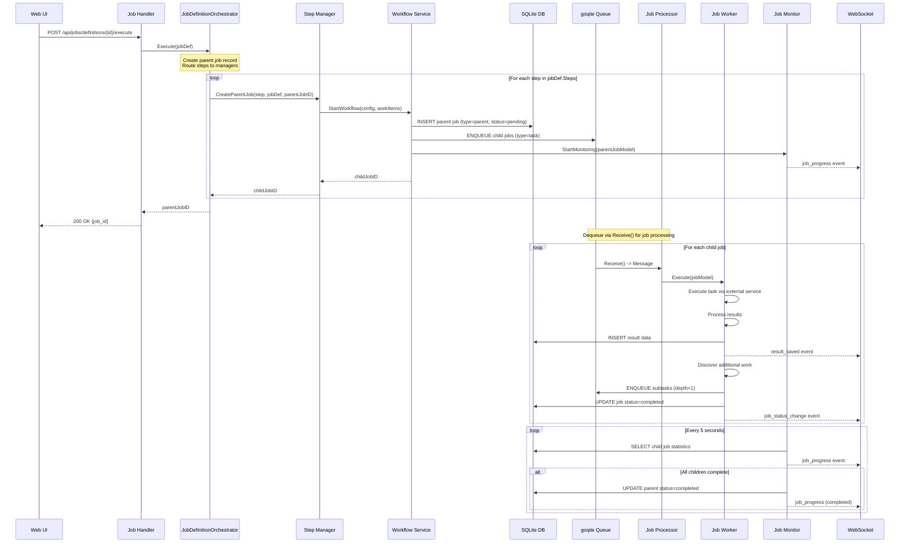

I have created the following plan after thorough exploration and analysis of the codebase. Follow the below plan verbatim. Trust the files and references. Do not re-verify what's written in the plan. Explore only when absolutely necessary. First implement all the proposed file changes and then I'll review all the changes together at the end.

### Observations

**Current Documentation State:**

The architecture document is comprehensive but has a **gap** in explaining the JobDefinitionOrchestrator:
- ✅ **File structure** mentions it (line 405: "Routes job definition steps to managers")
- ✅ **Implementations** lists it under Monitors (line 381) - though this categorization is debatable
- ❌ **Components & Interfaces** section lacks detailed description
- ❌ **Sequence diagram** doesn't show the orchestrator layer
- ❌ **Flow phases** description jumps directly from Handler to Manager

**Architectural Context:**

The JobDefinitionOrchestrator serves as the **workflow coordinator** that:
1. Receives job definition execution requests from handlers
2. Creates parent job records for tracking
3. Routes each step to the appropriate StepManager based on action type
4. Handles sequential execution with error strategies (fail/continue/retry)
5. Integrates with JobMonitor for crawler jobs
6. Manages error tolerance thresholds

**Positioning in Architecture:**

The orchestrator is **not** a Manager, Worker, or Monitor - it's a **coordinator** that sits above these layers:
```
JobDefinitionOrchestrator (Workflow Coordination)
    ↓
StepManagers (Domain Orchestration)
    ↓
Workers (Execution)
    ↓
Monitor (Progress Tracking)
```

**Documentation Improvements Needed:**

1. Add new subsection in Components & Interfaces for JobDefinitionOrchestrator
2. Update sequence diagram to show: UI → Handler → **JobDefinitionOrchestrator** → StepManager
3. Add clarifying comment in diagram about Dequeue operation
4. Update Phase 1 flow description to include orchestrator
5. Consider moving orchestrator from "Monitors" list to separate "Coordinators" category

### Approach

This is a **documentation enhancement** to explicitly document the `JobDefinitionOrchestrator` component in the Manager/Worker architecture guide. The orchestrator is already implemented and referenced in the file structure section (line 405), but lacks detailed explanation in the Components & Interfaces section and sequence diagram.

**Strategy:**
1. Add JobDefinitionOrchestrator as a new component in the Components & Interfaces section
2. Update the sequence diagram to show the orchestrator layer between Handler and Manager
3. Add clarifying note about the Dequeue operation in Phase 2
4. Update metadata (last updated date, version if needed)

**Key Design Decision:** Position JobDefinitionOrchestrator as the **entry point coordinator** that routes job definition steps to appropriate StepManagers. This distinguishes it from:
- **StepManagers** - Domain-specific orchestrators (create jobs for specific action types)
- **JobMonitor** - Progress tracking and aggregation
- **JobProcessor** - Queue-based job routing to workers

The orchestrator sits **above** the Manager layer, handling multi-step workflow coordination from job definitions.

### Reasoning

I explored the codebase systematically:
1. Read the complete `job_definition_orchestrator.go` implementation (465 lines) to understand its role
2. Read the architecture document summary and key sections (lines 1-594)
3. Identified that JobDefinitionOrchestrator is mentioned in file structure (line 405) but not in Components section
4. Analyzed the sequence diagram (lines 246-293) to understand where to insert the orchestrator
5. Verified the Dequeue operation is correctly placed in Phase 2 (line 272)

The orchestrator's role is clear from the implementation:
- Routes job definition steps to registered StepManagers
- Manages parent job creation and metadata
- Handles error tolerance and retry logic
- Integrates with JobMonitor for progress tracking
- Executes steps sequentially with error strategies

## Proposed File Changes

### docs\architecture\MANAGER_WORKER_ARCHITECTURE.md(MODIFY)

References: 

- internal\jobs\job_definition_orchestrator.go
- internal\app\app.go
- internal\handlers\job_definition_handler.go

**Update Document Metadata (Lines 3-4):**

1. **Version (Line 3):** Keep as `1.2` (no version bump needed for clarification)
2. **Last Updated (Line 4):** Update to current date `2025-01-16` (or current date when implementing)

**Rationale:** Document date reflects when JobDefinitionOrchestrator documentation was added. Version remains 1.2 since this is clarification, not architectural change.
**Add JobDefinitionOrchestrator to Component Responsibilities Table (After Line 52):**

Insert new row in the table:

```markdown
| **JobDefinitionOrchestrator** | Coordination (Workflow) | Routes job definition steps to StepManagers - Handles multi-step workflows, error strategies, parent job creation |
```

**Position:** Insert between JobProcessor row and the closing table marker.

**Rationale:** The table currently lists 4 components (StepManager, JobWorker, JobMonitor, JobProcessor). Adding JobDefinitionOrchestrator as the 5th component provides a complete picture of the architecture layers. Position it last since it's the highest-level coordinator.
**Add New Section: JobDefinitionOrchestrator (Workflow Coordination) - Insert After Line 116:**

Add complete new section between the StepManager implementations list and the JobWorker Interface section:

```markdown
### JobDefinitionOrchestrator (Workflow Coordination)

**File:** `internal/jobs/job_definition_orchestrator.go`

The JobDefinitionOrchestrator is the **entry point coordinator** for job definition execution. It sits above the Manager layer and routes multi-step workflows to appropriate StepManagers.

**Responsibilities:**
- Parse job definitions and execute steps sequentially
- Route each step to the appropriate StepManager based on action type (e.g., "crawl" → CrawlerManager)
- Create parent job records for workflow tracking
- Handle error strategies (fail, continue, retry) per step
- Manage error tolerance thresholds across child jobs
- Integrate with JobMonitor for crawler job progress tracking
- Persist job metadata (auth_id, job_definition_id) for child job access

**Key Methods:**
- `Execute(ctx, jobDef)` - Executes a job definition with all its steps
- `RegisterStepExecutor(mgr)` - Registers a StepManager for an action type

**Integration Points:**
- **Handlers** call `Execute()` when user triggers job definition
- **StepManagers** registered via `RegisterStepExecutor()` during app initialization
- **JobMonitor** started for crawler jobs to track child progress
- **JobManager** used for job CRUD operations (create, update status, add logs)

**Example Flow:**
```go
// 1. Handler receives job definition execution request
parentJobID, err := orchestrator.Execute(ctx, jobDef)

// 2. Orchestrator creates parent job record
parentJob := &Job{ID: parentJobID, Type: "parent", Status: "pending"}

// 3. Orchestrator executes each step sequentially
for _, step := range jobDef.Steps {
    // Route to appropriate manager
    mgr := orchestrator.stepExecutors[step.Action]
    childJobID, err := mgr.CreateParentJob(ctx, step, jobDef, parentJobID)
    
    // Handle errors based on step.OnError strategy
}

// 4. For crawler jobs, start monitoring
if isCrawlerJob {
    orchestrator.jobMonitor.StartMonitoring(ctx, parentJobModel)
}
```

**Distinction from StepManagers:**
- **JobDefinitionOrchestrator** - Routes steps across multiple domains (multi-step workflows)
- **StepManagers** - Orchestrate single domain (e.g., CrawlerManager handles only crawl steps)

**Registered StepManagers:**
During app initialization in `internal/app/app.go`, all 6 managers are registered:
- `"crawl"` → CrawlerManager
- `"agent"` → AgentManager
- `"database_maintenance"` → DatabaseMaintenanceManager
- `"transform"` → TransformManager
- `"reindex"` → ReindexManager
- `"places_search"` → PlacesSearchManager
```

**Position:** Insert this entire section after line 116 (after the StepManager implementations list) and before line 117 (JobWorker Interface section).

**Rationale:** This provides comprehensive documentation of the orchestrator's role, distinguishing it from managers, workers, and monitors. The example flow shows how it coordinates the entire workflow. Position it between Manager and Worker sections since it's the entry point that delegates to managers.
**Update Sequence Diagram to Include JobDefinitionOrchestrator (Lines 246-293):**

Replace the entire sequence diagram with updated version:



**Key Changes:**
1. **Added Orchestrator participant** at the top
2. **Updated Phase 1 flow**: Handler → Orchestrator → Manager (shows orchestrator routing)
3. **Added loop** around step execution to show multi-step workflow handling
4. **Added Note** over Orchestrator explaining its role
5. **Added clarifying Note** in Phase 2: "Dequeue via Receive() for job processing"
6. **Maintained all existing interactions** - only inserted orchestrator layer

**Rationale:** The updated diagram accurately reflects the actual code flow where handlers call `JobDefinitionOrchestrator.Execute()`, which then routes steps to managers. The Note clarifies the Dequeue operation as requested. The loop shows how the orchestrator handles multi-step workflows sequentially.
**Update Flow Phases Description to Include Orchestrator (Lines 295-305):**

Replace Phase 1 description with updated version:

```markdown
#### Phase 1: Job Creation (Orchestration Layer)
1. User clicks "Execute" in Web UI
2. Handler calls `JobDefinitionOrchestrator.Execute(jobDef)`
3. Orchestrator creates parent job record in database
4. Orchestrator iterates through job definition steps sequentially
5. For each step, orchestrator routes to appropriate `StepManager.CreateParentJob()`
6. Manager calls `WorkflowService.StartWorkflow()` with configuration
7. Service creates parent job in database (type=`parent`)
8. Service spawns child jobs (type=`task`) and enqueues them
9. Service starts `JobMonitor` in separate goroutine (for crawler jobs)
10. Orchestrator returns parent job ID to handler
11. Handler returns parent job ID to UI
```

**Changes:**
- Added steps 2-5 to show orchestrator's role
- Renumbered subsequent steps
- Clarified that monitoring is for crawler jobs specifically
- Shows the complete flow from handler through orchestrator to manager

**Rationale:** The updated description matches the sequence diagram and actual implementation. It clearly shows the orchestrator as the entry point that coordinates multi-step workflows.
**Update Phase 2 Description to Add Dequeue Clarification (Lines 306-314):**

Update the Phase 2 section header and first step:

```markdown
#### Phase 2: Job Execution (Worker Layer)
8. `JobProcessor` dequeues message from goqite via `Receive()` method (polling-based)
9. Processor routes to appropriate `JobWorker` based on job type
10. Worker executes task via external service
...(rest remains unchanged)
```

**Changes:**
- Added clarification "via `Receive()` method (polling-based)" to step 8
- Renumbered steps to match updated Phase 1 (now starts at 8 instead of 8)

**Note:** If Phase 1 adds 4 new steps (2-5), then Phase 2 should start at step 12, not 8. Adjust numbering accordingly:
- Phase 1: Steps 1-11
- Phase 2: Steps 12-18
- Phase 3: Steps 19-21

**Rationale:** Clarifies that dequeue happens via the `Receive()` method, which is a polling-based operation. This addresses the user's request to verify and clarify the Dequeue operation.
**Update Implementations Section - Recategorize JobDefinitionOrchestrator (Lines 379-382):**

Replace the "Monitors (Monitoring):" section with:

```markdown
**Coordinators (Workflow Orchestration):**
- ✅ `JobDefinitionOrchestrator` (internal/jobs/job_definition_orchestrator.go) - Routes job definition steps to managers

**Monitors (Progress Tracking):**
- ✅ `JobMonitor` (internal/jobs/monitor/job_monitor.go) - Tracks child job progress and aggregates statistics
```

**Rationale:** JobDefinitionOrchestrator is not a monitor - it's a coordinator that routes workflows. Separating it into a "Coordinators" category clarifies its distinct role. JobMonitor is the true monitor that tracks progress. This categorization aligns with the architectural layers:
- Coordinators - Route workflows
- Managers - Orchestrate domains
- Workers - Execute tasks
- Monitors - Track progress
**Update File Structure Section - Add Coordinator Category (Lines 404-406):**

Update the file structure description:

```markdown
- ✅ `internal/jobs/monitor/` - Job progress monitoring
  - ✅ `job_monitor.go` - Child job progress tracking (implements JobMonitor)
- ✅ `internal/jobs/` - Workflow coordination
  - ✅ `job_definition_orchestrator.go` - Routes job definition steps to managers (workflow coordinator)
```

**Changes:**
- Updated comment for `job_definition_orchestrator.go` to emphasize "workflow coordinator" role
- Changed section description from "Job definition routing" to "Workflow coordination"

**Rationale:** Clarifies that the orchestrator is a coordinator, not just a router. The term "workflow coordination" better describes its multi-step orchestration responsibility.
**Update Architecture Benefits Section (Lines 506-509):**

Update the "Clear Separation of Concerns" bullet:

```markdown
1. **Clear Separation of Concerns:**
   - Coordinators (1) - Route multi-step workflows to managers
   - Managers (6) - Orchestrate domain-specific workflows, create parent jobs, spawn children
   - Workers (3) - Execute individual jobs from queue
   - Monitors (1) - Track progress, aggregate statistics
```

**Changes:**
- Added "Coordinators (1)" as the first layer
- Updated counts: Monitors from (2) to (1) since JobDefinitionOrchestrator is now a coordinator
- Clarified each layer's responsibility

**Rationale:** Reflects the updated architecture with 4 distinct layers. Shows the hierarchy: Coordinator → Managers → Workers, with Monitors running in parallel for progress tracking.