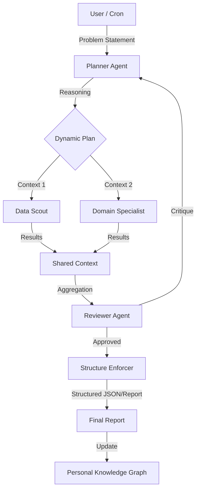

# Architecture Review: Dynamic "Thinking" Workflows
> Date: 2025-12-26
> Status: Proposed

## 1. Executive Summary

This review proposes an architectural shift from **static, data-first pipelines** to **dynamic, problem-first workflows**. Currently, jobs like `asx-stocks-daily` rely on rigid sequences: *Collect Data -> Analyze Data*. If collection fails or is incomplete, the analysis fails or produces low-confidence "N/A" results.

The proposed "Thinking" architecture introduces a **Planner Agent** that starts with a problem statement, reasons about the necessary data and tools, and dynamically orchestrates the execution. This decoupling allows for robustness (e.g., "Data X is missing, so I will try source Y or skip to inference Z") and broader applicability beyond stock analysis.

Importantly, this system is designed for **long-running context collection**, continuously gathering and synthesizing data to build a knowledge base, rather than acting as a real-time chat bot.

## 2. Current State Analysis

### 2.1. Existing Architecture (The "Factory" Model)
The current system operates like a factory line:
1.  **Configuration**: User defines a static list of inputs (e.g., stock tickers in `[config]`).
2.  **Collection**: `job_template` iterates over inputs, running collectors (e.g., `asx-stock-data`).
3.  **Analysis**: `summary_worker` or `agent_worker` consumes the collected documents.

**Strengths**:
*   Deterministic and easy to reason about.
*   Highly parallelizable.
*   Clear separation of concerns for *successful* paths.

**Weaknesses**:
*   **Brittle Dependencies**: Analysis blindly assumes data exists.
*   **No recovery**: If `asx-stock-data` returns empty, the analysis step has no mechanism to say "I need to check Google News instead."
*   **Domain Specificity**: The structure is heavily tuned to "List of Items -> Process Item". It struggles with open-ended tasks like "Find me an undervalued tech stock" (where the list isn't known upfront).

### 2.2. Case Study: SMSF Portfolio
*   **Input**: List of holdings (Units, Avg Price) in `smsf-portfolio-daily.toml`.
*   **Process**: Fetch prices -> Calculate Value -> Summarize.
*   **Failure Mode**: If price fetch fails, the summary reports "N/A" for value, making the "Senior Investment Strategist" persona look incompetent.

## 3. Proposed "Thinking" Architecture

We propose a **Planner-Executor-Reviewer** pattern.



### 3.1. Phase 1: The Planner (Zero-Step Thinking)
Instead of a hardcoded TOML template, the entry point is a **Problem Statement**.
*   **Input**: "Analyze the health of my tech holdings given the recent rate hike rumors."
*   **Role**: The Planner does NOT fetch data. It *thinks* about what data is needed.
*   **Output**: A dynamic job definition (or list of steps).
    *   *Thought*: "I need current prices for tech stocks. I also need news about 'rate hikes' and 'tech sector impact'."
    *   *Action*: Schedule `fetch_prices(tickers=[...])` AND `web_search(query="interest rate impact on tech stocks 2025")`.

### 3.2. Phase 2: Dynamic Workers (The "Tool Use")
Workers remain structured but become "tools" for the Planner.
*   **Data Scout Workers**: specialized in fetching specific entities (Repo stats, Stock prices, Restaurant menus).
*   **Analyst Workers**: specialized in processing raw data into insights.

**Key Change**: Workers should return metadata about *confidence* and *completeness*.
*   If `fetch_prices` fails for a ticker, it returns `status: partial_success, missing: ['WES']`.

### 3.3. Phase 3: Structured Review & Verification
Before the final output is presented, a **Reviewer Step** runs.
*   **Input**: The Planner's original goal + The Executor's results.
*   **Logic**:
    *   "Did we answer the user's question?"
    *   "Are there 'N/A' values in critical fields?"
    *   "Is the confidence level high enough?"
*   **Action**:
    *   *Pass*: Forward to user.
    *   *Fail*: Trigger a **Recovery Loop** (e.g., "Data missing. Search web for 'WES share price' as fallback").

## 4. Implementation Strategy

### 4.1. New Worker: `OrchestratorWorker` (The Planner)
A new worker type `orchestrator` that utilizes an LLM (Gemini 2.0 / Claude 3.5 Sonnet) with a "Chain of Thought" prompt.

**Config Example:**
```toml
[step.plan_execution]
type = "orchestrator"
goal = "Analyze portfolio risks"
context = ["smsf-holdings.json"]
available_tools = ["asx-data", "web-search", "news-crawler"]
thinking_level = "HIGH"
```

### 4.2. Structured Review Templates
Extend `summary_worker` to support **Schema Validation**.
Instead of just free-text summaries, enforce outputs that map to a JSON schema or strict markdown tables.

**Validation Rules:**
*   `no_missing_data`: "Reject if any cell in 'Current Price' column is empty or 'N/A'."
*   `double_check`: "If P/L > 50%, verify against historical data."

### 4.3. Separating Config from Code
*   **User Config**: `~/.quaero/config/user_portfolio.toml` (Private, simple key-value).
*   **System Templates**: `deployments/common/job-templates/...` (Version controlled logic).
*   **Injection**: The Job Runner injects User Config into System Templates at runtime.

## 5. Applicability to Non-Stock Domains

This pattern is domain-agnostic.

**Example 1: Code Repo Analysis**
*   **Problem**: "Why is the build failing?"
*   **Planner**: "I need build logs. I need recent commits. I need to check for infrastructure outages."
*   **Execution**: Fetches logs (Worker A), Diffs code (Worker B), Checks Status Page (Worker C).
*   **Review**: "I found a syntax error in commit X. Confidence: High."

**Example 2: Restaurant Search**
*   **Problem**: "Find a romantic Italian place near me open now."
*   **Planner**: "Get location. Search 'romantic Italian'. Filter by 'Open Now'. Check reviews for 'quiet' or 'intimate'."
*   **Execution**: Places API -> Review Scraper -> Sentiment Analysis.
*   **Review**: "Place A is open but reviews say it's loud. Place B is perfect. Recommending B."

## 6. Recommendations
1.  **Pilot the `OrchestratorWorker`**: Build a prototype "Planner" that takes a simple goal and outputs a `job_template` configuration dynamically.
2.  **Enhance `SummaryWorker`**: Add a "Validation" stage that can reject a summary and request a re-run with different parameters (The "Critique Loop" already exists in code, leverage it for *data coverage* not just writing style).
3.  **Refactor Config**: Pull specific stock lists out of `.toml` files and into a dedicated `EntityRegistry` or simple JSON/YAML files in a user-data directory.
## 7. Migration Examples

### 7.1. ASX Stocks Daily (Orchestrated)
Replaces `deployments/common/job-definitions/asx-stocks-daily.toml`.

**Key Changes:**
*   `type = "orchestrator"`: Uses the new thinking worker.
*   `goal`: Natural language description of the outcome.
*   `output_schema`: Enforces the specific structure required for the email report.
*   `available_tools`: Exposes existing capabilities as tools.

```toml
# deployments/future/jobs/asx-stocks-daily-orchestrated.toml
id = "asx-stocks-daily-orchestrated"
name = "ASX Daily Stock Analysis (Thinking)"
type = "orchestrator"
description = "Analyzes stock daily data and generates structured email reports"
schedule = "0 18 * * 1-5" # 6pm weekdays
timeout = "2h"

[config]
# Output validation - ensures the result handles the email template variable {body}
output_schema = "deployments/common/schemas/stock_report_schema.toml"
# Context - The planner reads these to know WHICH stocks to process
context_files = ["deployments/common/config/user_stocks.toml"]

[step.daily_analysis]
type = "orchestrator"
goal = """
Perform a daily analysis of all stocks listed in the context file.
1. Collect latest prices and announcements for each stock.
2. Analyze the data to determine a sentiment.
3. Generate a structured text report for each stock.
4. If data is missing for any stock, explicitly note this in the 'error' field instead of leaving cells blank.
"""
thinking_level = "HIGH"
model_preference = "auto" # Let system pick best reasoner

# Tools expose the existing workers as callable functions
available_tools = [
    { name = "fetch_stock_data", worker = "asx-stock-data" },
    { name = "run_financial_analysis", worker = "asx-stock-review" },
    { name = "search_web", worker = "web-search" } # Fallback tool
]
```

### 7.2. SMSF Portfolio Daily (Thinking)
Replaces `deployments/common/job-definitions/smsf-portfolio-daily.toml`.

**Key Changes:**
*   **Holistic Goal**: "Review the portfolio" rather than "Run Step 1, then Step 2".
*   **Personal Context**: Can read "My Investment Strategy" doc to align advice.
*   **Long-Running**: Can create/update persistence documents (e.g., `portfolio_history_2025.md`).

```toml
# deployments/future/jobs/smsf-portfolio-thinking.toml
id = "smsf-portfolio-thinking"
name = "SMSF Portfolio Strategy Review"
type = "orchestrator"
description = "Strategic review of SMSF portfolio using deep reasoning"
schedule = "0 9 * * *" # 9am daily

[config]
output_schema = "deployments/common/schemas/portfolio_email_schema.toml"
context_files = [
    "deployments/common/config/smsf_holdings.toml",
    "docs/personal/investment_strategy.md" # Strategy context!
]

[step.strategic_review]
type = "orchestrator"
goal = """
Review the current SMSF portfolio against my investment strategy.
1. Calculate current valuations and P/L for all holdings.
2. Check for any 'sell' signals based on the strategy document (e.g. drop > 10%).
3. Synthesize a brief executive summary for the daily email.
4. Update the 'portfolio_history' document with today's valuation.
"""
thinking_level = "HIGH"

available_tools = [
    { name = "fetch_market_data", worker = "asx-stock-data" },
    { name = "fetch_indices", worker = "asx-index-review" },
    { name = "read_news", worker = "news-crawler" },
    { name = "update_document", worker = "doc_manager" } # New tool for DocDB
]
```

### 7.3. Required Templates & Schemas

**Planner System Prompt (Template)**
*   **Role**: "You are a Senior Investment Orchestrator. You do not just run tools; you solve problems."
*   **Constraint**: "You must produce a final output that matches `{schema_toml}` exactly. If you cannot fill a field, you must start a 'Recovery Loop' to find the data."

**Output Schema (TOML Example)**
We prefer TOML for configuration and output to avoid syntax verbosity.
*   **Best Practice**: Use `[table.key]` syntax instead of array of tables `[[array]]`.

Example: `deployments/common/schemas/stock_report_schema.toml`
*(This defines the STRUCTURE the LLM must generate)*

```toml
# Expected Output Structure

report_date = "2025-12-25"
executive_summary = "High level market overview..."

# Note: Use map syntax [stocks.TICKER] instead of [[stocks]]
[stocks.CBA]
price = 120.50
change_percent = 0.5
sentiment = "BULLISH"
action_required = false

[stocks.WES]
price = 50.20
change_percent = -0.2
sentiment = "NEUTRAL"
action_required = false

# If data is missing
[stocks.XYZ]
price = 0.0
missing_data_reason = "Suspended from trading"
action_required = true
```

## 8. Updated Process Structure

The new "Thinking" process follow a 4-step loop:

1.  **Ingest**: Planner reads `goal` + `context_files` (e.g., holdings).
2.  **Reason**: Planner identifies gaps ("I have holdings, I need prices").
3.  **Act (Loop)**:
    *   Call `fetch_stock_data`.
    *   *Result*: "Available for CBA, Missing for XYZ".
    *   *Reason*: "XYZ is missing. I will try `search_web` for 'XYZ share price'".
    *   Call `search_web`.
4.  **Enforce**:
    *   Planner generates TOML output.
    *   **Enforcer Step** validates against `stock_report_schema.toml`.
    *   *Success*: Email output is generated (or Document updated).
    *   *Failure*: Enforcer returns error to Planner -> "Field 'sentiment' missing for XYZ". Planner retries.

## 9. Codebase Refactoring Required

### 9.1. Naming Conflict: `Orchestrator`
**Issue**: The codebase currently has `internal/queue/orchestrator.go` which handles the technical execution of job definitions (steps, workers, events). Introducing a new "Orchestrator" worker type will cause semantic confusion.

**Resolution**: Rename the *system* component to reflect its mechanical nature, freeing the "Orchestrator" term for the *cognitive* AI agent.

| Current Name | New Name | Rationale |
| :--- | :--- | :--- |
| `queue.Orchestrator` | `queue.JobDispatcher` | It dispatches steps and workers mechanically. |
| `internal/queue/orchestrator.go` | `internal/queue/dispatcher.go` | Matches the new struct name. |
| `NEW Worker` | `OrchestratorWorker` | usage: `type = "orchestrator"`. It "orchestrates" the logic and sub-tasks. |

**Action Plan**:
1.  Refactor `internal/queue/orchestrator.go` -> `internal/queue/dispatcher.go`.
2.  Update `struct Orchestrator` -> `struct JobDispatcher`.
3.  Update references in `job_manager.go` and `worker_factory.go`.

